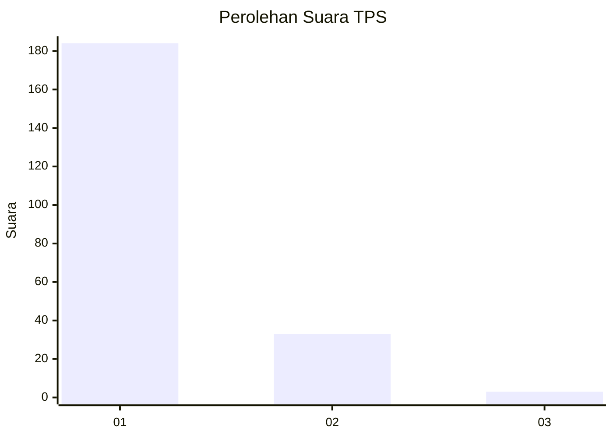
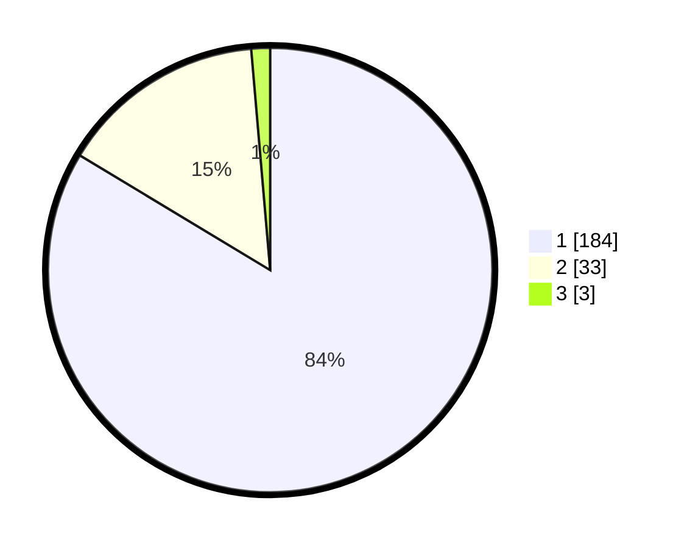

# Hasil

## Grafik

## Tabel

| No. | Nama Paslon    | Suara | Suara (raw) | Persentase |
|:--- |:-------------- | -----:| -----------:| ----------:|
| 1   | ANIES MUHAIMIN | 184   | [184][p-1]  | 83,64      |
| 2   | PRABOWO GIBRAN | 33    | [33][p-2]   | 15,00      |
| 3   | GANJAR MAHFUD  | 3     | [3][p-3]    | 1,36       |

[p-1]: https://github.com/gigit-pemilu/pemilu-2024-12-sumatera-utara/blob/main/pilpres/hitung-suara/sub/12-sumatera-utara/sub/13-mandailing-natal/sub/13-batang-natal/sub/1017-muara-soma/sub/003-tps/sub/paslon-1.txt
[p-2]: https://github.com/gigit-pemilu/pemilu-2024-12-sumatera-utara/blob/main/pilpres/hitung-suara/sub/12-sumatera-utara/sub/13-mandailing-natal/sub/13-batang-natal/sub/1017-muara-soma/sub/003-tps/sub/paslon-2.txt
[p-3]: https://github.com/gigit-pemilu/pemilu-2024-12-sumatera-utara/blob/main/pilpres/hitung-suara/sub/12-sumatera-utara/sub/13-mandailing-natal/sub/13-batang-natal/sub/1017-muara-soma/sub/003-tps/sub/paslon-3.txt

## Foto C Plano

https://sirekap-obj-formc.kpu.go.id/1ec9/pemilu/ppwp/12/13/13/10/17/1213131017003-20240216-145543--0f44ce35-4086-4c6c-863f-571225e0e66f.jpg

https://sirekap-obj-formc.kpu.go.id/1ec9/pemilu/ppwp/12/13/13/10/17/1213131017003-20240216-144155--76f2e361-76b7-4b35-9f89-b87907800ff2.jpg

https://sirekap-obj-formc.kpu.go.id/1ec9/pemilu/ppwp/12/13/13/10/17/1213131017003-20240216-144446--74457c30-403c-4bb3-ba43-9a7a35f4006f.jpg

## Metadata

| Key        | Value               |
| ---------- | ------------------- |
| Time Stamp | 2024-02-17 02:30:03 |

