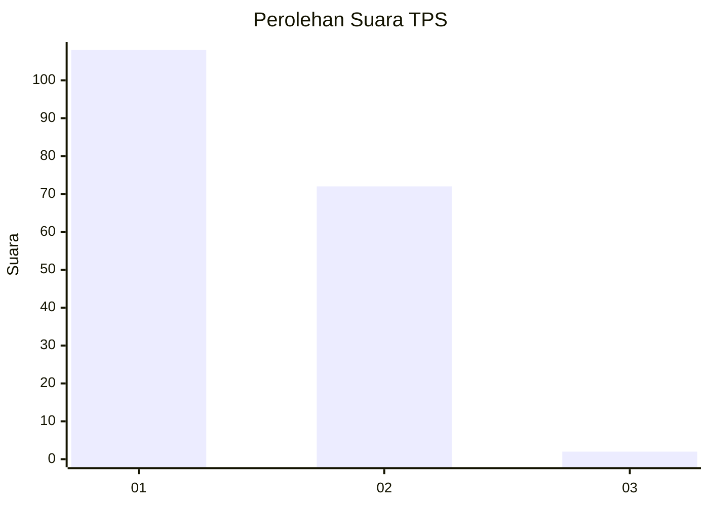
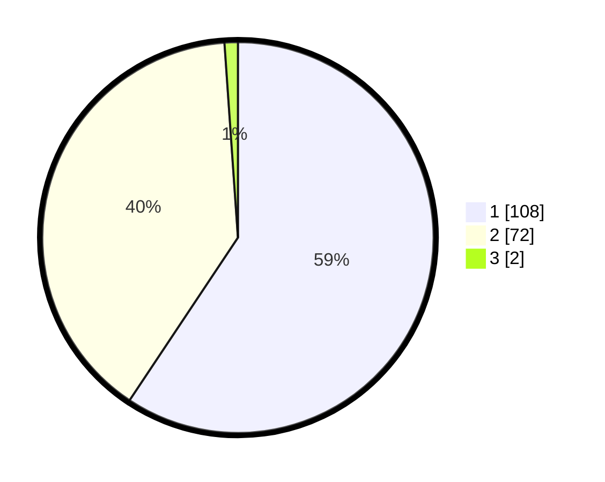

# Hasil

## Grafik

## Tabel

| No. | Nama Paslon    | Suara | Suara (raw) | Persentase |
|:--- |:-------------- | -----:| -----------:| ----------:|
| 1   | ANIES MUHAIMIN | 108   | [108][p-1]  | 59,34      |
| 2   | PRABOWO GIBRAN | 72    | [72][p-2]   | 39,56      |
| 3   | GANJAR MAHFUD  | 2     | [2][p-3]    | 1,10       |

[p-1]: https://github.com/gigit-pemilu/pemilu-2024-12-sumatera-utara/blob/main/pilpres/hitung-suara/sub/12-sumatera-utara/sub/13-mandailing-natal/sub/13-batang-natal/sub/2003-aek-manggis/sub/001-tps/sub/paslon-1.txt
[p-2]: https://github.com/gigit-pemilu/pemilu-2024-12-sumatera-utara/blob/main/pilpres/hitung-suara/sub/12-sumatera-utara/sub/13-mandailing-natal/sub/13-batang-natal/sub/2003-aek-manggis/sub/001-tps/sub/paslon-2.txt
[p-3]: https://github.com/gigit-pemilu/pemilu-2024-12-sumatera-utara/blob/main/pilpres/hitung-suara/sub/12-sumatera-utara/sub/13-mandailing-natal/sub/13-batang-natal/sub/2003-aek-manggis/sub/001-tps/sub/paslon-3.txt

## Foto C Plano

https://sirekap-obj-formc.kpu.go.id/a781/pemilu/ppwp/12/13/13/20/03/1213132003001-20240215-050140--c6cfb323-d55f-4c28-b3ab-28049a52b0b4.jpg

https://sirekap-obj-formc.kpu.go.id/a781/pemilu/ppwp/12/13/13/20/03/1213132003001-20240215-050339--d33f2fea-d932-4efe-bbee-bd48e2059ecc.jpg

https://sirekap-obj-formc.kpu.go.id/a781/pemilu/ppwp/12/13/13/20/03/1213132003001-20240215-050513--90a0225e-7e15-43ec-af1c-2e105d33c761.jpg

## Metadata

| Key        | Value               |
| ---------- | ------------------- |
| Time Stamp | 2024-02-16 00:00:26 |

