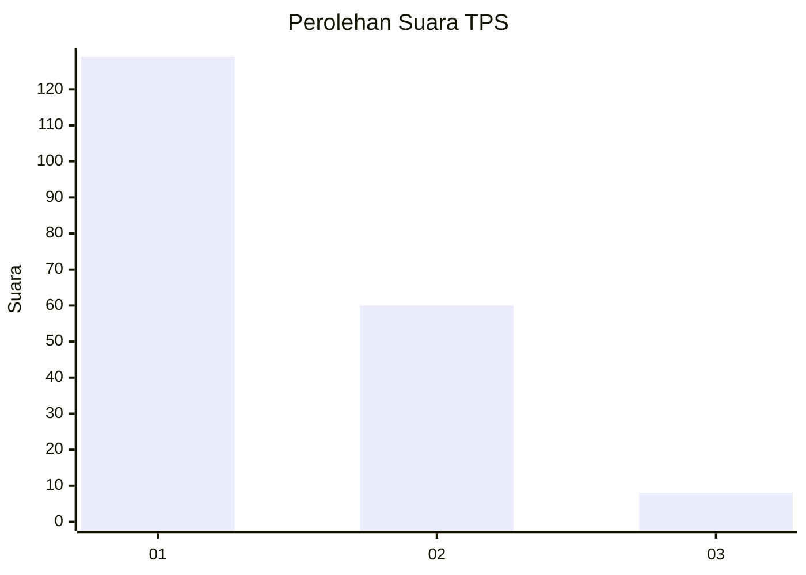
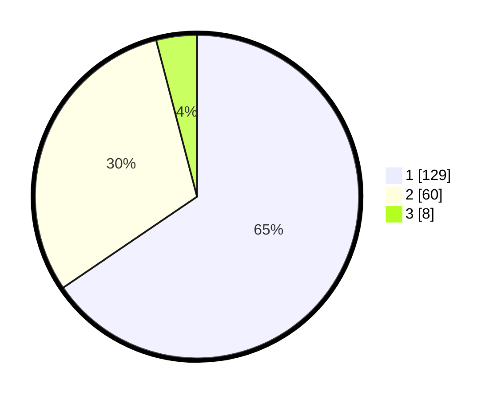

# Hasil

## Grafik

## Tabel

| No. | Nama Paslon    | Suara | Suara (raw) | Persentase |
|:--- |:-------------- | -----:| -----------:| ----------:|
| 1   | ANIES MUHAIMIN | 129   | [129][p-1]  | 65,48      |
| 2   | PRABOWO GIBRAN | 60    | [60][p-2]   | 30,46      |
| 3   | GANJAR MAHFUD  | 8     | [8][p-3]    | 4,06       |

[p-1]: https://github.com/gigit-pemilu/pemilu-2024-12-sumatera-utara/blob/main/pilpres/hitung-suara/sub/12-sumatera-utara/sub/13-mandailing-natal/sub/13-batang-natal/sub/2010-banjar-malayu/sub/004-tps/sub/paslon-1.txt
[p-2]: https://github.com/gigit-pemilu/pemilu-2024-12-sumatera-utara/blob/main/pilpres/hitung-suara/sub/12-sumatera-utara/sub/13-mandailing-natal/sub/13-batang-natal/sub/2010-banjar-malayu/sub/004-tps/sub/paslon-2.txt
[p-3]: https://github.com/gigit-pemilu/pemilu-2024-12-sumatera-utara/blob/main/pilpres/hitung-suara/sub/12-sumatera-utara/sub/13-mandailing-natal/sub/13-batang-natal/sub/2010-banjar-malayu/sub/004-tps/sub/paslon-3.txt

## Foto C Plano

https://sirekap-obj-formc.kpu.go.id/5d63/pemilu/ppwp/12/13/13/20/10/1213132010004-20240217-100501--e5ae1a82-be47-4ef1-add8-032184f0257a.jpg

https://sirekap-obj-formc.kpu.go.id/5d63/pemilu/ppwp/12/13/13/20/10/1213132010004-20240217-113211--f7e9cadd-31a6-4844-907f-527de3255bb0.jpg

https://sirekap-obj-formc.kpu.go.id/5d63/pemilu/ppwp/12/13/13/20/10/1213132010004-20240217-113332--374ee2a0-1632-4150-9d9f-54ff2079a3f1.jpg

## Metadata

| Key        | Value               |
| ---------- | ------------------- |
| Time Stamp | 2024-02-24 22:31:28 |

## DATA PEMILIH TETAP

Jumlah pemilih dalam DPT: **232**.
 * L: **633**.
 * P: **883**.

## DATA PENGGUNA HAK PILIH

Jumlah pengguna hak pilih dalam DPT: **872**.
 * L: **802**.
 * P: **358**.

Jumlah pengguna hak pilih dalam DPTb: **884**.
 * L: **848**.
 * P: **888**.

Jumlah pengguna hak pilih dalam DPK: **52**.
 * L: **6**.
 * P: **4**.

Jumlah pengguna hak pilih: **208**.
 * L: **283**.
 * P: **94**.

## JUMLAH SUARA SAH DAN TIDAK SAH

JUMLAH SELURUH SUARA SAH: **0**.

JUMLAH SUARA TIDAK SAH: **0**.

JUMLAH SELURUH SUARA SAH DAN SUARA TIDAK SAH: **0**.

