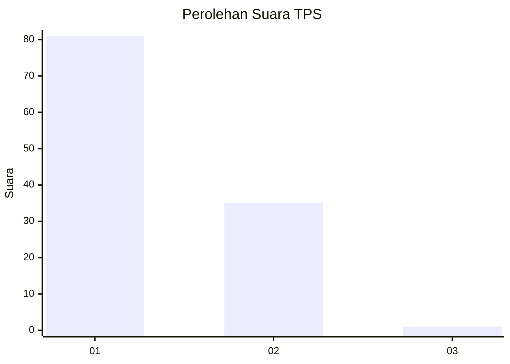
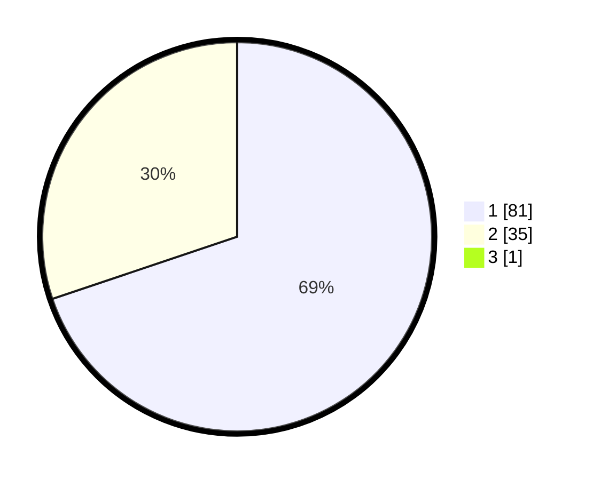

# Hasil

## Grafik

## Tabel

| No. | Nama Paslon    | Suara | Suara (raw) | Persentase |
|:--- |:-------------- | -----:| -----------:| ----------:|
| 1   | ANIES MUHAIMIN | 81    | [81][p-1]   | 69,23      |
| 2   | PRABOWO GIBRAN | 35    | [35][p-2]   | 29,91      |
| 3   | GANJAR MAHFUD  | 1     | [1][p-3]    | 0,85       |

[p-1]: https://github.com/gigit-pemilu/pemilu-2024-12-sumatera-utara/blob/main/pilpres/hitung-suara/sub/12-sumatera-utara/sub/13-mandailing-natal/sub/13-batang-natal/sub/2031-tor-naincat/sub/002-tps/sub/paslon-1.txt
[p-2]: https://github.com/gigit-pemilu/pemilu-2024-12-sumatera-utara/blob/main/pilpres/hitung-suara/sub/12-sumatera-utara/sub/13-mandailing-natal/sub/13-batang-natal/sub/2031-tor-naincat/sub/002-tps/sub/paslon-2.txt
[p-3]: https://github.com/gigit-pemilu/pemilu-2024-12-sumatera-utara/blob/main/pilpres/hitung-suara/sub/12-sumatera-utara/sub/13-mandailing-natal/sub/13-batang-natal/sub/2031-tor-naincat/sub/002-tps/sub/paslon-3.txt

## Foto C Plano

https://sirekap-obj-formc.kpu.go.id/e939/pemilu/ppwp/12/13/13/20/31/1213132031002-20240214-155253--88da7ba8-2898-4bf5-97d8-8c4be1e1fb07.jpg

https://sirekap-obj-formc.kpu.go.id/e939/pemilu/ppwp/12/13/13/20/31/1213132031002-20240214-155229--47b67688-4fd0-4a18-9d92-c24d5aa8ce84.jpg

https://sirekap-obj-formc.kpu.go.id/e939/pemilu/ppwp/12/13/13/20/31/1213132031002-20240214-155438--87f706e9-749b-49bd-baab-f7320eaa38bd.jpg

## Metadata

| Key        | Value               |
| ---------- | ------------------- |
| Time Stamp | 2024-02-14 21:46:01 |

