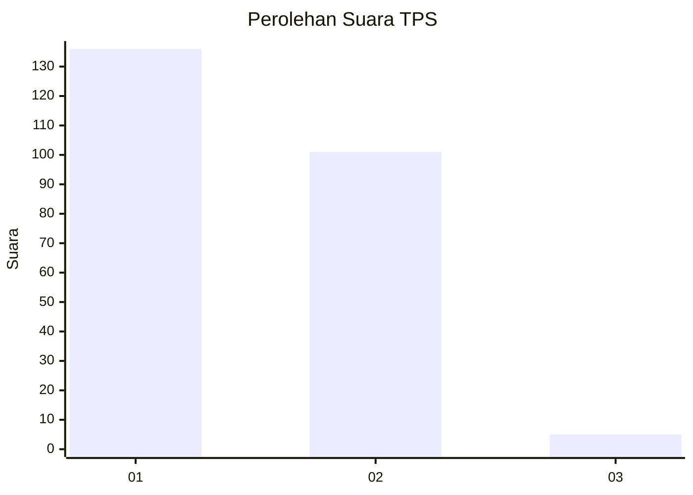
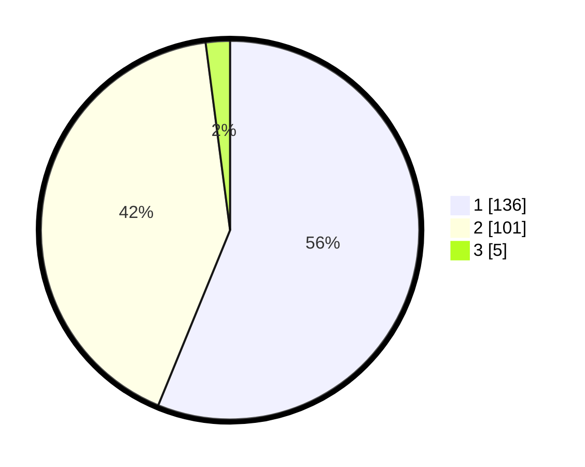

# Hasil

## Grafik

## Tabel

| No. | Nama Paslon    | Suara | Suara (raw) | Persentase |
|:--- |:-------------- | -----:| -----------:| ----------:|
| 1   | ANIES MUHAIMIN | 136   | [136][p-1]  | 56,20      |
| 2   | PRABOWO GIBRAN | 101   | [101][p-2]  | 41,74      |
| 3   | GANJAR MAHFUD  | 5     | [5][p-3]    | 2,07       |

[p-1]: https://github.com/gigit-pemilu/pemilu-2024-12-sumatera-utara/blob/main/pilpres/hitung-suara/sub/12-sumatera-utara/sub/13-mandailing-natal/sub/14-lingga-bayu/sub/1024-simpang-gambir/sub/001-tps/sub/paslon-1.txt
[p-2]: https://github.com/gigit-pemilu/pemilu-2024-12-sumatera-utara/blob/main/pilpres/hitung-suara/sub/12-sumatera-utara/sub/13-mandailing-natal/sub/14-lingga-bayu/sub/1024-simpang-gambir/sub/001-tps/sub/paslon-2.txt
[p-3]: https://github.com/gigit-pemilu/pemilu-2024-12-sumatera-utara/blob/main/pilpres/hitung-suara/sub/12-sumatera-utara/sub/13-mandailing-natal/sub/14-lingga-bayu/sub/1024-simpang-gambir/sub/001-tps/sub/paslon-3.txt

## Foto C Plano

https://sirekap-obj-formc.kpu.go.id/3e0d/pemilu/ppwp/12/13/14/10/24/1213141024001-20240215-073126--424f8293-483d-4bc7-a12e-1aec995e52f9.jpg

https://sirekap-obj-formc.kpu.go.id/3e0d/pemilu/ppwp/12/13/14/10/24/1213141024001-20240215-073257--a5975e35-7592-4fc5-af24-4f89719bc689.jpg

https://sirekap-obj-formc.kpu.go.id/3e0d/pemilu/ppwp/12/13/14/10/24/1213141024001-20240215-073413--0956f2f6-bb46-4338-a0a8-927c321f3db6.jpg

## Metadata

| Key        | Value               |
| ---------- | ------------------- |
| Time Stamp | 2024-02-15 23:29:50 |

