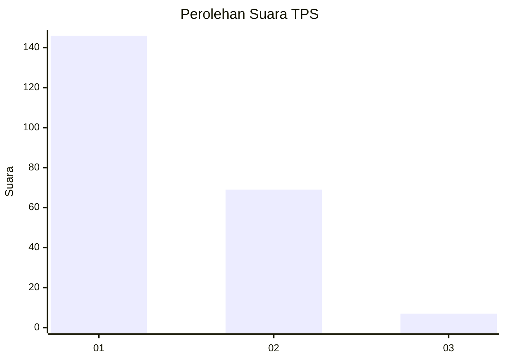
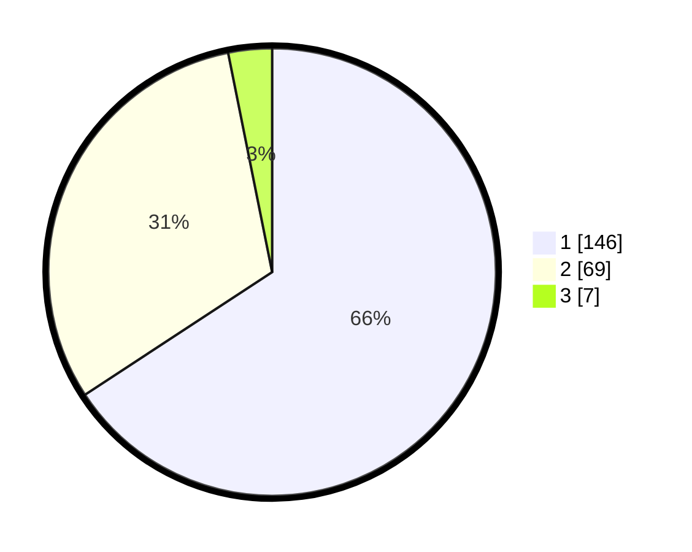

# Hasil

## Grafik

## Tabel

| No. | Nama Paslon    | Suara | Suara (raw) | Persentase |
|:--- |:-------------- | -----:| -----------:| ----------:|
| 1   | ANIES MUHAIMIN | 146   | [146][p-1]  | 65,77      |
| 2   | PRABOWO GIBRAN | 69    | [69][p-2]   | 31,08      |
| 3   | GANJAR MAHFUD  | 7     | [7][p-3]    | 3,15       |

[p-1]: https://github.com/gigit-pemilu/pemilu-2024/blob/main/pilpres/hitung-suara/sub/12-sumatera-utara/sub/13-mandailing-natal/sub/14-lingga-bayu/sub/1024-simpang-gambir/sub/004-tps/sub/paslon-1.txt
[p-2]: https://github.com/gigit-pemilu/pemilu-2024/blob/main/pilpres/hitung-suara/sub/12-sumatera-utara/sub/13-mandailing-natal/sub/14-lingga-bayu/sub/1024-simpang-gambir/sub/004-tps/sub/paslon-2.txt
[p-3]: https://github.com/gigit-pemilu/pemilu-2024/blob/main/pilpres/hitung-suara/sub/12-sumatera-utara/sub/13-mandailing-natal/sub/14-lingga-bayu/sub/1024-simpang-gambir/sub/004-tps/sub/paslon-3.txt

## Foto C Plano

https://sirekap-obj-formc.kpu.go.id/672d/pemilu/ppwp/12/13/14/10/24/1213141024004-20240215-040816--c879ade3-340f-423a-be83-95d91c590663.jpg

https://sirekap-obj-formc.kpu.go.id/672d/pemilu/ppwp/12/13/14/10/24/1213141024004-20240214-201125--266bb33c-b248-4790-abe9-24d266918529.jpg

https://sirekap-obj-formc.kpu.go.id/672d/pemilu/ppwp/12/13/14/10/24/1213141024004-20240214-201234--42bb9344-2a59-462e-886f-00f6ce9ea4c4.jpg

## Metadata

| Key        | Value               |
| ---------- | ------------------- |
| Time Stamp | 2024-02-15 07:00:44 |

