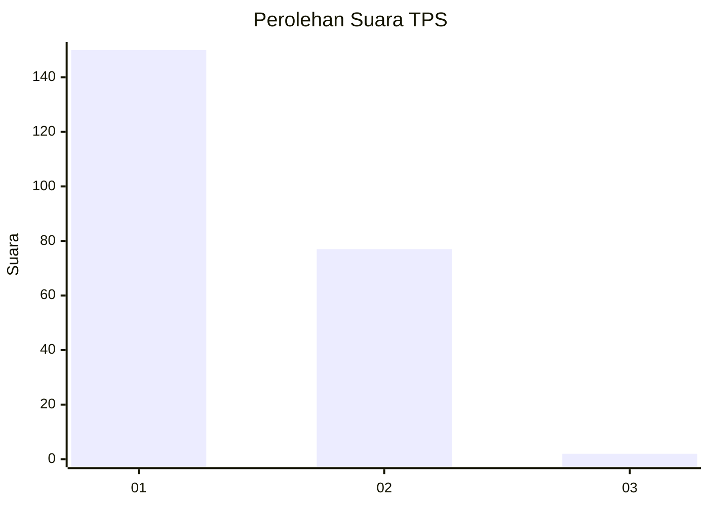
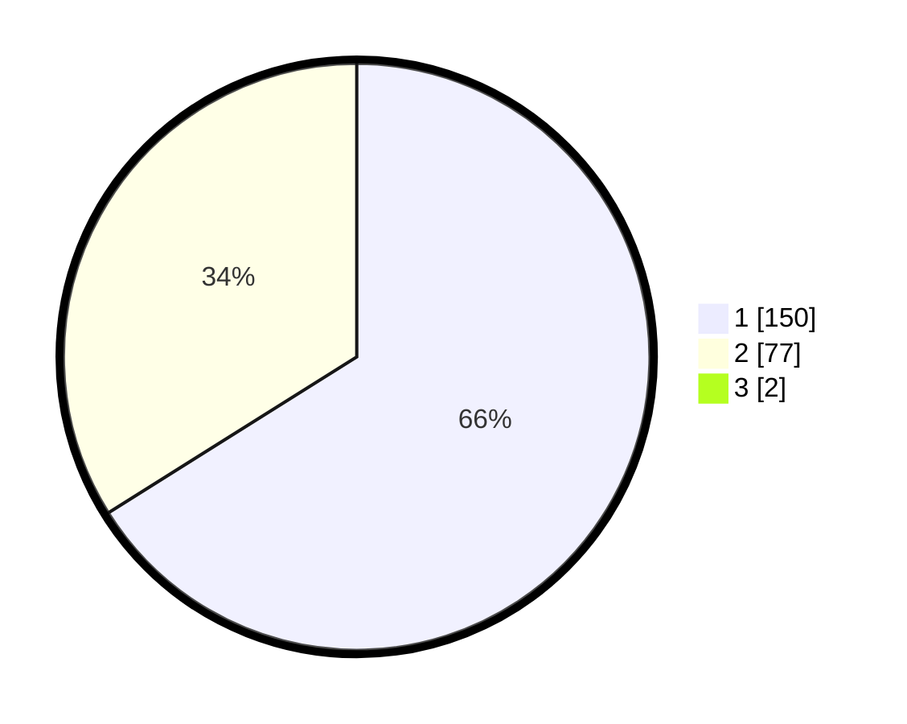

# Hasil

## Grafik

## Tabel

| No. | Nama Paslon    | Suara | Suara (raw) | Persentase |
|:--- |:-------------- | -----:| -----------:| ----------:|
| 1   | ANIES MUHAIMIN | 150   | [150][p-1]  | 65,50      |
| 2   | PRABOWO GIBRAN | 77    | [77][p-2]   | 33,62      |
| 3   | GANJAR MAHFUD  | 2     | [2][p-3]    | 0,87       |

[p-1]: https://github.com/gigit-pemilu/pemilu-2024/blob/main/pilpres/hitung-suara/sub/12-sumatera-utara/sub/13-mandailing-natal/sub/14-lingga-bayu/sub/2001-aek-garingging/sub/003-tps/sub/paslon-1.txt
[p-2]: https://github.com/gigit-pemilu/pemilu-2024/blob/main/pilpres/hitung-suara/sub/12-sumatera-utara/sub/13-mandailing-natal/sub/14-lingga-bayu/sub/2001-aek-garingging/sub/003-tps/sub/paslon-2.txt
[p-3]: https://github.com/gigit-pemilu/pemilu-2024/blob/main/pilpres/hitung-suara/sub/12-sumatera-utara/sub/13-mandailing-natal/sub/14-lingga-bayu/sub/2001-aek-garingging/sub/003-tps/sub/paslon-3.txt

## Foto C Plano

https://sirekap-obj-formc.kpu.go.id/0aa1/pemilu/ppwp/12/13/14/20/01/1213142001003-20240217-222754--41bd8df1-0090-4978-8c3d-9cac01fa1f82.jpg

https://sirekap-obj-formc.kpu.go.id/0aa1/pemilu/ppwp/12/13/14/20/01/1213142001003-20240217-223511--389215e8-82a7-4b5d-864c-b004465c3ef1.jpg

https://sirekap-obj-formc.kpu.go.id/0aa1/pemilu/ppwp/12/13/14/20/01/1213142001003-20240217-215209--f574c2bc-0ea9-457e-80f1-b2a95a63a009.jpg

## Metadata

| Key        | Value               |
| ---------- | ------------------- |
| Time Stamp | 2024-02-24 22:31:28 |

