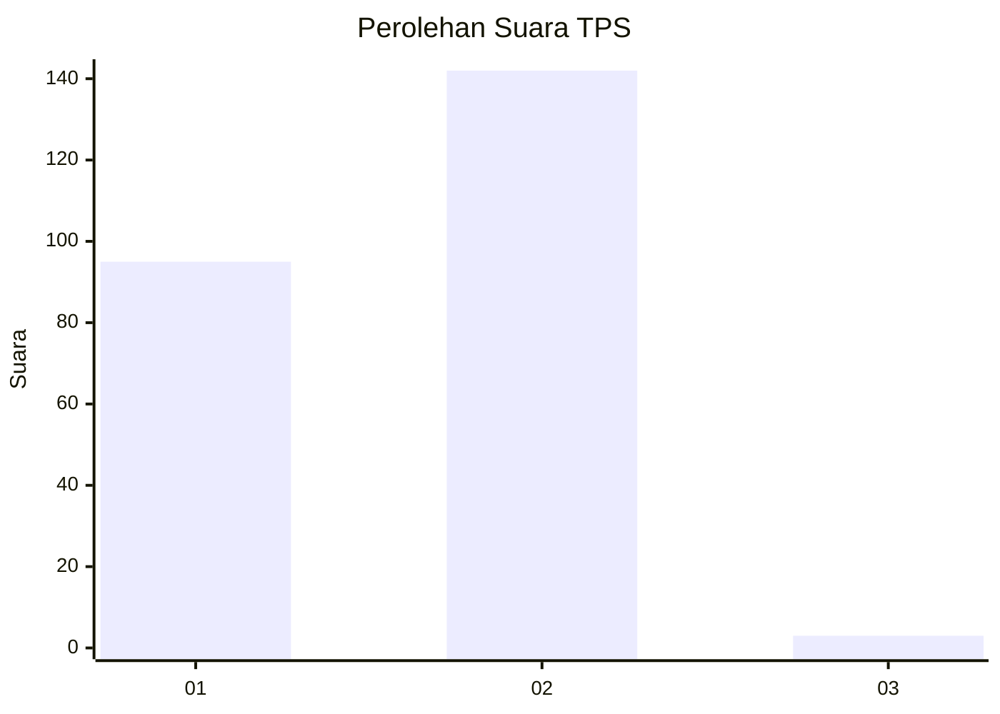
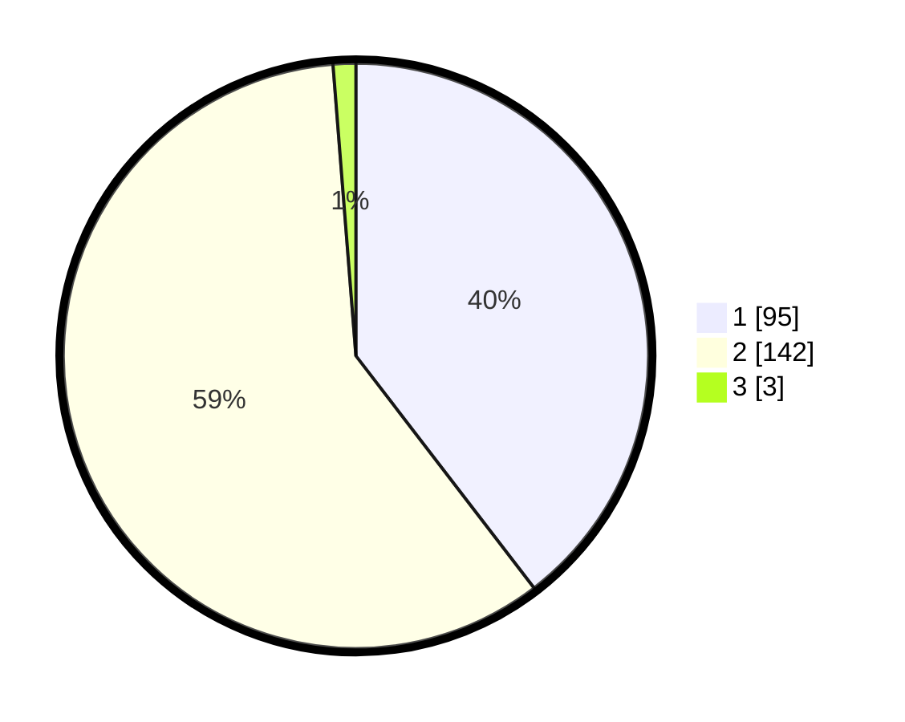

# Hasil

## Grafik

## Tabel

| No. | Nama Paslon    | Suara | Suara (raw) | Persentase |
|:--- |:-------------- | -----:| -----------:| ----------:|
| 1   | ANIES MUHAIMIN | 95    | [95][p-1]   | 39,58      |
| 2   | PRABOWO GIBRAN | 142   | [142][p-2]  | 59,17      |
| 3   | GANJAR MAHFUD  | 3     | [3][p-3]    | 1,25       |

[p-1]: https://github.com/gigit-pemilu/pemilu-2024/blob/main/pilpres/hitung-suara/sub/12-sumatera-utara/sub/13-mandailing-natal/sub/14-lingga-bayu/sub/2025-simpang-koje/sub/002-tps/sub/paslon-1.txt
[p-2]: https://github.com/gigit-pemilu/pemilu-2024/blob/main/pilpres/hitung-suara/sub/12-sumatera-utara/sub/13-mandailing-natal/sub/14-lingga-bayu/sub/2025-simpang-koje/sub/002-tps/sub/paslon-2.txt
[p-3]: https://github.com/gigit-pemilu/pemilu-2024/blob/main/pilpres/hitung-suara/sub/12-sumatera-utara/sub/13-mandailing-natal/sub/14-lingga-bayu/sub/2025-simpang-koje/sub/002-tps/sub/paslon-3.txt

## Foto C Plano

https://sirekap-obj-formc.kpu.go.id/b54e/pemilu/ppwp/12/13/14/20/25/1213142025002-20240216-151617--811ab953-c1de-4f52-bc13-f9efa72db5e8.jpg

https://sirekap-obj-formc.kpu.go.id/b54e/pemilu/ppwp/12/13/14/20/25/1213142025002-20240216-152033--44d12127-c36b-4b57-a058-a9a9c25a9e72.jpg

https://sirekap-obj-formc.kpu.go.id/b54e/pemilu/ppwp/12/13/14/20/25/1213142025002-20240216-150853--ff9afc00-b0a0-42a9-a3f7-cb01da88d165.jpg

## Metadata

| Key        | Value               |
| ---------- | ------------------- |
| Time Stamp | 2024-02-25 11:00:00 |

