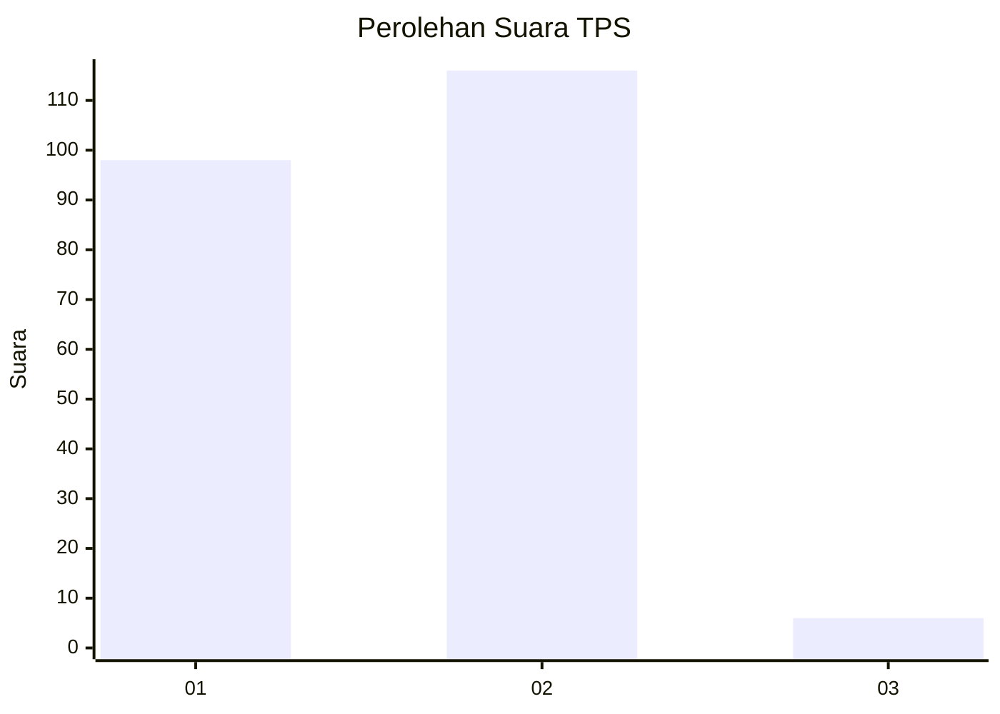
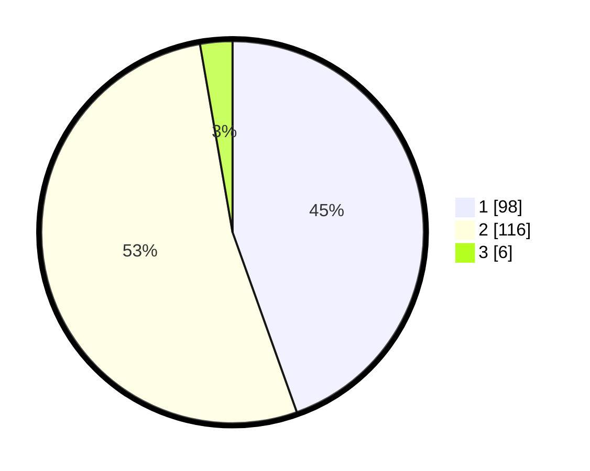

# Hasil

## Grafik

## Tabel

| No. | Nama Paslon    | Suara | Suara (raw) | Persentase |
|:--- |:-------------- | -----:| -----------:| ----------:|
| 1   | ANIES MUHAIMIN | 98    | [98][p-1]   | 44,55      |
| 2   | PRABOWO GIBRAN | 116   | [116][p-2]  | 52,73      |
| 3   | GANJAR MAHFUD  | 6     | [6][p-3]    | 2,73       |

[p-1]: https://github.com/gigit-pemilu/pemilu-2024/blob/main/pilpres/hitung-suara/sub/12-sumatera-utara/sub/13-mandailing-natal/sub/14-lingga-bayu/sub/2025-simpang-koje/sub/003-tps/sub/paslon-1.txt
[p-2]: https://github.com/gigit-pemilu/pemilu-2024/blob/main/pilpres/hitung-suara/sub/12-sumatera-utara/sub/13-mandailing-natal/sub/14-lingga-bayu/sub/2025-simpang-koje/sub/003-tps/sub/paslon-2.txt
[p-3]: https://github.com/gigit-pemilu/pemilu-2024/blob/main/pilpres/hitung-suara/sub/12-sumatera-utara/sub/13-mandailing-natal/sub/14-lingga-bayu/sub/2025-simpang-koje/sub/003-tps/sub/paslon-3.txt

## Foto C Plano

https://sirekap-obj-formc.kpu.go.id/998c/pemilu/ppwp/12/13/14/20/25/1213142025003-20240215-021256--879d02e6-8dd4-4fa4-a9cd-0cfbb4632ba1.jpg

https://sirekap-obj-formc.kpu.go.id/998c/pemilu/ppwp/12/13/14/20/25/1213142025003-20240215-021408--ccc80232-deea-4a03-b2df-ca530ed90cc8.jpg

https://sirekap-obj-formc.kpu.go.id/998c/pemilu/ppwp/12/13/14/20/25/1213142025003-20240215-021510--60f151e8-5a45-4773-a099-023a0015967d.jpg

## Metadata

| Key        | Value               |
| ---------- | ------------------- |
| Time Stamp | 2024-02-16 00:30:27 |

