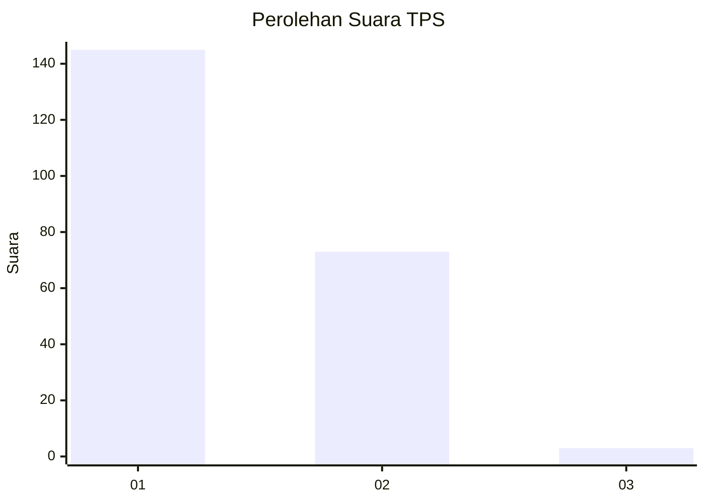
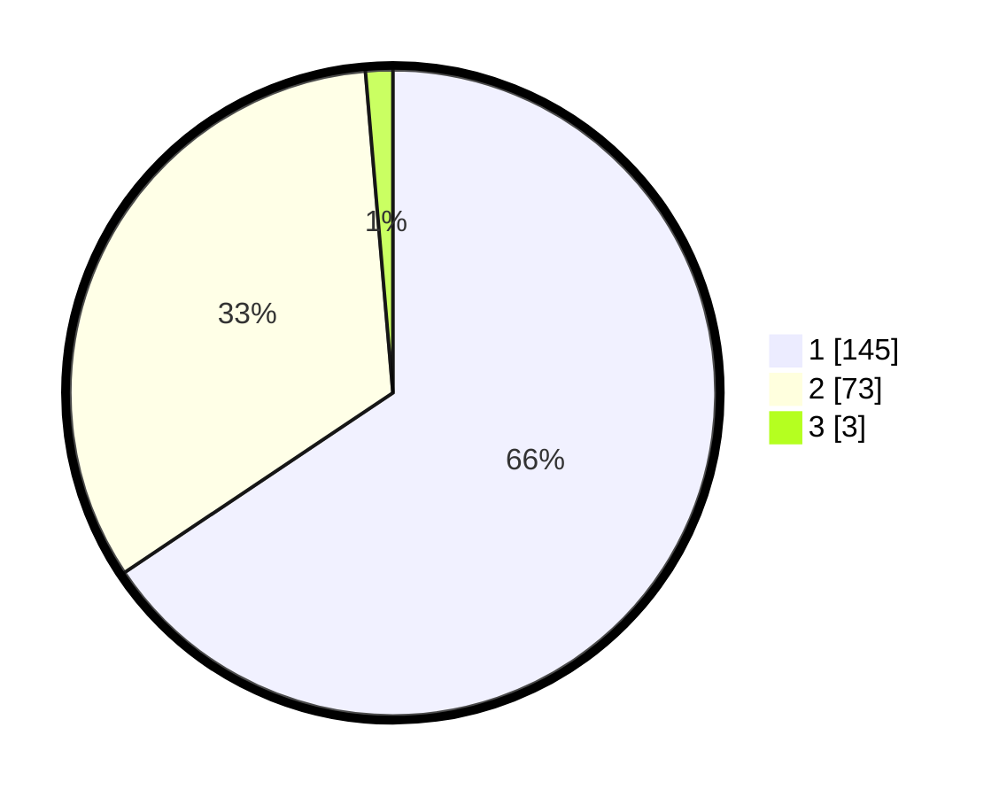

# Hasil

## Grafik

## Tabel

| No. | Nama Paslon    | Suara | Suara (raw) | Persentase |
|:--- |:-------------- | -----:| -----------:| ----------:|
| 1   | ANIES MUHAIMIN | 145   | [145][p-1]  | 65,61      |
| 2   | PRABOWO GIBRAN | 73    | [73][p-2]   | 33,03      |
| 3   | GANJAR MAHFUD  | 3     | [3][p-3]    | 1,36       |

[p-1]: https://github.com/gigit-pemilu/pemilu-2024-12-sumatera-utara/blob/main/pilpres/hitung-suara/sub/12-sumatera-utara/sub/13-mandailing-natal/sub/15-batahan/sub/1011-pasar-baru-batahan/sub/002-tps/sub/paslon-1.txt
[p-2]: https://github.com/gigit-pemilu/pemilu-2024-12-sumatera-utara/blob/main/pilpres/hitung-suara/sub/12-sumatera-utara/sub/13-mandailing-natal/sub/15-batahan/sub/1011-pasar-baru-batahan/sub/002-tps/sub/paslon-2.txt
[p-3]: https://github.com/gigit-pemilu/pemilu-2024-12-sumatera-utara/blob/main/pilpres/hitung-suara/sub/12-sumatera-utara/sub/13-mandailing-natal/sub/15-batahan/sub/1011-pasar-baru-batahan/sub/002-tps/sub/paslon-3.txt

## Foto C Plano

https://sirekap-obj-formc.kpu.go.id/b9d1/pemilu/ppwp/12/13/15/10/11/1213151011002-20240215-081814--b989f849-36c7-4a9c-827f-a2ebb3cd64ff.jpg

https://sirekap-obj-formc.kpu.go.id/b9d1/pemilu/ppwp/12/13/15/10/11/1213151011002-20240214-155446--a0c10fe2-54a9-43b3-b4c7-41e90fe204ba.jpg

https://sirekap-obj-formc.kpu.go.id/b9d1/pemilu/ppwp/12/13/15/10/11/1213151011002-20240214-155606--b34d702a-416b-4495-aa71-19843f7624cf.jpg

## Metadata

| Key        | Value               |
| ---------- | ------------------- |
| Time Stamp | 2024-02-15 23:29:50 |

