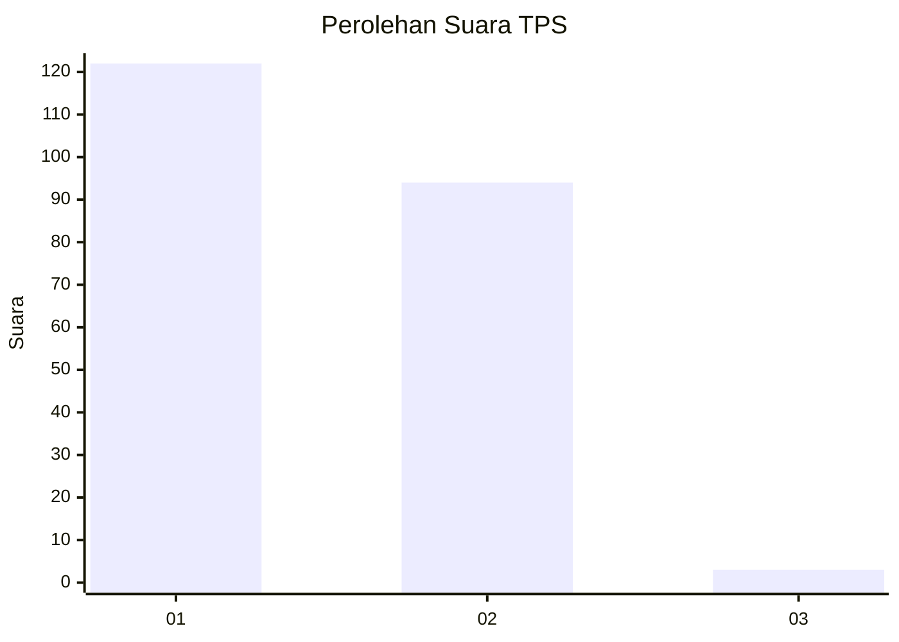
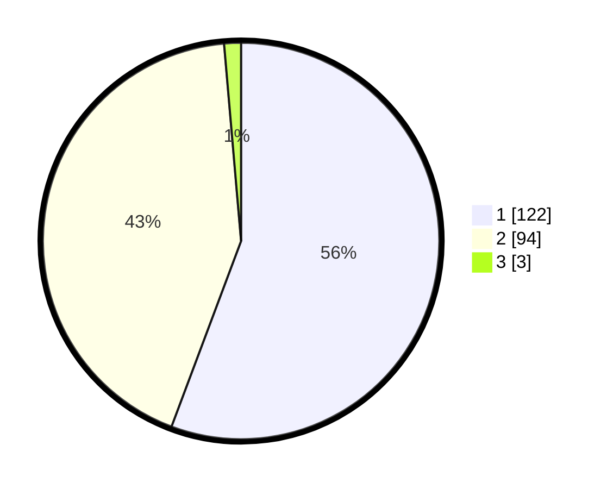

# Hasil

## Grafik

## Tabel

| No. | Nama Paslon    | Suara | Suara (raw) | Persentase |
|:--- |:-------------- | -----:| -----------:| ----------:|
| 1   | ANIES MUHAIMIN | 122   | [122][p-1]  | 55,71      |
| 2   | PRABOWO GIBRAN | 94    | [94][p-2]   | 42,92      |
| 3   | GANJAR MAHFUD  | 3     | [3][p-3]    | 1,37       |

[p-1]: https://github.com/gigit-pemilu/pemilu-2024-12-sumatera-utara/blob/main/pilpres/hitung-suara/sub/12-sumatera-utara/sub/13-mandailing-natal/sub/15-batahan/sub/2001-banjar-aur/sub/001-tps/sub/paslon-1.txt
[p-2]: https://github.com/gigit-pemilu/pemilu-2024-12-sumatera-utara/blob/main/pilpres/hitung-suara/sub/12-sumatera-utara/sub/13-mandailing-natal/sub/15-batahan/sub/2001-banjar-aur/sub/001-tps/sub/paslon-2.txt
[p-3]: https://github.com/gigit-pemilu/pemilu-2024-12-sumatera-utara/blob/main/pilpres/hitung-suara/sub/12-sumatera-utara/sub/13-mandailing-natal/sub/15-batahan/sub/2001-banjar-aur/sub/001-tps/sub/paslon-3.txt

## Foto C Plano

https://sirekap-obj-formc.kpu.go.id/ff94/pemilu/ppwp/12/13/15/20/01/1213152001001-20240214-201038--780e5837-22e3-4f87-94de-fe3fc0dc1f05.jpg

https://sirekap-obj-formc.kpu.go.id/ff94/pemilu/ppwp/12/13/15/20/01/1213152001001-20240214-201429--f3c9e4a3-88bb-437b-ad5a-9caae1bd3b3c.jpg

https://sirekap-obj-formc.kpu.go.id/ff94/pemilu/ppwp/12/13/15/20/01/1213152001001-20240214-202010--41e83521-e71c-4935-b13f-c9d0da6b31bb.jpg

## Metadata

| Key        | Value               |
| ---------- | ------------------- |
| Time Stamp | 2024-02-15 06:00:23 |

