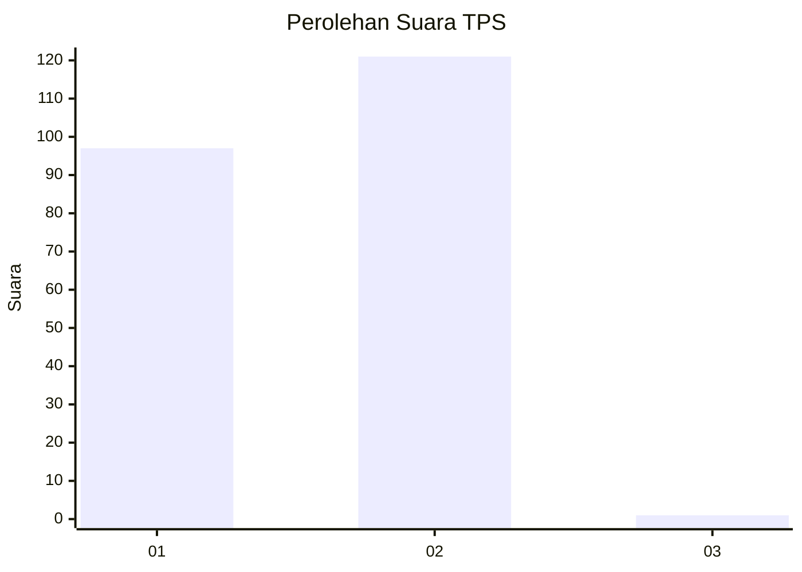
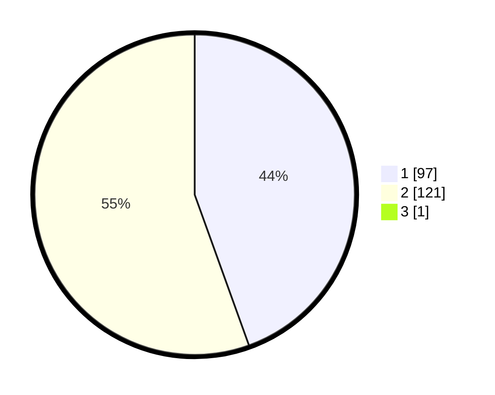

# Hasil

## Grafik

## Tabel

| No. | Nama Paslon    | Suara | Suara (raw) | Persentase |
|:--- |:-------------- | -----:| -----------:| ----------:|
| 1   | ANIES MUHAIMIN | 97    | [97][p-1]   | 44,29      |
| 2   | PRABOWO GIBRAN | 121   | [121][p-2]  | 55,25      |
| 3   | GANJAR MAHFUD  | 1     | [1][p-3]    | 0,46       |

[p-1]: https://github.com/gigit-pemilu/pemilu-2024/blob/main/pilpres/hitung-suara/sub/12-sumatera-utara/sub/13-mandailing-natal/sub/15-batahan/sub/2001-banjar-aur/sub/002-tps/sub/paslon-1.txt
[p-2]: https://github.com/gigit-pemilu/pemilu-2024/blob/main/pilpres/hitung-suara/sub/12-sumatera-utara/sub/13-mandailing-natal/sub/15-batahan/sub/2001-banjar-aur/sub/002-tps/sub/paslon-2.txt
[p-3]: https://github.com/gigit-pemilu/pemilu-2024/blob/main/pilpres/hitung-suara/sub/12-sumatera-utara/sub/13-mandailing-natal/sub/15-batahan/sub/2001-banjar-aur/sub/002-tps/sub/paslon-3.txt

## Foto C Plano

https://sirekap-obj-formc.kpu.go.id/c508/pemilu/ppwp/12/13/15/20/01/1213152001002-20240215-082037--632bba7e-1968-4055-b210-89983d878a87.jpg

https://sirekap-obj-formc.kpu.go.id/c508/pemilu/ppwp/12/13/15/20/01/1213152001002-20240215-082102--d4fb89c4-1a2d-4628-a37c-a9047eb932b6.jpg

https://sirekap-obj-formc.kpu.go.id/c508/pemilu/ppwp/12/13/15/20/01/1213152001002-20240215-082120--0c7af6a7-6eeb-475a-af21-4a60e7d53d6a.jpg

## Metadata

| Key        | Value               |
| ---------- | ------------------- |
| Time Stamp | 2024-02-17 02:00:02 |

