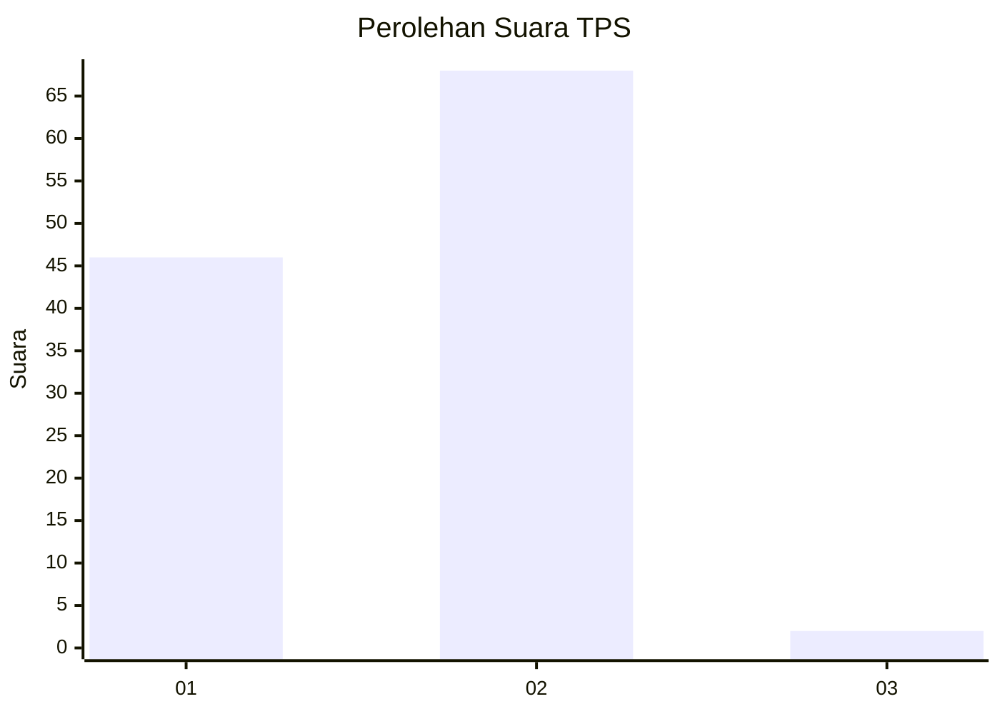
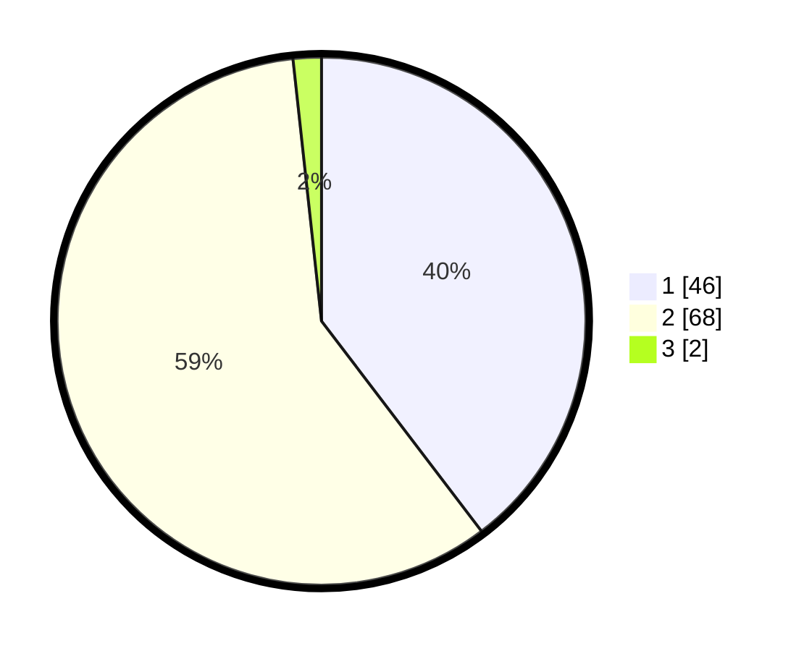

# Hasil

## Grafik

## Tabel

| No. | Nama Paslon    | Suara | Suara (raw) | Persentase |
|:--- |:-------------- | -----:| -----------:| ----------:|
| 1   | ANIES MUHAIMIN | 46    | [46][p-1]   | 39,66      |
| 2   | PRABOWO GIBRAN | 68    | [68][p-2]   | 58,62      |
| 3   | GANJAR MAHFUD  | 2     | [2][p-3]    | 1,72       |

[p-1]: https://github.com/gigit-pemilu/pemilu-2024-12-sumatera-utara/blob/main/pilpres/hitung-suara/sub/12-sumatera-utara/sub/13-mandailing-natal/sub/15-batahan/sub/2004-batu-sondat/sub/005-tps/sub/paslon-1.txt
[p-2]: https://github.com/gigit-pemilu/pemilu-2024-12-sumatera-utara/blob/main/pilpres/hitung-suara/sub/12-sumatera-utara/sub/13-mandailing-natal/sub/15-batahan/sub/2004-batu-sondat/sub/005-tps/sub/paslon-2.txt
[p-3]: https://github.com/gigit-pemilu/pemilu-2024-12-sumatera-utara/blob/main/pilpres/hitung-suara/sub/12-sumatera-utara/sub/13-mandailing-natal/sub/15-batahan/sub/2004-batu-sondat/sub/005-tps/sub/paslon-3.txt

## Foto C Plano

https://sirekap-obj-formc.kpu.go.id/e92b/pemilu/ppwp/12/13/15/20/04/1213152004005-20240214-224558--deeb562a-3660-4a19-bfc8-b156c8a5739c.jpg

https://sirekap-obj-formc.kpu.go.id/e92b/pemilu/ppwp/12/13/15/20/04/1213152004005-20240214-225134--8d59632e-70e6-4dec-a5c4-5882c8d4dbb1.jpg

https://sirekap-obj-formc.kpu.go.id/e92b/pemilu/ppwp/12/13/15/20/04/1213152004005-20240214-225322--8d87322a-eb1b-4b34-9ded-4dd7f9137796.jpg

## Metadata

| Key        | Value               |
| ---------- | ------------------- |
| Time Stamp | 2024-02-15 23:29:50 |

