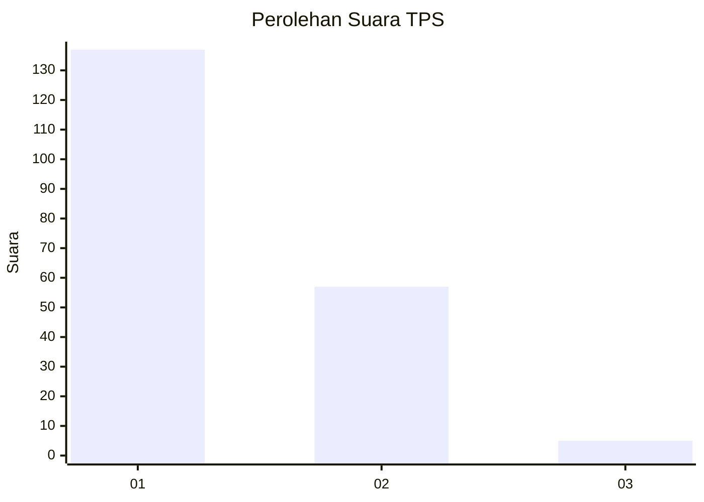
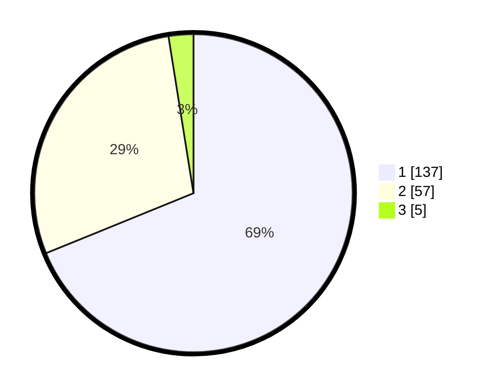

# Hasil

## Grafik

## Tabel

| No. | Nama Paslon    | Suara | Suara (raw) | Persentase |
|:--- |:-------------- | -----:| -----------:| ----------:|
| 1   | ANIES MUHAIMIN | 137   | [137][p-1]  | 68,84      |
| 2   | PRABOWO GIBRAN | 57    | [57][p-2]   | 28,64      |
| 3   | GANJAR MAHFUD  | 5     | [5][p-3]    | 2,51       |

[p-1]: https://github.com/gigit-pemilu/pemilu-2024-12-sumatera-utara/blob/main/pilpres/hitung-suara/sub/12-sumatera-utara/sub/13-mandailing-natal/sub/16-natal/sub/1008-pasar-ii-natal/sub/001-tps/sub/paslon-1.txt
[p-2]: https://github.com/gigit-pemilu/pemilu-2024-12-sumatera-utara/blob/main/pilpres/hitung-suara/sub/12-sumatera-utara/sub/13-mandailing-natal/sub/16-natal/sub/1008-pasar-ii-natal/sub/001-tps/sub/paslon-2.txt
[p-3]: https://github.com/gigit-pemilu/pemilu-2024-12-sumatera-utara/blob/main/pilpres/hitung-suara/sub/12-sumatera-utara/sub/13-mandailing-natal/sub/16-natal/sub/1008-pasar-ii-natal/sub/001-tps/sub/paslon-3.txt

## Foto C Plano

https://sirekap-obj-formc.kpu.go.id/5fbc/pemilu/ppwp/12/13/16/10/08/1213161008001-20240214-231419--77b7b005-f46c-4d4d-aef3-798ea6e7e903.jpg

https://sirekap-obj-formc.kpu.go.id/5fbc/pemilu/ppwp/12/13/16/10/08/1213161008001-20240215-063037--6d013703-3728-47eb-82b3-9998a08f8d98.jpg

https://sirekap-obj-formc.kpu.go.id/5fbc/pemilu/ppwp/12/13/16/10/08/1213161008001-20240215-063214--138a83a3-cfa4-4e90-a821-8278aad33e1b.jpg

## Metadata

| Key        | Value               |
| ---------- | ------------------- |
| Time Stamp | 2024-02-15 23:29:50 |

