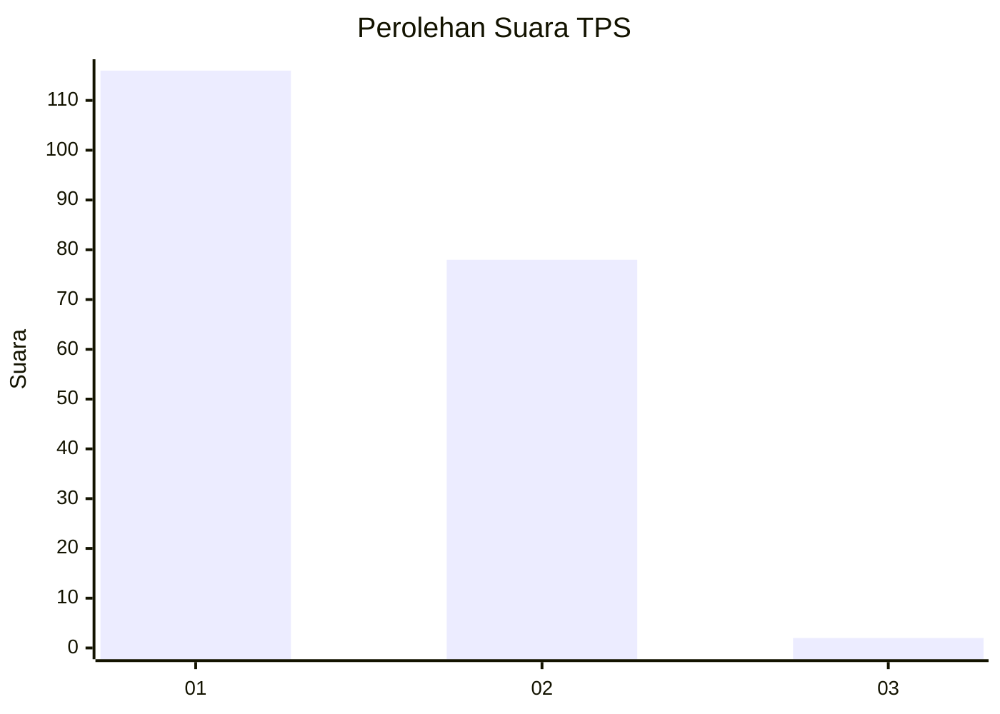
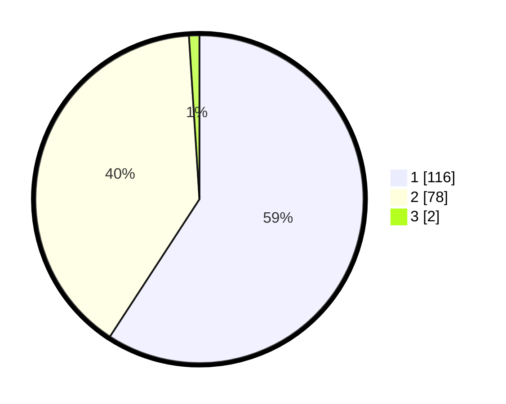

# Hasil

## Grafik

## Tabel

| No. | Nama Paslon    | Suara | Suara (raw) | Persentase |
|:--- |:-------------- | -----:| -----------:| ----------:|
| 1   | ANIES MUHAIMIN | 116   | [116][p-1]  | 59,18      |
| 2   | PRABOWO GIBRAN | 78    | [78][p-2]   | 39,80      |
| 3   | GANJAR MAHFUD  | 2     | [2][p-3]    | 1,02       |

[p-1]: https://github.com/gigit-pemilu/pemilu-2024-12-sumatera-utara/blob/main/pilpres/hitung-suara/sub/12-sumatera-utara/sub/13-mandailing-natal/sub/16-natal/sub/1008-pasar-ii-natal/sub/003-tps/sub/paslon-1.txt
[p-2]: https://github.com/gigit-pemilu/pemilu-2024-12-sumatera-utara/blob/main/pilpres/hitung-suara/sub/12-sumatera-utara/sub/13-mandailing-natal/sub/16-natal/sub/1008-pasar-ii-natal/sub/003-tps/sub/paslon-2.txt
[p-3]: https://github.com/gigit-pemilu/pemilu-2024-12-sumatera-utara/blob/main/pilpres/hitung-suara/sub/12-sumatera-utara/sub/13-mandailing-natal/sub/16-natal/sub/1008-pasar-ii-natal/sub/003-tps/sub/paslon-3.txt

## Foto C Plano

https://sirekap-obj-formc.kpu.go.id/5ba3/pemilu/ppwp/12/13/16/10/08/1213161008003-20240219-105005--9cec12c4-a0d8-4524-aee0-a40e4897303e.jpg

https://sirekap-obj-formc.kpu.go.id/5ba3/pemilu/ppwp/12/13/16/10/08/1213161008003-20240219-105552--ddfbe5cd-7961-4ac1-9cee-44add5ea9a71.jpg

https://sirekap-obj-formc.kpu.go.id/5ba3/pemilu/ppwp/12/13/16/10/08/1213161008003-20240219-105724--39482ce8-aeba-4f34-8a59-6fe3c843a351.jpg

## Metadata

| Key        | Value               |
| ---------- | ------------------- |
| Time Stamp | 2024-02-24 22:31:28 |

