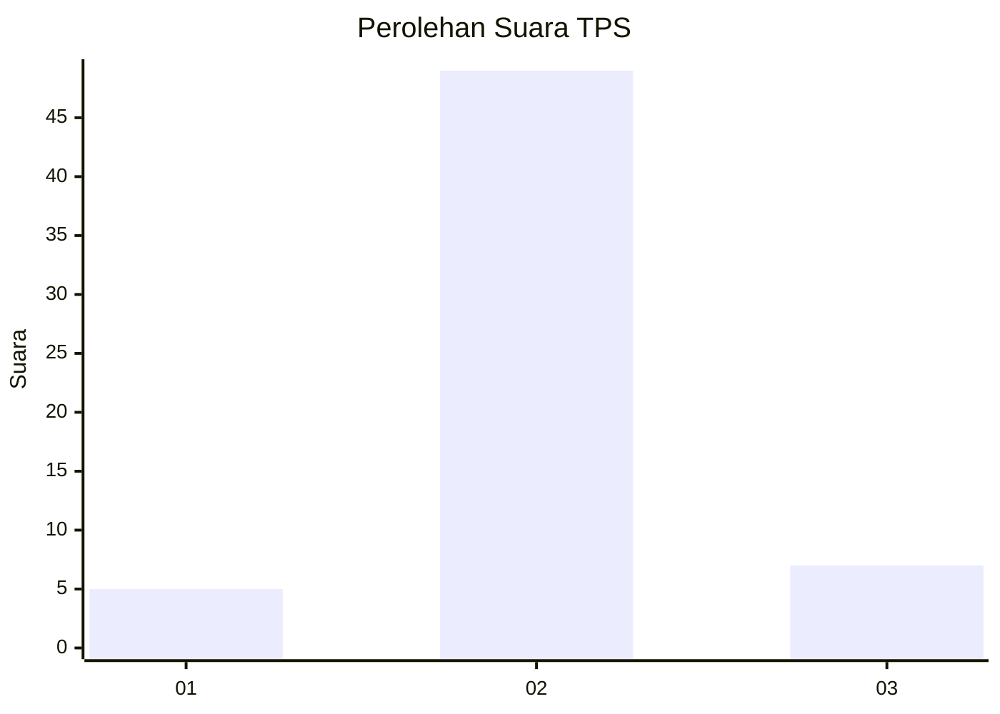
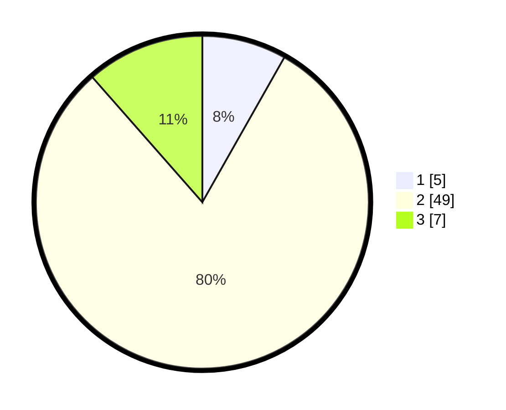

# Hasil

## Grafik

## Tabel

| No. | Nama Paslon    | Suara | Suara (raw) | Persentase |
|:--- |:-------------- | -----:| -----------:| ----------:|
| 1   | ANIES MUHAIMIN | 5     | [5][p-1]    | 8,20       |
| 2   | PRABOWO GIBRAN | 49    | [49][p-2]   | 80,33      |
| 3   | GANJAR MAHFUD  | 7     | [7][p-3]    | 11,48      |

[p-1]: https://github.com/gigit-pemilu/pemilu-2024/blob/main/pilpres/hitung-suara/sub/12-sumatera-utara/sub/13-mandailing-natal/sub/16-natal/sub/1008-pasar-ii-natal/sub/901-tps/sub/paslon-1.txt
[p-2]: https://github.com/gigit-pemilu/pemilu-2024/blob/main/pilpres/hitung-suara/sub/12-sumatera-utara/sub/13-mandailing-natal/sub/16-natal/sub/1008-pasar-ii-natal/sub/901-tps/sub/paslon-2.txt
[p-3]: https://github.com/gigit-pemilu/pemilu-2024/blob/main/pilpres/hitung-suara/sub/12-sumatera-utara/sub/13-mandailing-natal/sub/16-natal/sub/1008-pasar-ii-natal/sub/901-tps/sub/paslon-3.txt

## Foto C Plano

https://sirekap-obj-formc.kpu.go.id/9f26/pemilu/ppwp/12/13/16/10/08/1213161008901-20240214-232719--70ba918d-ca46-468a-9148-26624e6714a7.jpg

https://sirekap-obj-formc.kpu.go.id/9f26/pemilu/ppwp/12/13/16/10/08/1213161008901-20240214-232412--823237ee-452e-472c-9b72-c281a953b5e4.jpg

https://sirekap-obj-formc.kpu.go.id/9f26/pemilu/ppwp/12/13/16/10/08/1213161008901-20240214-232518--0f95789b-95eb-4811-9386-476e7a90f735.jpg

## Metadata

| Key        | Value               |
| ---------- | ------------------- |
| Time Stamp | 2024-02-15 23:29:50 |

