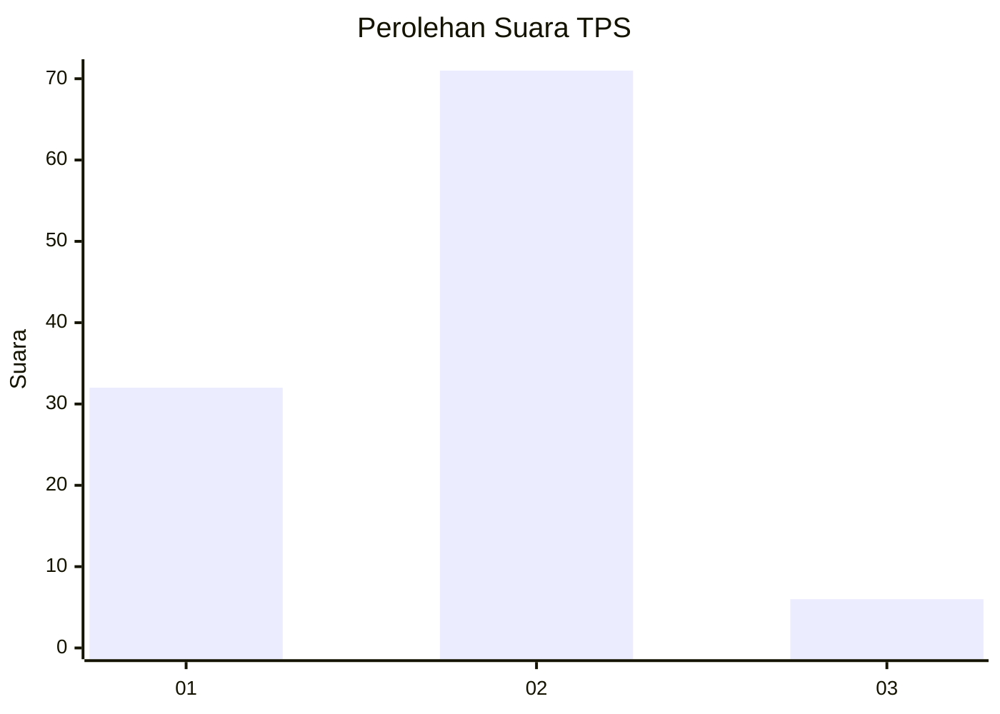
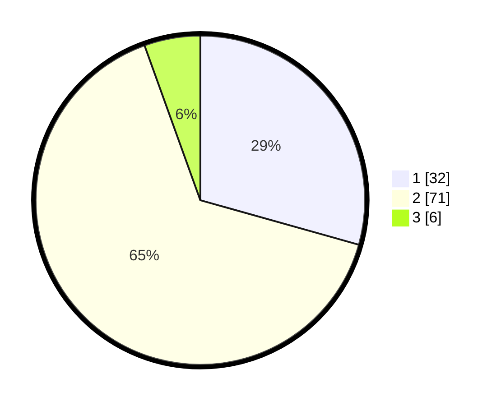

# Hasil

## Grafik

## Tabel

| No. | Nama Paslon    | Suara | Suara (raw) | Persentase |
|:--- |:-------------- | -----:| -----------:| ----------:|
| 1   | ANIES MUHAIMIN | 32    | [32][p-1]   | 29,36      |
| 2   | PRABOWO GIBRAN | 71    | [71][p-2]   | 65,14      |
| 3   | GANJAR MAHFUD  | 6     | [6][p-3]    | 5,50       |

[p-1]: https://github.com/gigit-pemilu/pemilu-2024/blob/main/pilpres/hitung-suara/sub/12-sumatera-utara/sub/13-mandailing-natal/sub/16-natal/sub/2013-perkebunan-patiluban/sub/001-tps/sub/paslon-1.txt
[p-2]: https://github.com/gigit-pemilu/pemilu-2024/blob/main/pilpres/hitung-suara/sub/12-sumatera-utara/sub/13-mandailing-natal/sub/16-natal/sub/2013-perkebunan-patiluban/sub/001-tps/sub/paslon-2.txt
[p-3]: https://github.com/gigit-pemilu/pemilu-2024/blob/main/pilpres/hitung-suara/sub/12-sumatera-utara/sub/13-mandailing-natal/sub/16-natal/sub/2013-perkebunan-patiluban/sub/001-tps/sub/paslon-3.txt

## Foto C Plano

https://sirekap-obj-formc.kpu.go.id/0a88/pemilu/ppwp/12/13/16/20/13/1213162013001-20240214-220910--dd85e03b-8528-445a-a604-84af4aba7f3d.jpg

https://sirekap-obj-formc.kpu.go.id/0a88/pemilu/ppwp/12/13/16/20/13/1213162013001-20240214-221053--07e0e596-b252-4b92-a4bc-8dca57c6c391.jpg

https://sirekap-obj-formc.kpu.go.id/0a88/pemilu/ppwp/12/13/16/20/13/1213162013001-20240214-221219--7e52510c-fa9d-4c25-b078-c3676b719fb2.jpg

## Metadata

| Key        | Value               |
| ---------- | ------------------- |
| Time Stamp | 2024-02-15 23:29:50 |

