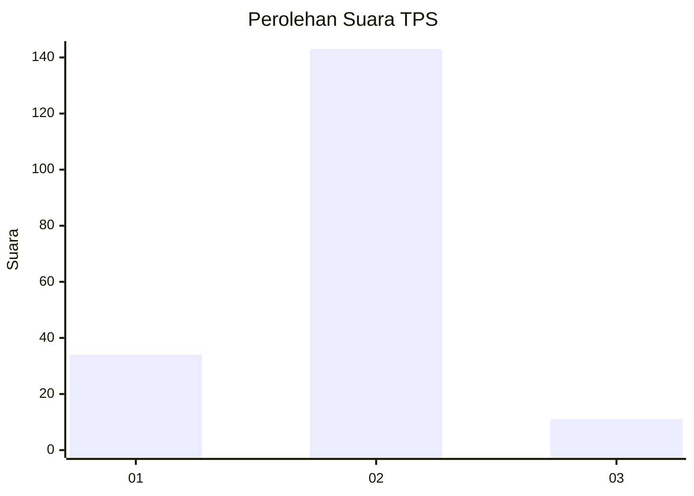
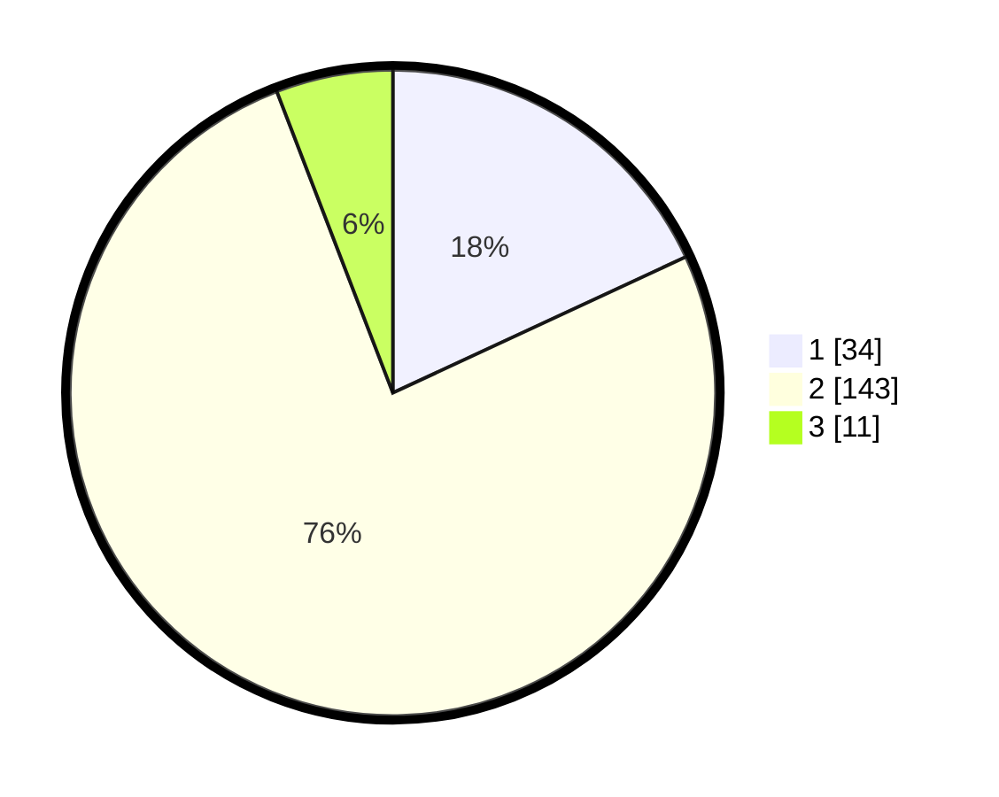

# Hasil

## Grafik

## Tabel

| No. | Nama Paslon    | Suara | Suara (raw) | Persentase |
|:--- |:-------------- | -----:| -----------:| ----------:|
| 1   | ANIES MUHAIMIN | 34    | [34][p-1]   | 18,09      |
| 2   | PRABOWO GIBRAN | 143   | [143][p-2]  | 76,06      |
| 3   | GANJAR MAHFUD  | 11    | [11][p-3]   | 5,85       |

[p-1]: https://github.com/gigit-pemilu/pemilu-2024/blob/main/pilpres/hitung-suara/sub/12-sumatera-utara/sub/13-mandailing-natal/sub/16-natal/sub/2017-sikara-kara-i/sub/003-tps/sub/paslon-1.txt
[p-2]: https://github.com/gigit-pemilu/pemilu-2024/blob/main/pilpres/hitung-suara/sub/12-sumatera-utara/sub/13-mandailing-natal/sub/16-natal/sub/2017-sikara-kara-i/sub/003-tps/sub/paslon-2.txt
[p-3]: https://github.com/gigit-pemilu/pemilu-2024/blob/main/pilpres/hitung-suara/sub/12-sumatera-utara/sub/13-mandailing-natal/sub/16-natal/sub/2017-sikara-kara-i/sub/003-tps/sub/paslon-3.txt

## Foto C Plano

https://sirekap-obj-formc.kpu.go.id/61a3/pemilu/ppwp/12/13/16/20/17/1213162017003-20240215-004534--4d7e1deb-5e19-4e05-8c55-8b41d466dca6.jpg

https://sirekap-obj-formc.kpu.go.id/61a3/pemilu/ppwp/12/13/16/20/17/1213162017003-20240215-003205--bc063431-58a8-4fac-b8be-0e6a8e17c79f.jpg

https://sirekap-obj-formc.kpu.go.id/61a3/pemilu/ppwp/12/13/16/20/17/1213162017003-20240215-003250--9b44c826-87a7-4cda-a2bf-20b71260edc8.jpg

## Metadata

| Key        | Value               |
| ---------- | ------------------- |
| Time Stamp | 2024-02-16 00:00:26 |

