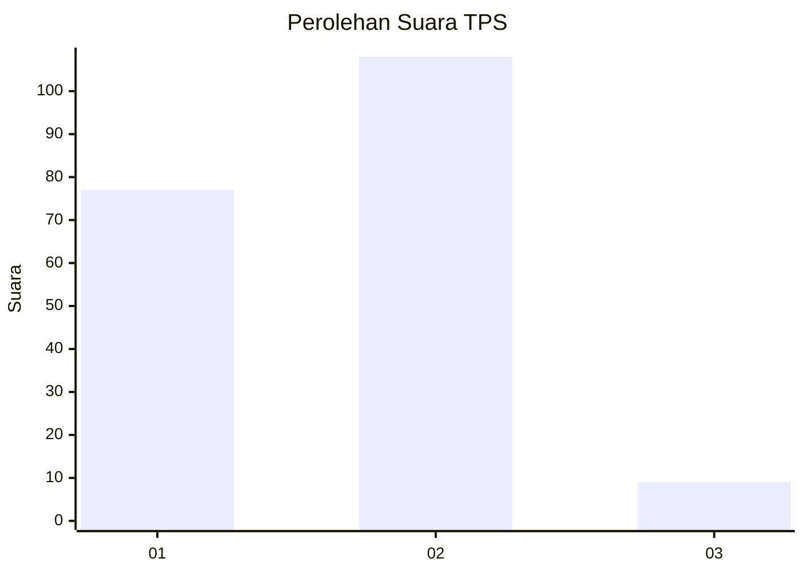
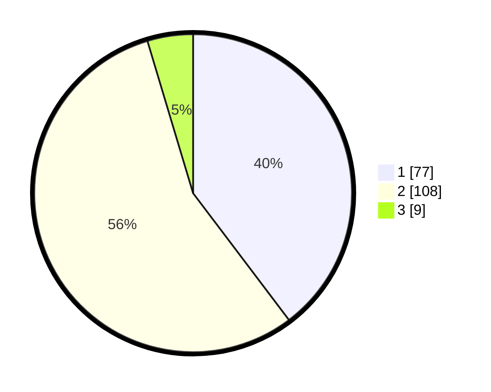

# Hasil

## Grafik

## Tabel

| No. | Nama Paslon    | Suara | Suara (raw) | Persentase |
|:--- |:-------------- | -----:| -----------:| ----------:|
| 1   | ANIES MUHAIMIN | 77    | [77][p-1]   | 39,69      |
| 2   | PRABOWO GIBRAN | 108   | [108][p-2]  | 55,67      |
| 3   | GANJAR MAHFUD  | 9     | [9][p-3]    | 4,64       |

[p-1]: https://github.com/gigit-pemilu/pemilu-2024/blob/main/pilpres/hitung-suara/sub/12-sumatera-utara/sub/13-mandailing-natal/sub/17-muara-batang-gadis/sub/2006-pasar-singkuang-i/sub/001-tps/sub/paslon-1.txt
[p-2]: https://github.com/gigit-pemilu/pemilu-2024/blob/main/pilpres/hitung-suara/sub/12-sumatera-utara/sub/13-mandailing-natal/sub/17-muara-batang-gadis/sub/2006-pasar-singkuang-i/sub/001-tps/sub/paslon-2.txt
[p-3]: https://github.com/gigit-pemilu/pemilu-2024/blob/main/pilpres/hitung-suara/sub/12-sumatera-utara/sub/13-mandailing-natal/sub/17-muara-batang-gadis/sub/2006-pasar-singkuang-i/sub/001-tps/sub/paslon-3.txt

## Foto C Plano

https://sirekap-obj-formc.kpu.go.id/13c4/pemilu/ppwp/12/13/17/20/06/1213172006001-20240215-083340--1aded41c-b6e2-4408-87aa-c315eb0e228b.jpg

https://sirekap-obj-formc.kpu.go.id/13c4/pemilu/ppwp/12/13/17/20/06/1213172006001-20240215-083511--95cc80e5-9f5d-4dc9-869d-1ed4e8a8014c.jpg

https://sirekap-obj-formc.kpu.go.id/13c4/pemilu/ppwp/12/13/17/20/06/1213172006001-20240215-083636--7ddb397c-0c93-43f4-ae0c-0626afbe2a04.jpg

## Metadata

| Key        | Value               |
| ---------- | ------------------- |
| Time Stamp | 2024-02-15 23:29:50 |

