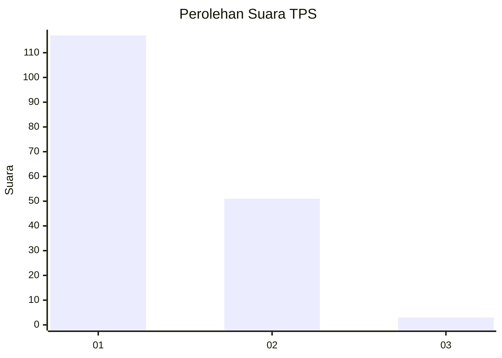
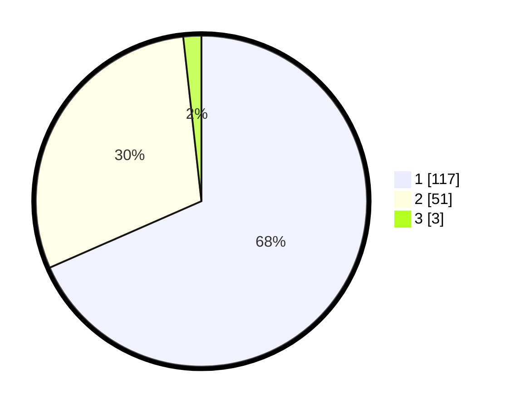

# Hasil

## Grafik

## Tabel

| No. | Nama Paslon    | Suara | Suara (raw) | Persentase |
|:--- |:-------------- | -----:| -----------:| ----------:|
| 1   | ANIES MUHAIMIN | 117   | [117][p-1]  | 68,42      |
| 2   | PRABOWO GIBRAN | 51    | [51][p-2]   | 29,82      |
| 3   | GANJAR MAHFUD  | 3     | [3][p-3]    | 1,75       |

[p-1]: https://github.com/gigit-pemilu/pemilu-2024-12-sumatera-utara/blob/main/pilpres/hitung-suara/sub/12-sumatera-utara/sub/13-mandailing-natal/sub/18-ranto-baek/sub/2003-sampuran/sub/001-tps/sub/paslon-1.txt
[p-2]: https://github.com/gigit-pemilu/pemilu-2024-12-sumatera-utara/blob/main/pilpres/hitung-suara/sub/12-sumatera-utara/sub/13-mandailing-natal/sub/18-ranto-baek/sub/2003-sampuran/sub/001-tps/sub/paslon-2.txt
[p-3]: https://github.com/gigit-pemilu/pemilu-2024-12-sumatera-utara/blob/main/pilpres/hitung-suara/sub/12-sumatera-utara/sub/13-mandailing-natal/sub/18-ranto-baek/sub/2003-sampuran/sub/001-tps/sub/paslon-3.txt

## Foto C Plano

https://sirekap-obj-formc.kpu.go.id/01db/pemilu/ppwp/12/13/18/20/03/1213182003001-20240215-102009--27598c45-9a8c-48aa-b59e-8c1289743076.jpg

https://sirekap-obj-formc.kpu.go.id/01db/pemilu/ppwp/12/13/18/20/03/1213182003001-20240215-102802--f51accfd-0f2c-4337-ad0e-6704e2d36706.jpg

https://sirekap-obj-formc.kpu.go.id/01db/pemilu/ppwp/12/13/18/20/03/1213182003001-20240215-074456--08ce525b-1d0f-4618-b158-9b14cd1143b6.jpg

## Metadata

| Key        | Value               |
| ---------- | ------------------- |
| Time Stamp | 2024-02-15 23:29:50 |

