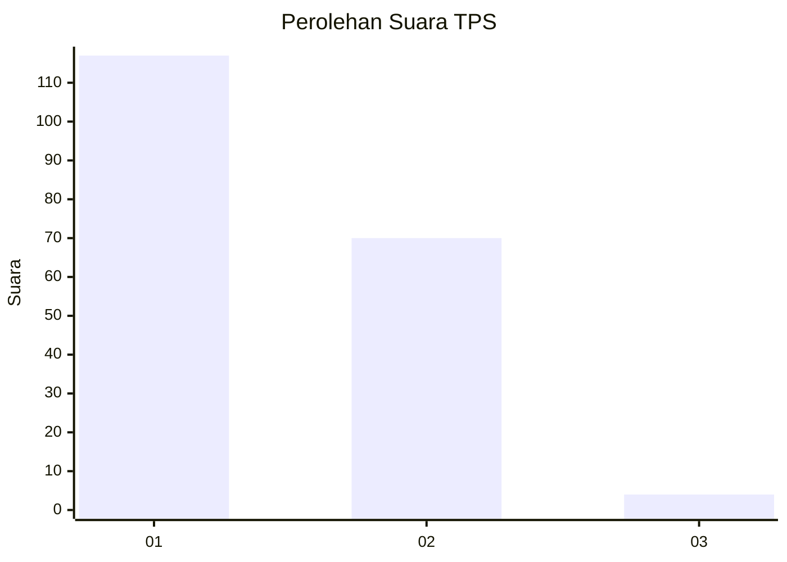
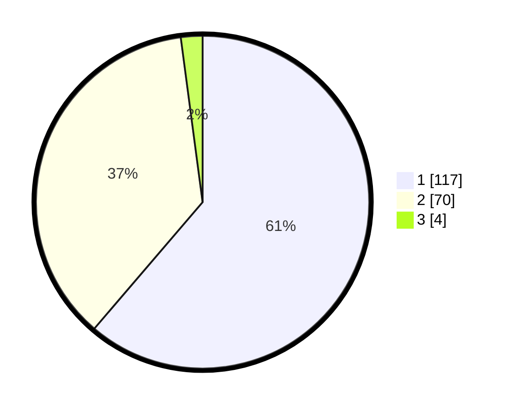

# Hasil

## Grafik

## Tabel

| No. | Nama Paslon    | Suara | Suara (raw) | Persentase |
|:--- |:-------------- | -----:| -----------:| ----------:|
| 1   | ANIES MUHAIMIN | 117   | [117][p-1]  | 61,26      |
| 2   | PRABOWO GIBRAN | 70    | [70][p-2]   | 36,65      |
| 3   | GANJAR MAHFUD  | 4     | [4][p-3]    | 2,09       |

[p-1]: https://github.com/gigit-pemilu/pemilu-2024/blob/main/pilpres/hitung-suara/sub/12-sumatera-utara/sub/13-mandailing-natal/sub/18-ranto-baek/sub/2010-banjar-maga/sub/002-tps/sub/paslon-1.txt
[p-2]: https://github.com/gigit-pemilu/pemilu-2024/blob/main/pilpres/hitung-suara/sub/12-sumatera-utara/sub/13-mandailing-natal/sub/18-ranto-baek/sub/2010-banjar-maga/sub/002-tps/sub/paslon-2.txt
[p-3]: https://github.com/gigit-pemilu/pemilu-2024/blob/main/pilpres/hitung-suara/sub/12-sumatera-utara/sub/13-mandailing-natal/sub/18-ranto-baek/sub/2010-banjar-maga/sub/002-tps/sub/paslon-3.txt

## Foto C Plano

https://sirekap-obj-formc.kpu.go.id/00ef/pemilu/ppwp/12/13/18/20/10/1213182010002-20240214-222525--e8fb2e69-b318-4c6b-b250-ca13f937d72a.jpg

https://sirekap-obj-formc.kpu.go.id/00ef/pemilu/ppwp/12/13/18/20/10/1213182010002-20240214-223313--fe5cae01-224f-4337-bcfb-3013fa0f5dee.jpg

https://sirekap-obj-formc.kpu.go.id/00ef/pemilu/ppwp/12/13/18/20/10/1213182010002-20240214-223611--b4c27e47-46ae-44b0-a0c1-9d412a71a4fc.jpg

## Metadata

| Key        | Value               |
| ---------- | ------------------- |
| Time Stamp | 2024-02-15 23:29:50 |

