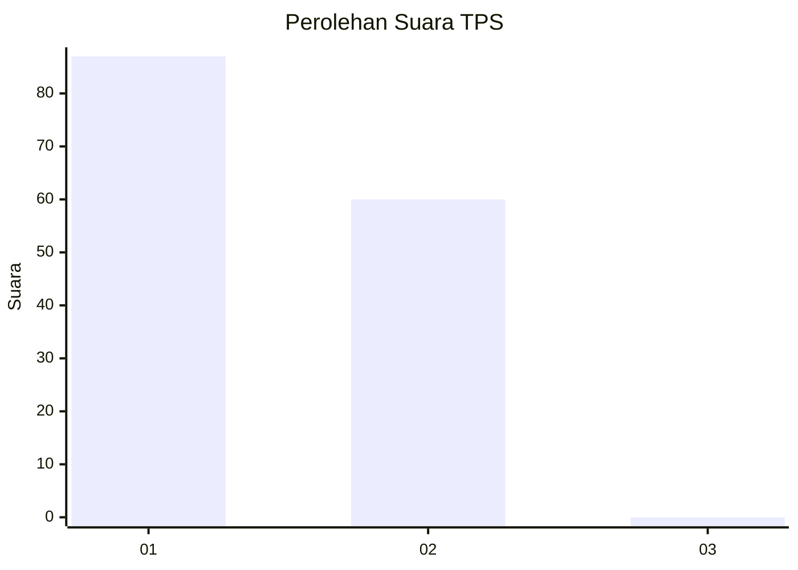
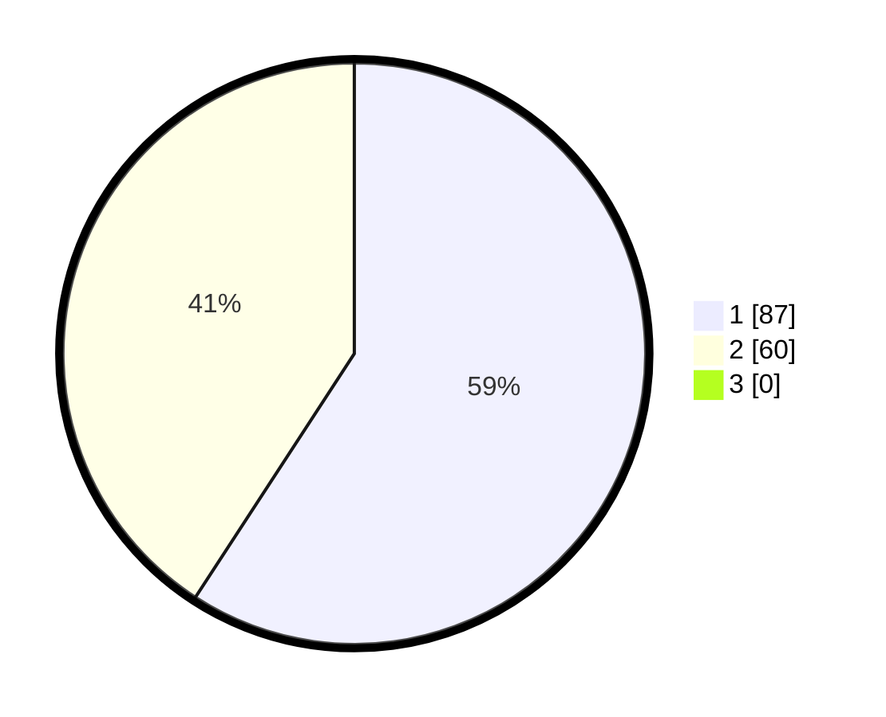

# Hasil

## Grafik

## Tabel

| No. | Nama Paslon    | Suara | Suara (raw) | Persentase |
|:--- |:-------------- | -----:| -----------:| ----------:|
| 1   | ANIES MUHAIMIN | 87    | [87][p-1]   | 59,18      |
| 2   | PRABOWO GIBRAN | 60    | [60][p-2]   | 40,82      |
| 3   | GANJAR MAHFUD  | 0     | [0][p-3]    | 0,00       |

[p-1]: https://github.com/gigit-pemilu/pemilu-2024-12-sumatera-utara/blob/main/pilpres/hitung-suara/sub/12-sumatera-utara/sub/13-mandailing-natal/sub/19-huta-bargot/sub/2001-bangun-sejati/sub/002-tps/sub/paslon-1.txt
[p-2]: https://github.com/gigit-pemilu/pemilu-2024-12-sumatera-utara/blob/main/pilpres/hitung-suara/sub/12-sumatera-utara/sub/13-mandailing-natal/sub/19-huta-bargot/sub/2001-bangun-sejati/sub/002-tps/sub/paslon-2.txt
[p-3]: https://github.com/gigit-pemilu/pemilu-2024-12-sumatera-utara/blob/main/pilpres/hitung-suara/sub/12-sumatera-utara/sub/13-mandailing-natal/sub/19-huta-bargot/sub/2001-bangun-sejati/sub/002-tps/sub/paslon-3.txt

## Foto C Plano

https://sirekap-obj-formc.kpu.go.id/da59/pemilu/ppwp/12/13/19/20/01/1213192001002-20240216-222107--2eb7445f-461a-4764-830c-b04aef3a7f19.jpg

https://sirekap-obj-formc.kpu.go.id/da59/pemilu/ppwp/12/13/19/20/01/1213192001002-20240215-075926--5d0d2646-6d41-4102-a626-b6c709dabb7d.jpg

https://sirekap-obj-formc.kpu.go.id/da59/pemilu/ppwp/12/13/19/20/01/1213192001002-20240215-075751--b3ae3eb1-cdd7-4629-860e-8c8e01abb0d6.jpg

## Metadata

| Key        | Value               |
| ---------- | ------------------- |
| Time Stamp | 2024-02-16 22:30:00 |

