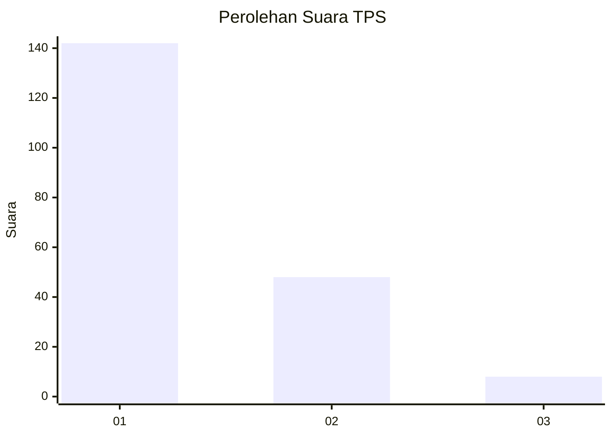
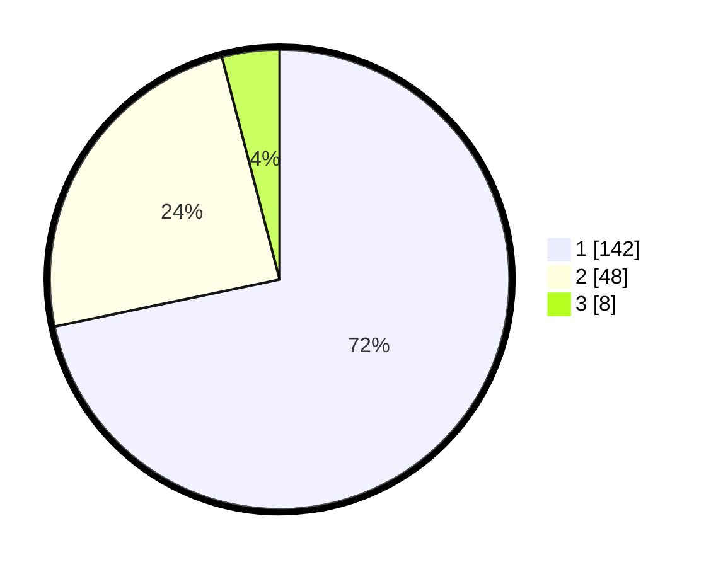

# Hasil

## Grafik

## Tabel

| No. | Nama Paslon    | Suara | Suara (raw) | Persentase |
|:--- |:-------------- | -----:| -----------:| ----------:|
| 1   | ANIES MUHAIMIN | 142   | [142][p-1]  | 71,72      |
| 2   | PRABOWO GIBRAN | 48    | [48][p-2]   | 24,24      |
| 3   | GANJAR MAHFUD  | 8     | [8][p-3]    | 4,04       |

[p-1]: https://github.com/gigit-pemilu/pemilu-2024-12-sumatera-utara/blob/main/pilpres/hitung-suara/sub/12-sumatera-utara/sub/13-mandailing-natal/sub/19-huta-bargot/sub/2004-huta-bargot-lombang/sub/001-tps/sub/paslon-1.txt
[p-2]: https://github.com/gigit-pemilu/pemilu-2024-12-sumatera-utara/blob/main/pilpres/hitung-suara/sub/12-sumatera-utara/sub/13-mandailing-natal/sub/19-huta-bargot/sub/2004-huta-bargot-lombang/sub/001-tps/sub/paslon-2.txt
[p-3]: https://github.com/gigit-pemilu/pemilu-2024-12-sumatera-utara/blob/main/pilpres/hitung-suara/sub/12-sumatera-utara/sub/13-mandailing-natal/sub/19-huta-bargot/sub/2004-huta-bargot-lombang/sub/001-tps/sub/paslon-3.txt

## Foto C Plano

https://sirekap-obj-formc.kpu.go.id/5738/pemilu/ppwp/12/13/19/20/04/1213192004001-20240215-174754--ec9e4d66-76a3-4a6a-8d1f-a0a46eb9485c.jpg

https://sirekap-obj-formc.kpu.go.id/5738/pemilu/ppwp/12/13/19/20/04/1213192004001-20240215-175108--8ca7c413-5ef7-47db-9aa7-be361d439631.jpg

https://sirekap-obj-formc.kpu.go.id/5738/pemilu/ppwp/12/13/19/20/04/1213192004001-20240215-175216--441c9894-0836-4a9b-b75c-3631c6ff504c.jpg

## Metadata

| Key        | Value               |
| ---------- | ------------------- |
| Time Stamp | 2024-02-16 21:01:00 |

