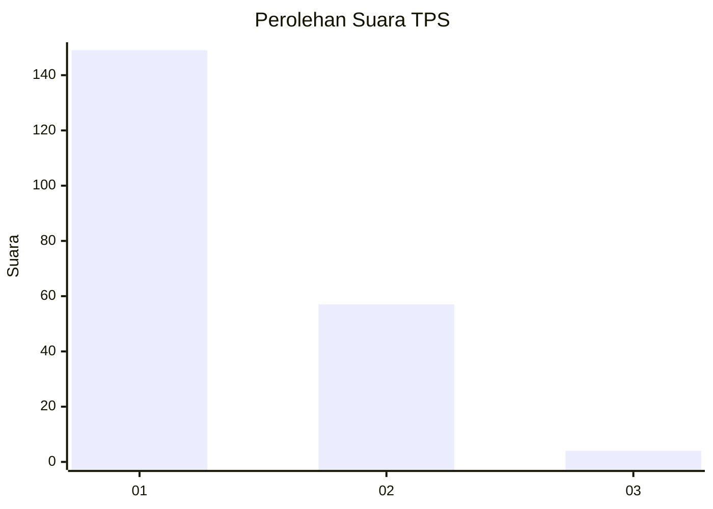
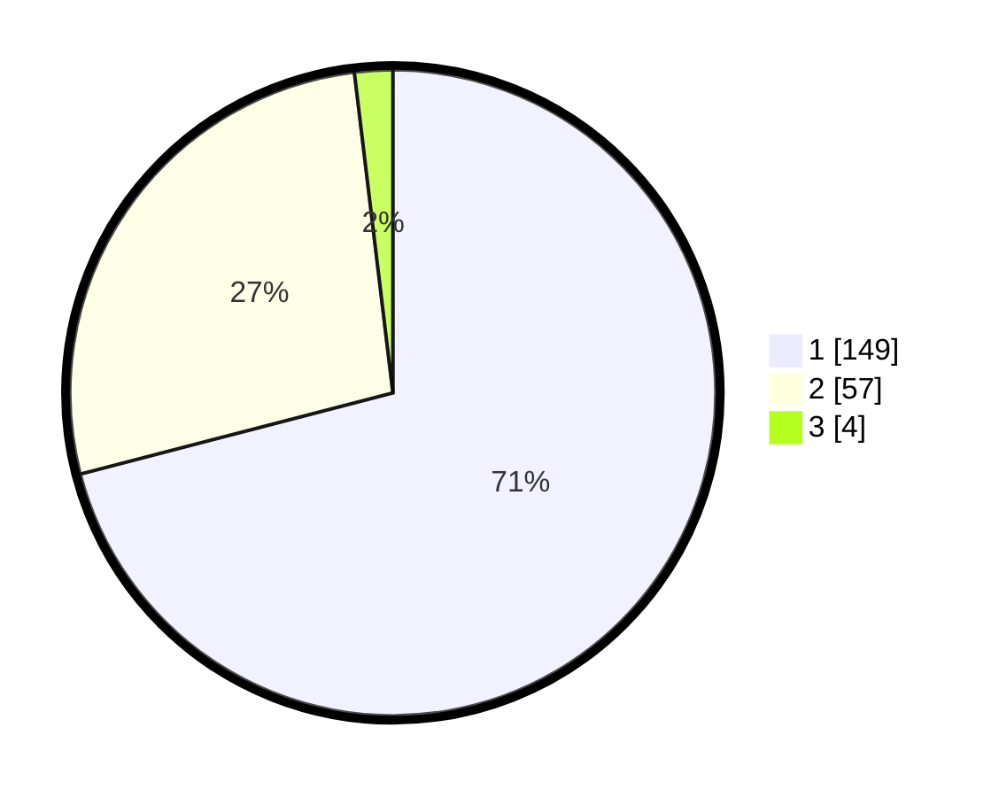

# Hasil

## Grafik

## Tabel

| No. | Nama Paslon    | Suara | Suara (raw) | Persentase |
|:--- |:-------------- | -----:| -----------:| ----------:|
| 1   | ANIES MUHAIMIN | 149   | [149][p-1]  | 70,95      |
| 2   | PRABOWO GIBRAN | 57    | [57][p-2]   | 27,14      |
| 3   | GANJAR MAHFUD  | 4     | [4][p-3]    | 1,90       |

[p-1]: https://github.com/gigit-pemilu/pemilu-2024/blob/main/pilpres/hitung-suara/sub/12-sumatera-utara/sub/13-mandailing-natal/sub/19-huta-bargot/sub/2012-saba-padang/sub/001-tps/sub/paslon-1.txt
[p-2]: https://github.com/gigit-pemilu/pemilu-2024/blob/main/pilpres/hitung-suara/sub/12-sumatera-utara/sub/13-mandailing-natal/sub/19-huta-bargot/sub/2012-saba-padang/sub/001-tps/sub/paslon-2.txt
[p-3]: https://github.com/gigit-pemilu/pemilu-2024/blob/main/pilpres/hitung-suara/sub/12-sumatera-utara/sub/13-mandailing-natal/sub/19-huta-bargot/sub/2012-saba-padang/sub/001-tps/sub/paslon-3.txt

## Foto C Plano

https://sirekap-obj-formc.kpu.go.id/b340/pemilu/ppwp/12/13/19/20/12/1213192012001-20240215-195155--07db5d47-b08e-4e5b-9225-3c2b4f4c5e57.jpg

https://sirekap-obj-formc.kpu.go.id/b340/pemilu/ppwp/12/13/19/20/12/1213192012001-20240215-194213--070a8758-6750-431d-9a9f-eafef0649465.jpg

https://sirekap-obj-formc.kpu.go.id/b340/pemilu/ppwp/12/13/19/20/12/1213192012001-20240215-201029--32125df0-a0b1-47c8-aeb1-bc5eef73ce24.jpg

## Metadata

| Key        | Value               |
| ---------- | ------------------- |
| Time Stamp | 2024-02-19 06:16:00 |

