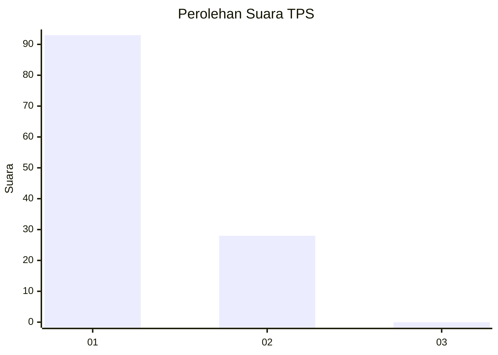
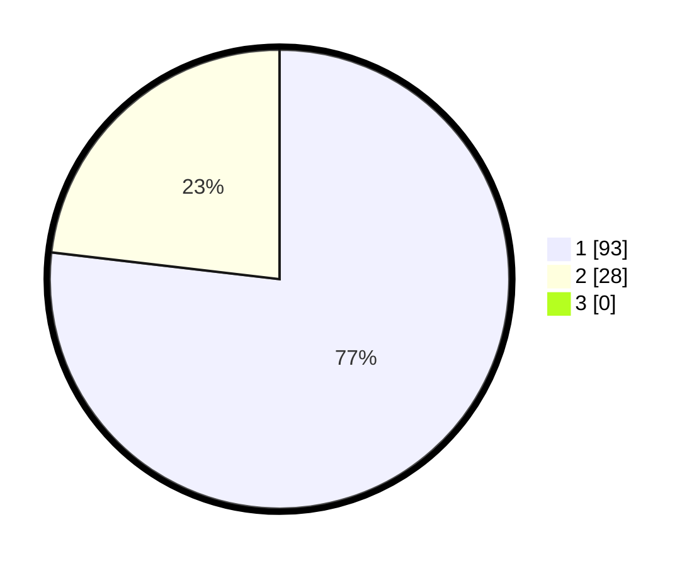

# Hasil

## Grafik

## Tabel

| No. | Nama Paslon    | Suara | Suara (raw) | Persentase |
|:--- |:-------------- | -----:| -----------:| ----------:|
| 1   | ANIES MUHAIMIN | 93    | [93][p-1]   | 76,86      |
| 2   | PRABOWO GIBRAN | 28    | [28][p-2]   | 23,14      |
| 3   | GANJAR MAHFUD  | 0     | [0][p-3]    | 0,00       |

[p-1]: https://github.com/gigit-pemilu/pemilu-2024-12-sumatera-utara/blob/main/pilpres/hitung-suara/sub/12-sumatera-utara/sub/13-mandailing-natal/sub/19-huta-bargot/sub/2014-huta-naingkan/sub/002-tps/sub/paslon-1.txt
[p-2]: https://github.com/gigit-pemilu/pemilu-2024-12-sumatera-utara/blob/main/pilpres/hitung-suara/sub/12-sumatera-utara/sub/13-mandailing-natal/sub/19-huta-bargot/sub/2014-huta-naingkan/sub/002-tps/sub/paslon-2.txt
[p-3]: https://github.com/gigit-pemilu/pemilu-2024-12-sumatera-utara/blob/main/pilpres/hitung-suara/sub/12-sumatera-utara/sub/13-mandailing-natal/sub/19-huta-bargot/sub/2014-huta-naingkan/sub/002-tps/sub/paslon-3.txt

## Foto C Plano

https://sirekap-obj-formc.kpu.go.id/e0eb/pemilu/ppwp/12/13/19/20/14/1213192014002-20240215-073603--9f6d2394-a957-4ac9-bf51-e575551f89f2.jpg

https://sirekap-obj-formc.kpu.go.id/e0eb/pemilu/ppwp/12/13/19/20/14/1213192014002-20240214-222121--dd41fa6f-5139-42c3-97c4-f438fb87ff6c.jpg

https://sirekap-obj-formc.kpu.go.id/e0eb/pemilu/ppwp/12/13/19/20/14/1213192014002-20240214-222923--15f6c297-7c03-4aaa-827c-477e0fcb3071.jpg

## Metadata

| Key        | Value               |
| ---------- | ------------------- |
| Time Stamp | 2024-02-15 23:29:50 |

