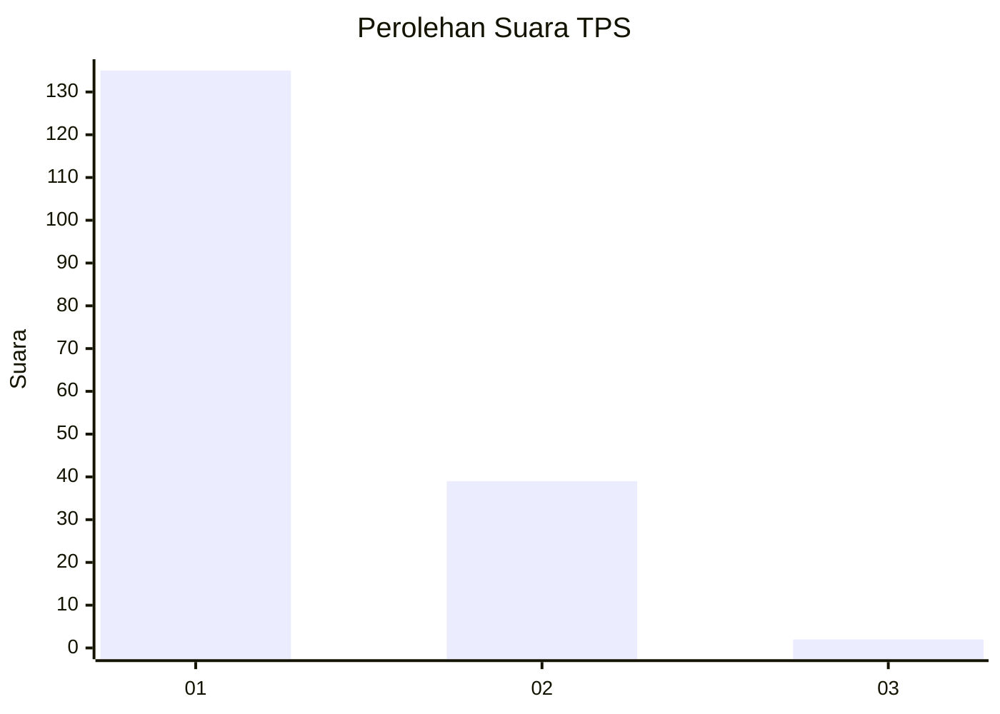
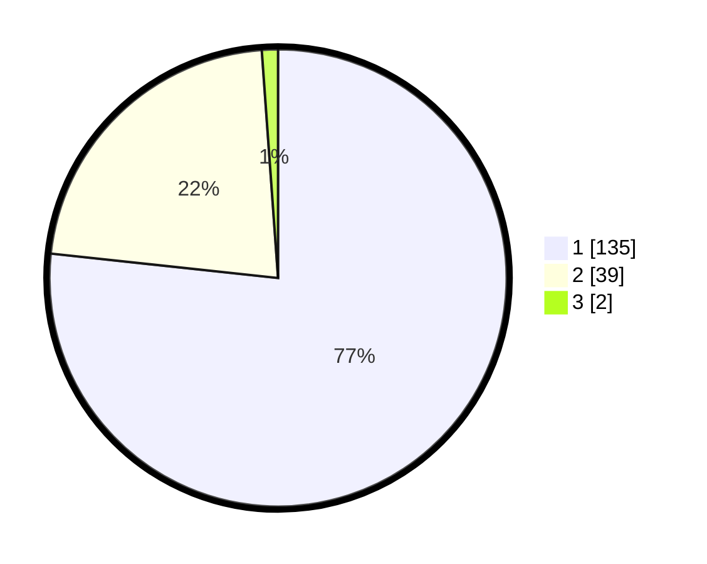

# Hasil

## Grafik

## Tabel

| No. | Nama Paslon    | Suara | Suara (raw) | Persentase |
|:--- |:-------------- | -----:| -----------:| ----------:|
| 1   | ANIES MUHAIMIN | 135   | [135][p-1]  | 76,70      |
| 2   | PRABOWO GIBRAN | 39    | [39][p-2]   | 22,16      |
| 3   | GANJAR MAHFUD  | 2     | [2][p-3]    | 1,14       |

[p-1]: https://github.com/gigit-pemilu/pemilu-2024-12-sumatera-utara/blob/main/pilpres/hitung-suara/sub/12-sumatera-utara/sub/13-mandailing-natal/sub/20-puncak-sorik-marapi/sub/2001-huta-lombang/sub/001-tps/sub/paslon-1.txt
[p-2]: https://github.com/gigit-pemilu/pemilu-2024-12-sumatera-utara/blob/main/pilpres/hitung-suara/sub/12-sumatera-utara/sub/13-mandailing-natal/sub/20-puncak-sorik-marapi/sub/2001-huta-lombang/sub/001-tps/sub/paslon-2.txt
[p-3]: https://github.com/gigit-pemilu/pemilu-2024-12-sumatera-utara/blob/main/pilpres/hitung-suara/sub/12-sumatera-utara/sub/13-mandailing-natal/sub/20-puncak-sorik-marapi/sub/2001-huta-lombang/sub/001-tps/sub/paslon-3.txt

## Foto C Plano

https://sirekap-obj-formc.kpu.go.id/d307/pemilu/ppwp/12/13/20/20/01/1213202001001-20240215-202736--f54a0dba-7d51-4396-8e08-d4894dfe5f17.jpg

https://sirekap-obj-formc.kpu.go.id/d307/pemilu/ppwp/12/13/20/20/01/1213202001001-20240215-203145--80048daf-802e-4cba-a1c7-0159e7349f7f.jpg

https://sirekap-obj-formc.kpu.go.id/d307/pemilu/ppwp/12/13/20/20/01/1213202001001-20240215-202952--5f077971-3f59-4a1e-bd6d-4738b64784c0.jpg

## Metadata

| Key        | Value               |
| ---------- | ------------------- |
| Time Stamp | 2024-02-16 11:00:29 |

