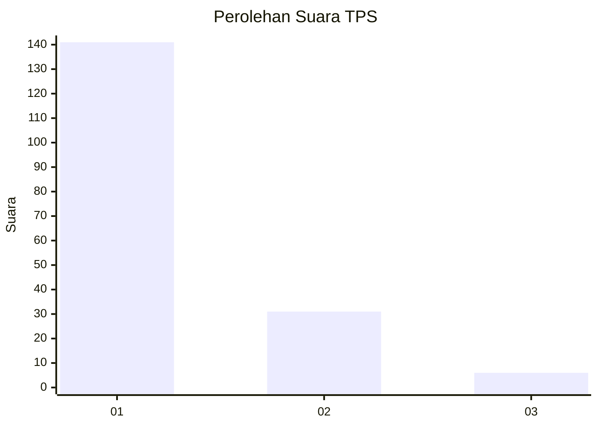
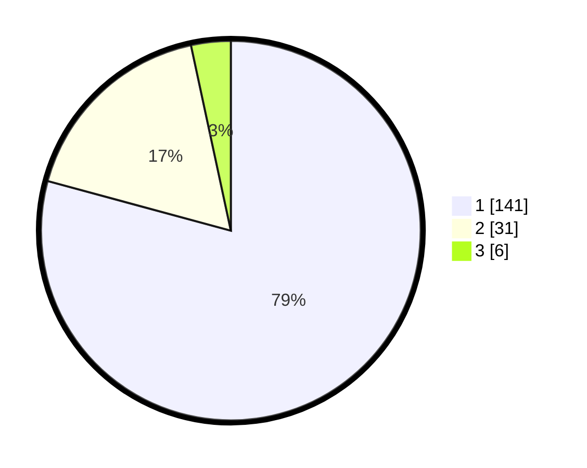

# Hasil

## Grafik

## Tabel

| No. | Nama Paslon    | Suara | Suara (raw) | Persentase |
|:--- |:-------------- | -----:| -----------:| ----------:|
| 1   | ANIES MUHAIMIN | 141   | [141][p-1]  | 79,21      |
| 2   | PRABOWO GIBRAN | 31    | [31][p-2]   | 17,42      |
| 3   | GANJAR MAHFUD  | 6     | [6][p-3]    | 3,37       |

[p-1]: https://github.com/gigit-pemilu/pemilu-2024/blob/main/pilpres/hitung-suara/sub/12-sumatera-utara/sub/13-mandailing-natal/sub/20-puncak-sorik-marapi/sub/2001-huta-lombang/sub/003-tps/sub/paslon-1.txt
[p-2]: https://github.com/gigit-pemilu/pemilu-2024/blob/main/pilpres/hitung-suara/sub/12-sumatera-utara/sub/13-mandailing-natal/sub/20-puncak-sorik-marapi/sub/2001-huta-lombang/sub/003-tps/sub/paslon-2.txt
[p-3]: https://github.com/gigit-pemilu/pemilu-2024/blob/main/pilpres/hitung-suara/sub/12-sumatera-utara/sub/13-mandailing-natal/sub/20-puncak-sorik-marapi/sub/2001-huta-lombang/sub/003-tps/sub/paslon-3.txt

## Foto C Plano

https://sirekap-obj-formc.kpu.go.id/c991/pemilu/ppwp/12/13/20/20/01/1213202001003-20240215-023427--f9f159f9-2f88-4d26-8fad-fa1c56bc2f70.jpg

https://sirekap-obj-formc.kpu.go.id/c991/pemilu/ppwp/12/13/20/20/01/1213202001003-20240215-023628--c7a13875-6c50-4828-94df-27a878b2fc30.jpg

https://sirekap-obj-formc.kpu.go.id/c991/pemilu/ppwp/12/13/20/20/01/1213202001003-20240215-023735--0b80d2b9-721e-48e4-9f6b-24fac65bdf46.jpg

## Metadata

| Key        | Value               |
| ---------- | ------------------- |
| Time Stamp | 2024-02-15 15:00:29 |

