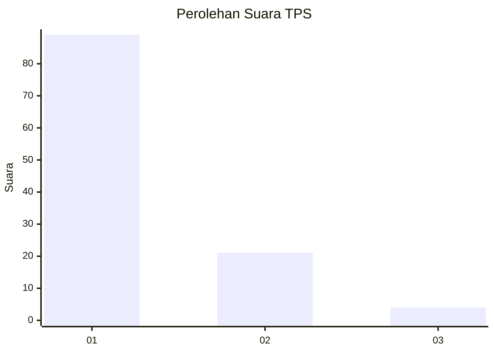
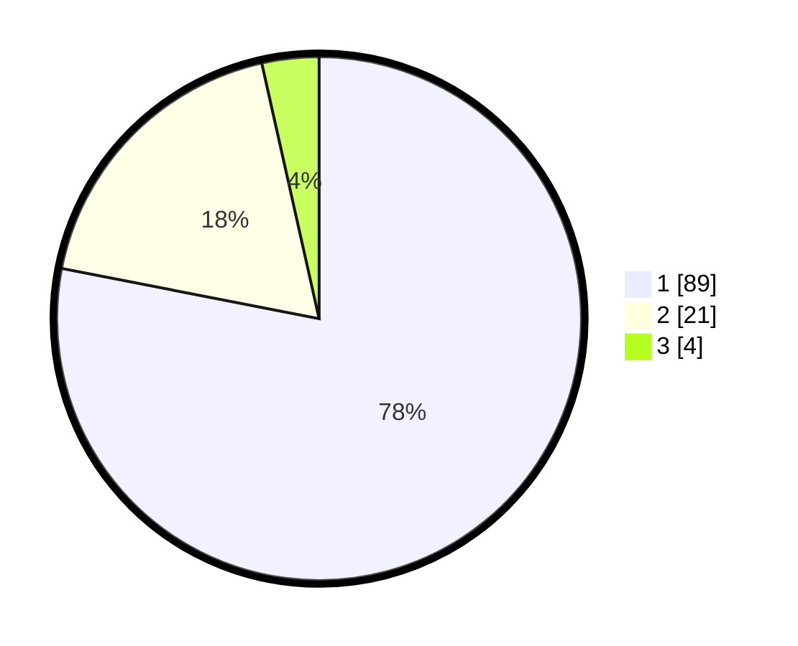

# Hasil

## Grafik

## Tabel

| No. | Nama Paslon    | Suara | Suara (raw) | Persentase |
|:--- |:-------------- | -----:| -----------:| ----------:|
| 1   | ANIES MUHAIMIN | 89    | [89][p-1]   | 78,07      |
| 2   | PRABOWO GIBRAN | 21    | [21][p-2]   | 18,42      |
| 3   | GANJAR MAHFUD  | 4     | [4][p-3]    | 3,51       |

[p-1]: https://github.com/gigit-pemilu/pemilu-2024/blob/main/pilpres/hitung-suara/sub/12-sumatera-utara/sub/13-mandailing-natal/sub/20-puncak-sorik-marapi/sub/2003-handel/sub/001-tps/sub/paslon-1.txt
[p-2]: https://github.com/gigit-pemilu/pemilu-2024/blob/main/pilpres/hitung-suara/sub/12-sumatera-utara/sub/13-mandailing-natal/sub/20-puncak-sorik-marapi/sub/2003-handel/sub/001-tps/sub/paslon-2.txt
[p-3]: https://github.com/gigit-pemilu/pemilu-2024/blob/main/pilpres/hitung-suara/sub/12-sumatera-utara/sub/13-mandailing-natal/sub/20-puncak-sorik-marapi/sub/2003-handel/sub/001-tps/sub/paslon-3.txt

## Foto C Plano

https://sirekap-obj-formc.kpu.go.id/1254/pemilu/ppwp/12/13/20/20/03/1213202003001-20240215-131007--e0c9f049-848d-4b7c-b580-d63ba5cb8d5c.jpg

https://sirekap-obj-formc.kpu.go.id/1254/pemilu/ppwp/12/13/20/20/03/1213202003001-20240215-022228--fe566f4d-b35c-49a3-ae5c-55cfaf7622ba.jpg

https://sirekap-obj-formc.kpu.go.id/1254/pemilu/ppwp/12/13/20/20/03/1213202003001-20240215-022238--9b98a537-391d-4623-8cf3-7568e31a77e5.jpg

## Metadata

| Key        | Value               |
| ---------- | ------------------- |
| Time Stamp | 2024-02-15 15:00:29 |

