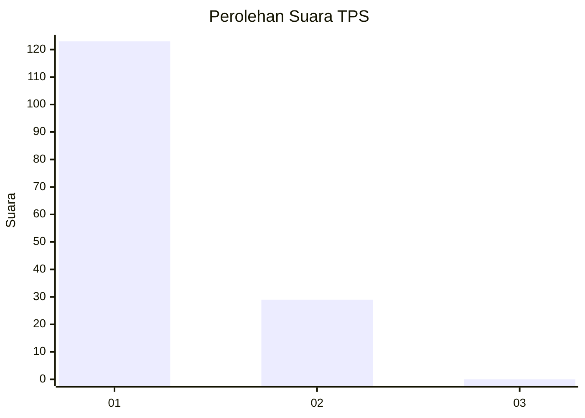
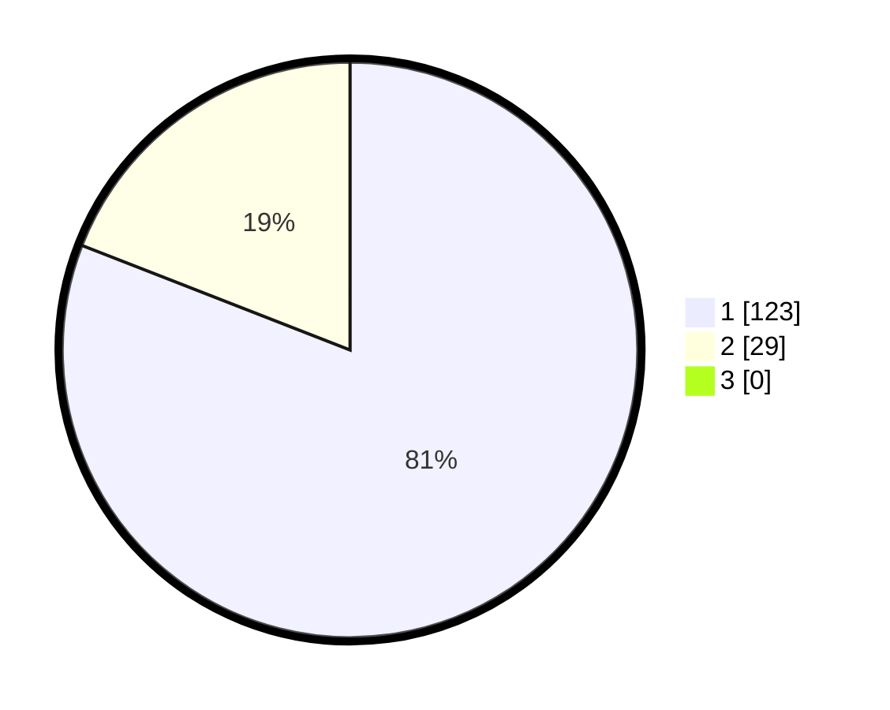

# Hasil

## Grafik

## Tabel

| No. | Nama Paslon    | Suara | Suara (raw) | Persentase |
|:--- |:-------------- | -----:| -----------:| ----------:|
| 1   | ANIES MUHAIMIN | 123   | [123][p-1]  | 80,92      |
| 2   | PRABOWO GIBRAN | 29    | [29][p-2]   | 19,08      |
| 3   | GANJAR MAHFUD  | 0     | [0][p-3]    | 0,00       |

[p-1]: https://github.com/gigit-pemilu/pemilu-2024-12-sumatera-utara/blob/main/pilpres/hitung-suara/sub/12-sumatera-utara/sub/13-mandailing-natal/sub/20-puncak-sorik-marapi/sub/2005-hutanamale/sub/004-tps/sub/paslon-1.txt
[p-2]: https://github.com/gigit-pemilu/pemilu-2024-12-sumatera-utara/blob/main/pilpres/hitung-suara/sub/12-sumatera-utara/sub/13-mandailing-natal/sub/20-puncak-sorik-marapi/sub/2005-hutanamale/sub/004-tps/sub/paslon-2.txt
[p-3]: https://github.com/gigit-pemilu/pemilu-2024-12-sumatera-utara/blob/main/pilpres/hitung-suara/sub/12-sumatera-utara/sub/13-mandailing-natal/sub/20-puncak-sorik-marapi/sub/2005-hutanamale/sub/004-tps/sub/paslon-3.txt

## Foto C Plano

https://sirekap-obj-formc.kpu.go.id/b649/pemilu/ppwp/12/13/20/20/05/1213202005004-20240215-080855--80453c86-e93c-4a5c-9f9a-c0e58e39b42c.jpg

https://sirekap-obj-formc.kpu.go.id/b649/pemilu/ppwp/12/13/20/20/05/1213202005004-20240215-081217--f997c47f-3bf2-4703-a95c-882749197a2f.jpg

https://sirekap-obj-formc.kpu.go.id/b649/pemilu/ppwp/12/13/20/20/05/1213202005004-20240215-081540--05d2698b-eff5-4173-88e2-14a90669e3d3.jpg

## Metadata

| Key        | Value               |
| ---------- | ------------------- |
| Time Stamp | 2024-02-15 22:40:13 |

