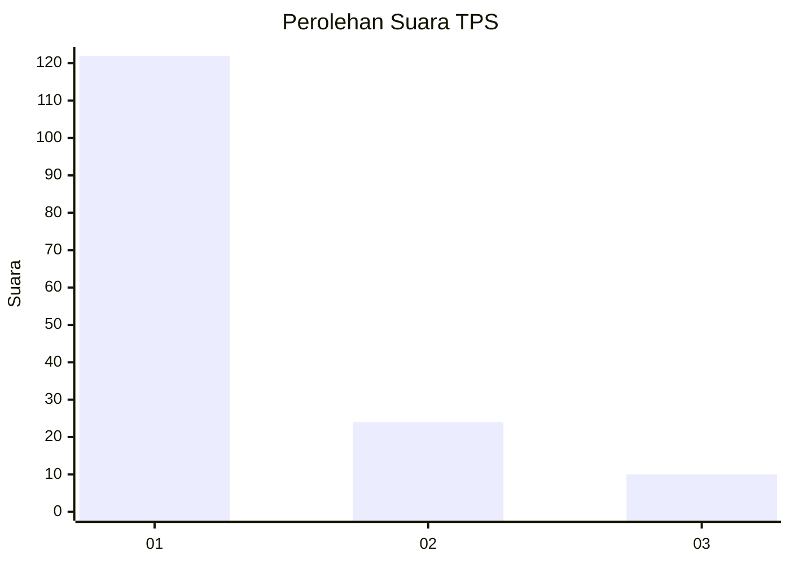
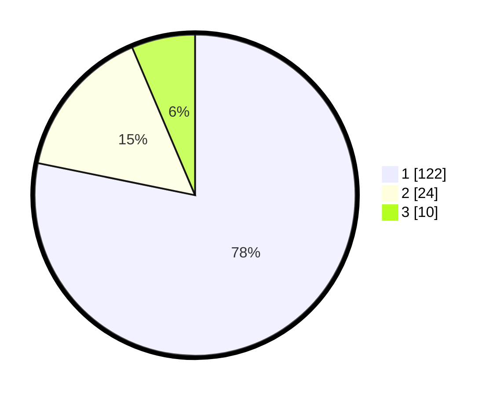

# Hasil

## Grafik

## Tabel

| No. | Nama Paslon    | Suara | Suara (raw) | Persentase |
|:--- |:-------------- | -----:| -----------:| ----------:|
| 1   | ANIES MUHAIMIN | 122   | [122][p-1]  | 78,21      |
| 2   | PRABOWO GIBRAN | 24    | [24][p-2]   | 15,38      |
| 3   | GANJAR MAHFUD  | 10    | [10][p-3]   | 6,41       |

[p-1]: https://github.com/gigit-pemilu/pemilu-2024-12-sumatera-utara/blob/main/pilpres/hitung-suara/sub/12-sumatera-utara/sub/13-mandailing-natal/sub/20-puncak-sorik-marapi/sub/2010-purba-julu/sub/001-tps/sub/paslon-1.txt
[p-2]: https://github.com/gigit-pemilu/pemilu-2024-12-sumatera-utara/blob/main/pilpres/hitung-suara/sub/12-sumatera-utara/sub/13-mandailing-natal/sub/20-puncak-sorik-marapi/sub/2010-purba-julu/sub/001-tps/sub/paslon-2.txt
[p-3]: https://github.com/gigit-pemilu/pemilu-2024-12-sumatera-utara/blob/main/pilpres/hitung-suara/sub/12-sumatera-utara/sub/13-mandailing-natal/sub/20-puncak-sorik-marapi/sub/2010-purba-julu/sub/001-tps/sub/paslon-3.txt

## Foto C Plano

https://sirekap-obj-formc.kpu.go.id/1c42/pemilu/ppwp/12/13/20/20/10/1213202010001-20240214-194119--b49bd9b2-f2bc-435b-800a-d3287f782c6f.jpg

https://sirekap-obj-formc.kpu.go.id/1c42/pemilu/ppwp/12/13/20/20/10/1213202010001-20240215-174715--6724f5db-197d-4b1f-bffc-fc23d12c49cd.jpg

https://sirekap-obj-formc.kpu.go.id/1c42/pemilu/ppwp/12/13/20/20/10/1213202010001-20240215-174929--a0cbd222-f9ae-4a20-8d22-36870b0df5c2.jpg

## Metadata

| Key        | Value               |
| ---------- | ------------------- |
| Time Stamp | 2024-02-15 23:29:50 |

