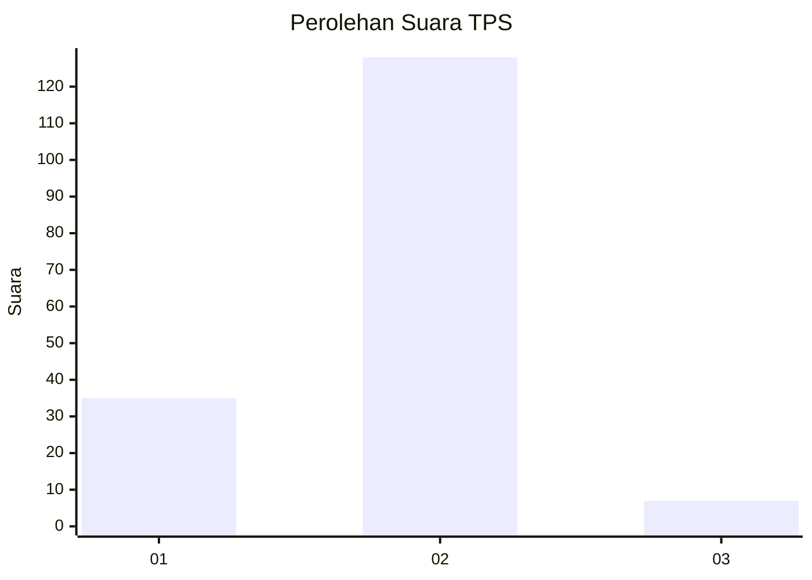
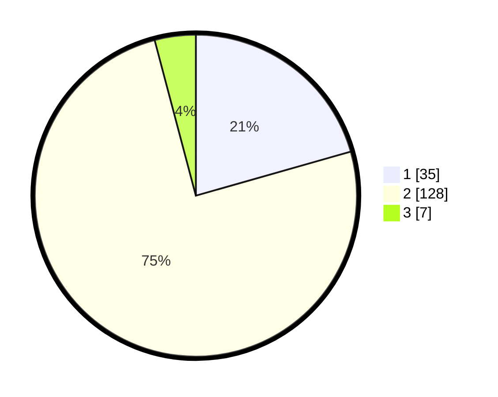

# Hasil

## Grafik

## Tabel

| No. | Nama Paslon    | Suara | Suara (raw) | Persentase |
|:--- |:-------------- | -----:| -----------:| ----------:|
| 1   | ANIES MUHAIMIN | 35    | [35][p-1]   | 20,59      |
| 2   | PRABOWO GIBRAN | 128   | [128][p-2]  | 75,29      |
| 3   | GANJAR MAHFUD  | 7     | [7][p-3]    | 4,12       |

[p-1]: https://github.com/gigit-pemilu/pemilu-2024/blob/main/pilpres/hitung-suara/sub/12-sumatera-utara/sub/13-mandailing-natal/sub/22-sinunukan/sub/2001-sinunukan-i/sub/005-tps/sub/paslon-1.txt
[p-2]: https://github.com/gigit-pemilu/pemilu-2024/blob/main/pilpres/hitung-suara/sub/12-sumatera-utara/sub/13-mandailing-natal/sub/22-sinunukan/sub/2001-sinunukan-i/sub/005-tps/sub/paslon-2.txt
[p-3]: https://github.com/gigit-pemilu/pemilu-2024/blob/main/pilpres/hitung-suara/sub/12-sumatera-utara/sub/13-mandailing-natal/sub/22-sinunukan/sub/2001-sinunukan-i/sub/005-tps/sub/paslon-3.txt

## Foto C Plano

https://sirekap-obj-formc.kpu.go.id/e4a7/pemilu/ppwp/12/13/22/20/01/1213222001005-20240214-194906--da016ecf-2444-49fa-85f8-c1e4c546bc3f.jpg

https://sirekap-obj-formc.kpu.go.id/e4a7/pemilu/ppwp/12/13/22/20/01/1213222001005-20240214-195717--c6a8277b-c603-4933-b1f2-8a62361d6848.jpg

https://sirekap-obj-formc.kpu.go.id/e4a7/pemilu/ppwp/12/13/22/20/01/1213222001005-20240214-195921--a8e8abdd-09e7-40c7-a333-f2b2d3978893.jpg

## Metadata

| Key        | Value               |
| ---------- | ------------------- |
| Time Stamp | 2024-02-15 22:30:27 |

