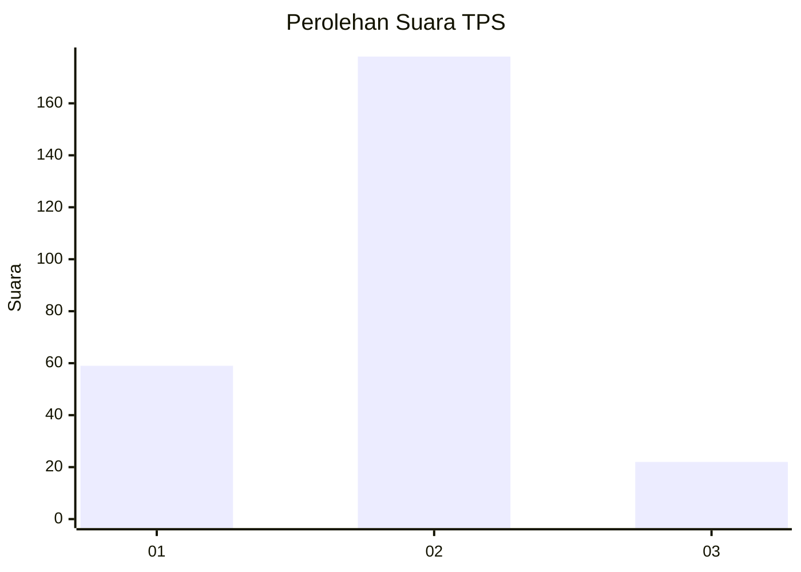
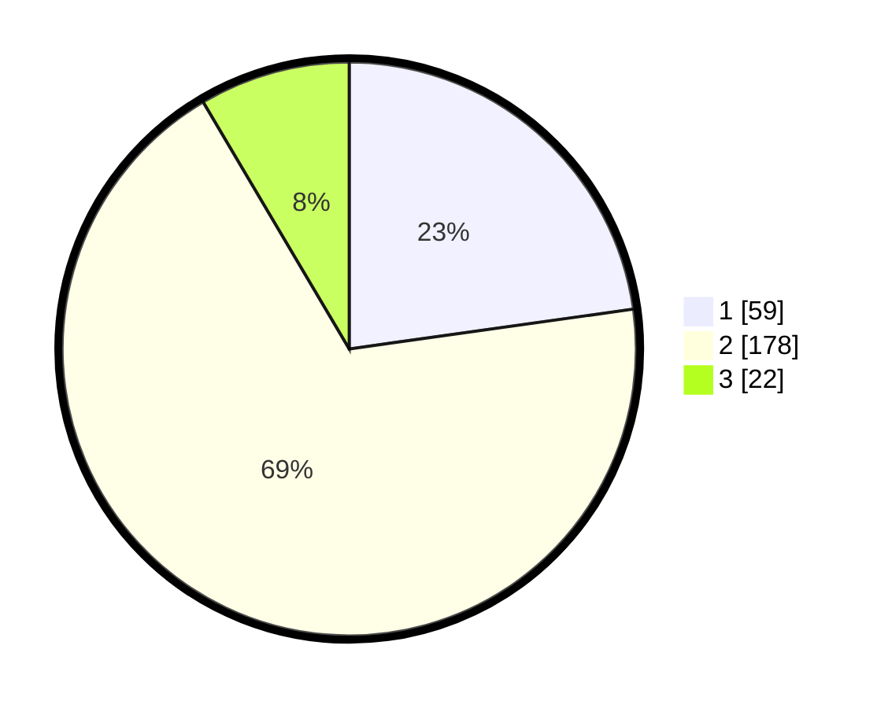

# Hasil

## Grafik

## Tabel

| No. | Nama Paslon    | Suara | Suara (raw) | Persentase |
|:--- |:-------------- | -----:| -----------:| ----------:|
| 1   | ANIES MUHAIMIN | 59    | [59][p-1]   | 22,78      |
| 2   | PRABOWO GIBRAN | 178   | [178][p-2]  | 68,73      |
| 3   | GANJAR MAHFUD  | 22    | [22][p-3]   | 8,49       |

[p-1]: https://github.com/gigit-pemilu/pemilu-2024-12-sumatera-utara/blob/main/pilpres/hitung-suara/sub/12-sumatera-utara/sub/13-mandailing-natal/sub/22-sinunukan/sub/2014-sinunukan-i-central/sub/001-tps/sub/paslon-1.txt
[p-2]: https://github.com/gigit-pemilu/pemilu-2024-12-sumatera-utara/blob/main/pilpres/hitung-suara/sub/12-sumatera-utara/sub/13-mandailing-natal/sub/22-sinunukan/sub/2014-sinunukan-i-central/sub/001-tps/sub/paslon-2.txt
[p-3]: https://github.com/gigit-pemilu/pemilu-2024-12-sumatera-utara/blob/main/pilpres/hitung-suara/sub/12-sumatera-utara/sub/13-mandailing-natal/sub/22-sinunukan/sub/2014-sinunukan-i-central/sub/001-tps/sub/paslon-3.txt

## Foto C Plano

https://sirekap-obj-formc.kpu.go.id/d58a/pemilu/ppwp/12/13/22/20/14/1213222014001-20240215-021020--82f3e138-7732-4730-ba15-833241429b66.jpg

https://sirekap-obj-formc.kpu.go.id/d58a/pemilu/ppwp/12/13/22/20/14/1213222014001-20240218-215447--48547592-0b3f-43ab-9ad4-dc7ab2820af6.jpg

https://sirekap-obj-formc.kpu.go.id/d58a/pemilu/ppwp/12/13/22/20/14/1213222014001-20240218-215851--edce77d7-c837-4ce1-bfe3-bb87e1067835.jpg

## Metadata

| Key        | Value               |
| ---------- | ------------------- |
| Time Stamp | 2024-02-21 18:00:00 |

