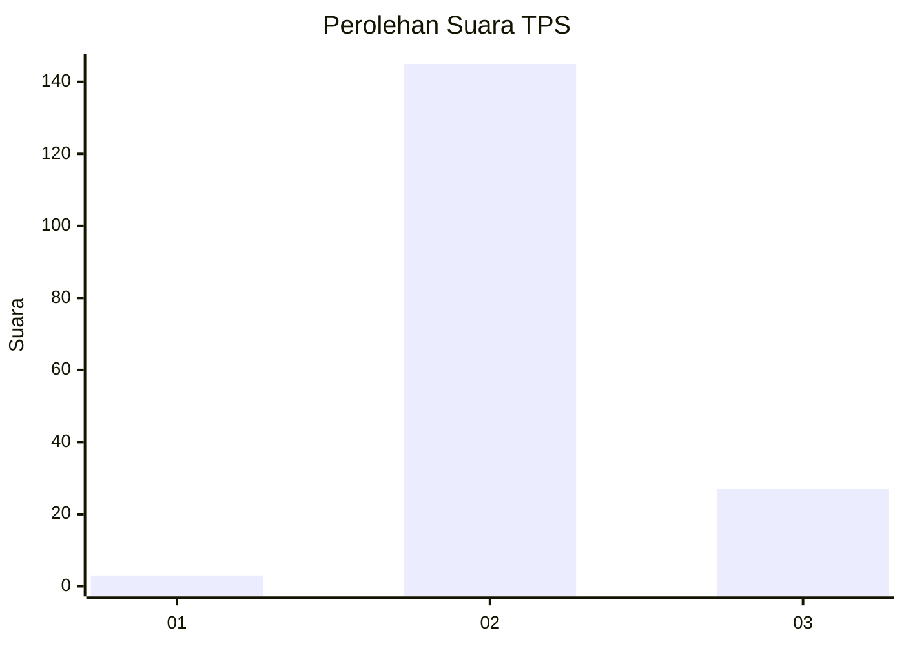
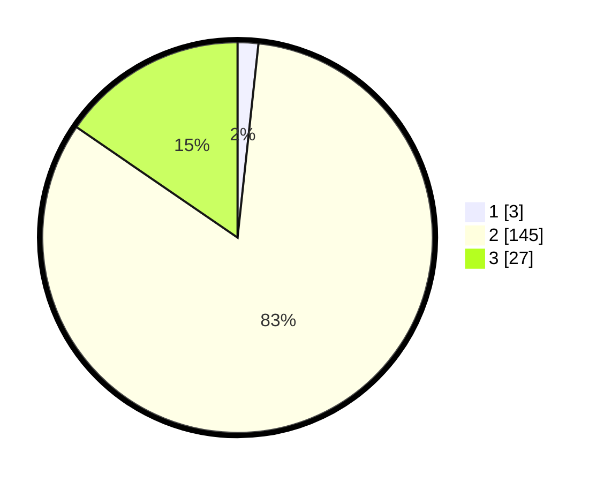

# Hasil

## Grafik

## Tabel

| No. | Nama Paslon    | Suara | Suara (raw) | Persentase |
|:--- |:-------------- | -----:| -----------:| ----------:|
| 1   | ANIES MUHAIMIN | 3     | [3][p-1]    | 1,71       |
| 2   | PRABOWO GIBRAN | 145   | [145][p-2]  | 82,86      |
| 3   | GANJAR MAHFUD  | 27    | [27][p-3]   | 15,43      |

[p-1]: https://github.com/gigit-pemilu/pemilu-2024/blob/main/pilpres/hitung-suara/sub/12-sumatera-utara/sub/13-mandailing-natal/sub/23-naga-juang/sub/2002-tarutung-panjang/sub/001-tps/sub/paslon-1.txt
[p-2]: https://github.com/gigit-pemilu/pemilu-2024/blob/main/pilpres/hitung-suara/sub/12-sumatera-utara/sub/13-mandailing-natal/sub/23-naga-juang/sub/2002-tarutung-panjang/sub/001-tps/sub/paslon-2.txt
[p-3]: https://github.com/gigit-pemilu/pemilu-2024/blob/main/pilpres/hitung-suara/sub/12-sumatera-utara/sub/13-mandailing-natal/sub/23-naga-juang/sub/2002-tarutung-panjang/sub/001-tps/sub/paslon-3.txt

## Foto C Plano

https://sirekap-obj-formc.kpu.go.id/9ade/pemilu/ppwp/12/13/23/20/02/1213232002001-20240215-150934--5ec2d2e5-9759-4b16-96ae-202e279400ab.jpg

https://sirekap-obj-formc.kpu.go.id/9ade/pemilu/ppwp/12/13/23/20/02/1213232002001-20240215-151126--9402d2e6-90fd-4c92-b12f-7b560b39f059.jpg

https://sirekap-obj-formc.kpu.go.id/9ade/pemilu/ppwp/12/13/23/20/02/1213232002001-20240215-151302--32d4d728-9805-4765-9af7-275b605a5841.jpg

## Metadata

| Key        | Value               |
| ---------- | ------------------- |
| Time Stamp | 2024-02-15 22:00:27 |

