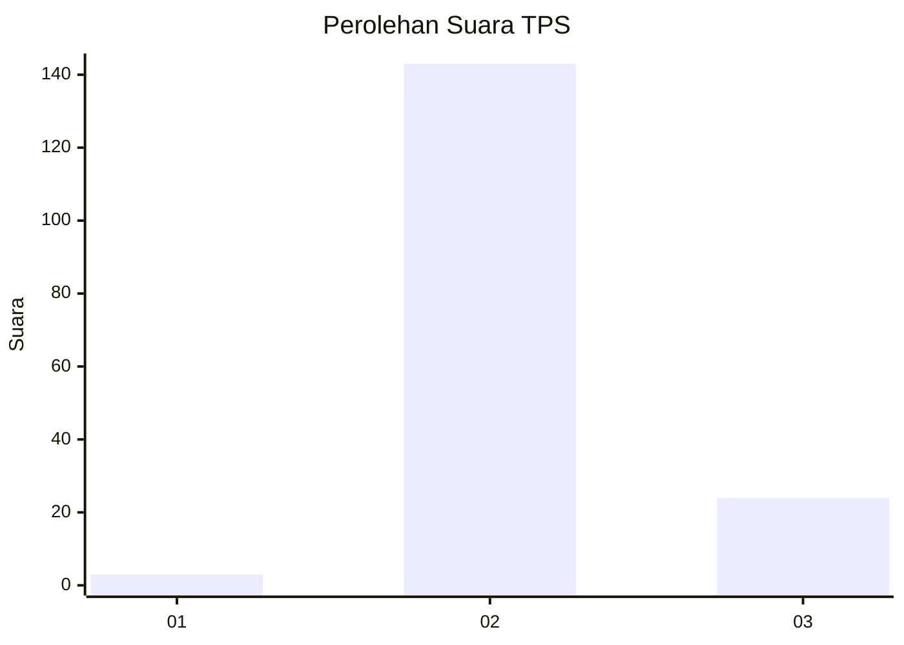
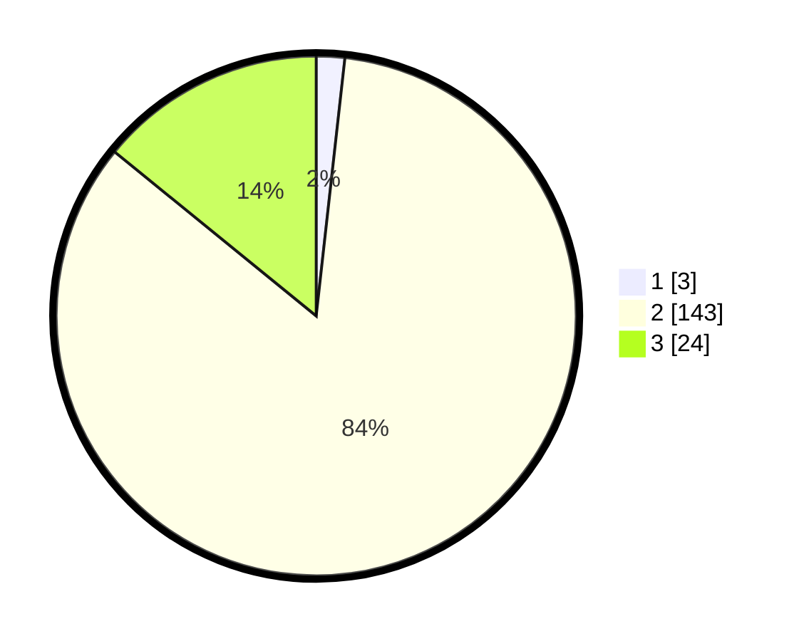

# Hasil

## Grafik

## Tabel

| No. | Nama Paslon    | Suara | Suara (raw) | Persentase |
|:--- |:-------------- | -----:| -----------:| ----------:|
| 1   | ANIES MUHAIMIN | 3     | [3][p-1]    | 1,76       |
| 2   | PRABOWO GIBRAN | 143   | [143][p-2]  | 84,12      |
| 3   | GANJAR MAHFUD  | 24    | [24][p-3]   | 14,12      |

[p-1]: https://github.com/gigit-pemilu/pemilu-2024/blob/main/pilpres/hitung-suara/sub/12-sumatera-utara/sub/13-mandailing-natal/sub/23-naga-juang/sub/2002-tarutung-panjang/sub/002-tps/sub/paslon-1.txt
[p-2]: https://github.com/gigit-pemilu/pemilu-2024/blob/main/pilpres/hitung-suara/sub/12-sumatera-utara/sub/13-mandailing-natal/sub/23-naga-juang/sub/2002-tarutung-panjang/sub/002-tps/sub/paslon-2.txt
[p-3]: https://github.com/gigit-pemilu/pemilu-2024/blob/main/pilpres/hitung-suara/sub/12-sumatera-utara/sub/13-mandailing-natal/sub/23-naga-juang/sub/2002-tarutung-panjang/sub/002-tps/sub/paslon-3.txt

## Foto C Plano

https://sirekap-obj-formc.kpu.go.id/315d/pemilu/ppwp/12/13/23/20/02/1213232002002-20240215-130344--614423f2-3eac-4b9b-a007-d7ee8282680d.jpg

https://sirekap-obj-formc.kpu.go.id/315d/pemilu/ppwp/12/13/23/20/02/1213232002002-20240214-234428--06b3e9e8-0a1c-4bd2-af8e-8ecd877082c4.jpg

https://sirekap-obj-formc.kpu.go.id/315d/pemilu/ppwp/12/13/23/20/02/1213232002002-20240214-234550--3755aba6-603e-4bde-a232-7adeb6a6b937.jpg

## Metadata

| Key        | Value               |
| ---------- | ------------------- |
| Time Stamp | 2024-02-15 15:00:29 |

