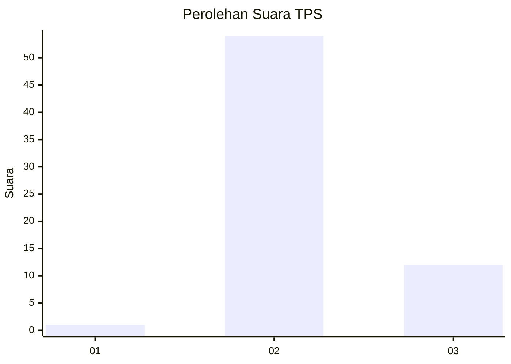
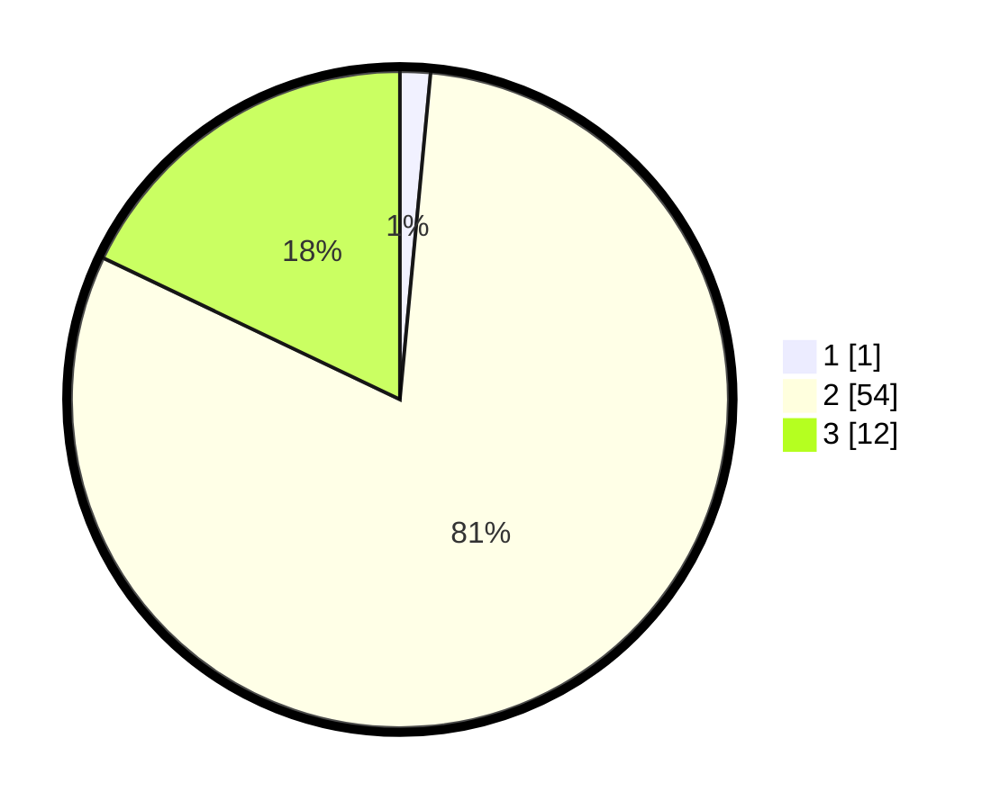

# Hasil

## Grafik

## Tabel

| No. | Nama Paslon    | Suara | Suara (raw) | Persentase |
|:--- |:-------------- | -----:| -----------:| ----------:|
| 1   | ANIES MUHAIMIN | 1     | [1][p-1]    | 1,49       |
| 2   | PRABOWO GIBRAN | 54    | [54][p-2]   | 80,60      |
| 3   | GANJAR MAHFUD  | 12    | [12][p-3]   | 17,91      |

[p-1]: https://github.com/gigit-pemilu/pemilu-2024-12-sumatera-utara/blob/main/pilpres/hitung-suara/sub/12-sumatera-utara/sub/14-nias-selatan/sub/01-lolomatua/sub/2005-hiliotalua/sub/002-tps/sub/paslon-1.txt
[p-2]: https://github.com/gigit-pemilu/pemilu-2024-12-sumatera-utara/blob/main/pilpres/hitung-suara/sub/12-sumatera-utara/sub/14-nias-selatan/sub/01-lolomatua/sub/2005-hiliotalua/sub/002-tps/sub/paslon-2.txt
[p-3]: https://github.com/gigit-pemilu/pemilu-2024-12-sumatera-utara/blob/main/pilpres/hitung-suara/sub/12-sumatera-utara/sub/14-nias-selatan/sub/01-lolomatua/sub/2005-hiliotalua/sub/002-tps/sub/paslon-3.txt

## Foto C Plano

https://sirekap-obj-formc.kpu.go.id/79e7/pemilu/ppwp/12/14/01/20/05/1214012005002-20240216-132020--c4a5e7ac-8fca-4d49-b9ab-98e1e4cd85d6.jpg

https://sirekap-obj-formc.kpu.go.id/79e7/pemilu/ppwp/12/14/01/20/05/1214012005002-20240216-132021--c116e702-2285-4c00-b440-186f3622c846.jpg

https://sirekap-obj-formc.kpu.go.id/79e7/pemilu/ppwp/12/14/01/20/05/1214012005002-20240216-132021--bcae9d99-380b-4cc7-9a4a-61294be90bd1.jpg

## Metadata

| Key        | Value               |
| ---------- | ------------------- |
| Time Stamp | 2024-02-16 16:25:10 |

## DATA PEMILIH TETAP

Jumlah pemilih dalam DPT: **145**.
 * L: **67**.
 * P: **78**.

## DATA PENGGUNA HAK PILIH

Jumlah pengguna hak pilih dalam DPT: **68**.
 * L: **34**.
 * P: **34**.

Jumlah pengguna hak pilih dalam DPTb: **0**.
 * L: **0**.
 * P: **0**.

Jumlah pengguna hak pilih dalam DPK: **0**.
 * L: **0**.
 * P: **0**.

Jumlah pengguna hak pilih: **68**.
 * L: **34**.
 * P: **34**.

## JUMLAH SUARA SAH DAN TIDAK SAH

JUMLAH SELURUH SUARA SAH: **67**.

JUMLAH SUARA TIDAK SAH: **1**.

JUMLAH SELURUH SUARA SAH DAN SUARA TIDAK SAH: **68**.

