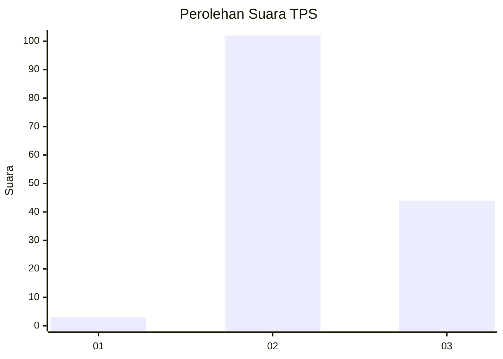

# Hasil

## Grafik

## Tabel

| No. | Nama Paslon    | Suara | Suara (raw) | Persentase |
|:--- |:-------------- | -----:| -----------:| ----------:|
| 1   | ANIES MUHAIMIN | 3     | [3][p-1]    | 2,01       |
| 2   | PRABOWO GIBRAN | 102   | [102][p-2]  | 68,46      |
| 3   | GANJAR MAHFUD  | 44    | [44][p-3]   | 29,53      |

[p-1]: https://github.com/gigit-pemilu/pemilu-2024-12-sumatera-utara/blob/main/pilpres/hitung-suara/sub/12-sumatera-utara/sub/14-nias-selatan/sub/01-lolomatua/sub/2006-koendrafo/sub/002-tps/sub/paslon-1.txt
[p-2]: https://github.com/gigit-pemilu/pemilu-2024-12-sumatera-utara/blob/main/pilpres/hitung-suara/sub/12-sumatera-utara/sub/14-nias-selatan/sub/01-lolomatua/sub/2006-koendrafo/sub/002-tps/sub/paslon-2.txt
[p-3]: https://github.com/gigit-pemilu/pemilu-2024-12-sumatera-utara/blob/main/pilpres/hitung-suara/sub/12-sumatera-utara/sub/14-nias-selatan/sub/01-lolomatua/sub/2006-koendrafo/sub/002-tps/sub/paslon-3.txt

## Foto C Plano

https://sirekap-obj-formc.kpu.go.id/65de/pemilu/ppwp/12/14/01/20/06/1214012006002-20240214-232957--652a9ad3-fba1-4106-90a1-384ddbd322e3.jpg

https://sirekap-obj-formc.kpu.go.id/65de/pemilu/ppwp/12/14/01/20/06/1214012006002-20240214-233323--d063d7e5-f8d1-44ed-a637-793200e41236.jpg

https://sirekap-obj-formc.kpu.go.id/65de/pemilu/ppwp/12/14/01/20/06/1214012006002-20240214-233221--2bda594d-e19b-45da-b0a3-6094ce464c40.jpg

## Metadata

| Key        | Value               |
| ---------- | ------------------- |
| Time Stamp | 2024-02-15 15:00:29 |

