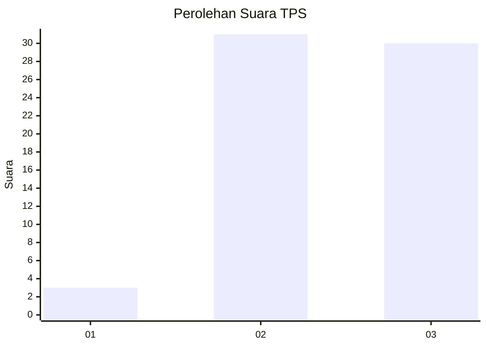
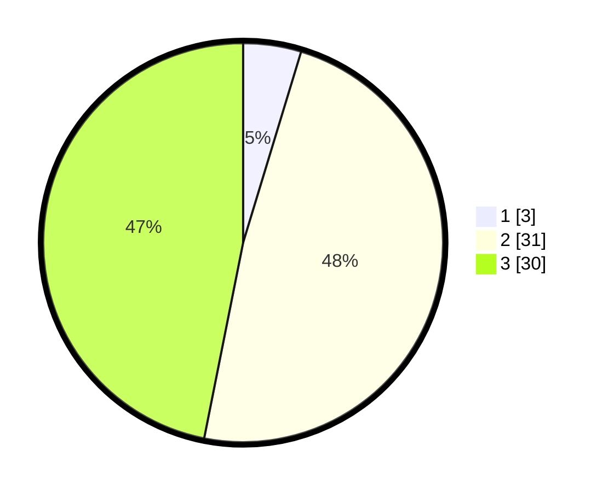

# Hasil

## Grafik

## Tabel

| No. | Nama Paslon    | Suara | Suara (raw) | Persentase |
|:--- |:-------------- | -----:| -----------:| ----------:|
| 1   | ANIES MUHAIMIN | 3     | [3][p-1]    | 4,69       |
| 2   | PRABOWO GIBRAN | 31    | [31][p-2]   | 48,44      |
| 3   | GANJAR MAHFUD  | 30    | [30][p-3]   | 46,88      |

[p-1]: https://github.com/gigit-pemilu/pemilu-2024-12-sumatera-utara/blob/main/pilpres/hitung-suara/sub/12-sumatera-utara/sub/14-nias-selatan/sub/01-lolomatua/sub/2024-ko'olotano/sub/001-tps/sub/paslon-1.txt
[p-2]: https://github.com/gigit-pemilu/pemilu-2024-12-sumatera-utara/blob/main/pilpres/hitung-suara/sub/12-sumatera-utara/sub/14-nias-selatan/sub/01-lolomatua/sub/2024-ko'olotano/sub/001-tps/sub/paslon-2.txt
[p-3]: https://github.com/gigit-pemilu/pemilu-2024-12-sumatera-utara/blob/main/pilpres/hitung-suara/sub/12-sumatera-utara/sub/14-nias-selatan/sub/01-lolomatua/sub/2024-ko'olotano/sub/001-tps/sub/paslon-3.txt

## Foto C Plano

https://sirekap-obj-formc.kpu.go.id/a459/pemilu/ppwp/12/14/01/20/24/1214012024001-20240215-110750--c87bca46-508e-42ed-8e6a-d13e1f191239.jpg

https://sirekap-obj-formc.kpu.go.id/a459/pemilu/ppwp/12/14/01/20/24/1214012024001-20240215-092328--68d1dc9c-b8ab-45dc-9bb1-3f0b39c6fed4.jpg

https://sirekap-obj-formc.kpu.go.id/a459/pemilu/ppwp/12/14/01/20/24/1214012024001-20240215-092450--36d5a9b2-1da6-47c1-a7fd-9cceae1c6f00.jpg

## Metadata

| Key        | Value               |
| ---------- | ------------------- |
| Time Stamp | 2024-02-15 15:00:29 |

