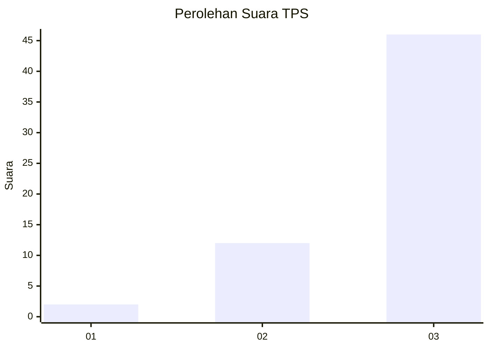
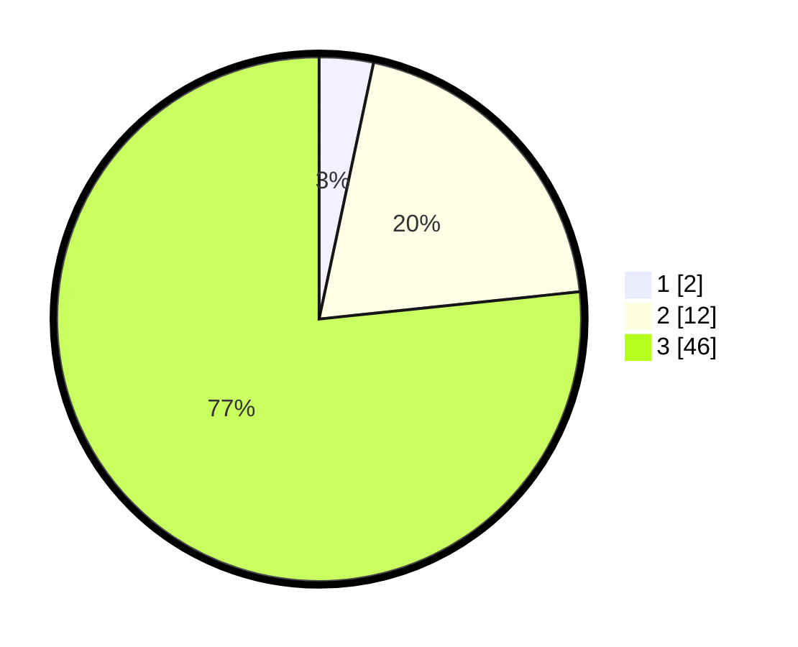

# Hasil

## Grafik

## Tabel

| No. | Nama Paslon    | Suara | Suara (raw) | Persentase |
|:--- |:-------------- | -----:| -----------:| ----------:|
| 1   | ANIES MUHAIMIN | 2     | [2][p-1]    | 3,33       |
| 2   | PRABOWO GIBRAN | 12    | [12][p-2]   | 20,00      |
| 3   | GANJAR MAHFUD  | 46    | [46][p-3]   | 76,67      |

[p-1]: https://github.com/gigit-pemilu/pemilu-2024/blob/main/pilpres/hitung-suara/sub/12-sumatera-utara/sub/14-nias-selatan/sub/01-lolomatua/sub/2024-ko'olotano/sub/002-tps/sub/paslon-1.txt
[p-2]: https://github.com/gigit-pemilu/pemilu-2024/blob/main/pilpres/hitung-suara/sub/12-sumatera-utara/sub/14-nias-selatan/sub/01-lolomatua/sub/2024-ko'olotano/sub/002-tps/sub/paslon-2.txt
[p-3]: https://github.com/gigit-pemilu/pemilu-2024/blob/main/pilpres/hitung-suara/sub/12-sumatera-utara/sub/14-nias-selatan/sub/01-lolomatua/sub/2024-ko'olotano/sub/002-tps/sub/paslon-3.txt

## Foto C Plano

https://sirekap-obj-formc.kpu.go.id/39ba/pemilu/ppwp/12/14/01/20/24/1214012024002-20240215-023425--e850041e-11b5-4a90-9790-8c1dfb17ddc7.jpg

https://sirekap-obj-formc.kpu.go.id/39ba/pemilu/ppwp/12/14/01/20/24/1214012024002-20240215-095658--c17ffce2-521c-4e4c-a3eb-ceddf8441c2f.jpg

https://sirekap-obj-formc.kpu.go.id/39ba/pemilu/ppwp/12/14/01/20/24/1214012024002-20240215-060833--df7c6665-79f1-40f9-a523-4b270b9da25c.jpg

## Metadata

| Key        | Value               |
| ---------- | ------------------- |
| Time Stamp | 2024-02-15 19:30:26 |

