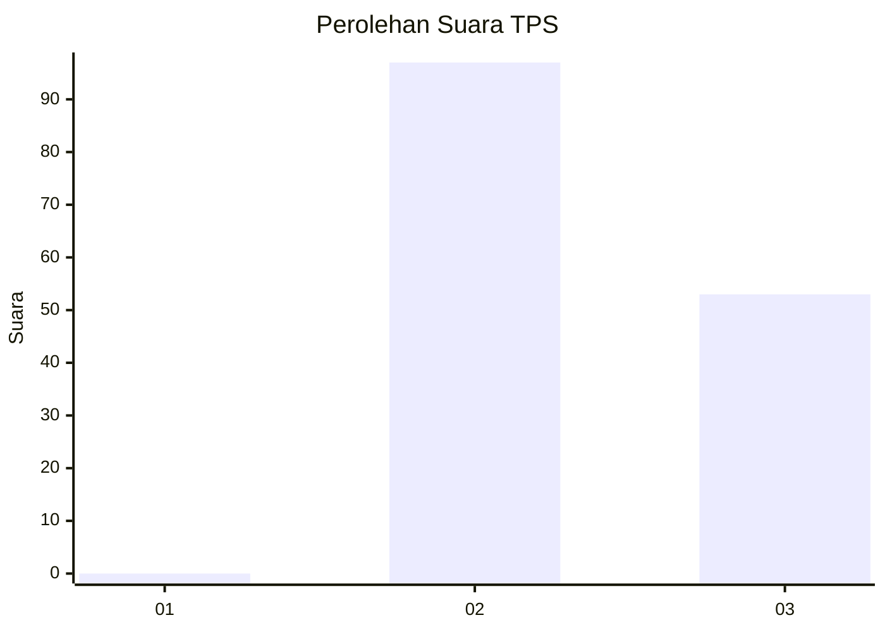
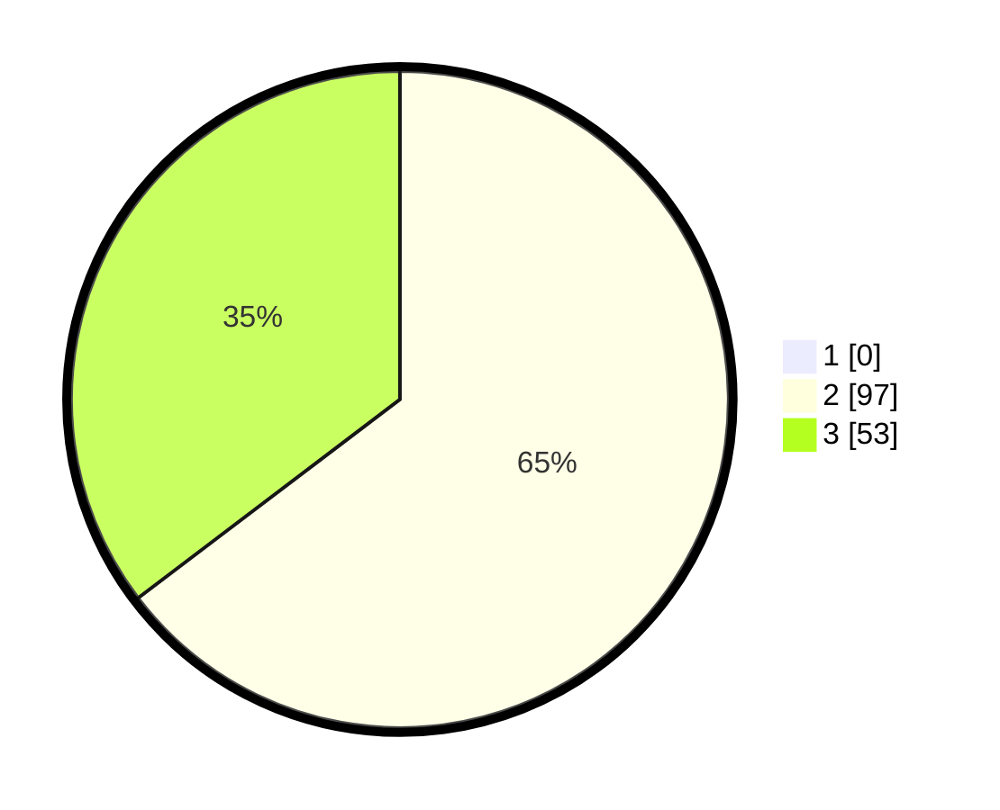

# Hasil

## Grafik

## Tabel

| No. | Nama Paslon    | Suara | Suara (raw) | Persentase |
|:--- |:-------------- | -----:| -----------:| ----------:|
| 1   | ANIES MUHAIMIN | 0     | [0][p-1]    | 0,00       |
| 2   | PRABOWO GIBRAN | 97    | [97][p-2]   | 64,67      |
| 3   | GANJAR MAHFUD  | 53    | [53][p-3]   | 35,33      |

[p-1]: https://github.com/gigit-pemilu/pemilu-2024-12-sumatera-utara/blob/main/pilpres/hitung-suara/sub/12-sumatera-utara/sub/14-nias-selatan/sub/02-gomo/sub/2041-orahili-sibohou/sub/002-tps/sub/paslon-1.txt
[p-2]: https://github.com/gigit-pemilu/pemilu-2024-12-sumatera-utara/blob/main/pilpres/hitung-suara/sub/12-sumatera-utara/sub/14-nias-selatan/sub/02-gomo/sub/2041-orahili-sibohou/sub/002-tps/sub/paslon-2.txt
[p-3]: https://github.com/gigit-pemilu/pemilu-2024-12-sumatera-utara/blob/main/pilpres/hitung-suara/sub/12-sumatera-utara/sub/14-nias-selatan/sub/02-gomo/sub/2041-orahili-sibohou/sub/002-tps/sub/paslon-3.txt

## Foto C Plano

https://sirekap-obj-formc.kpu.go.id/7cba/pemilu/ppwp/12/14/02/20/41/1214022041002-20240215-104417--48158d24-f23e-4191-876e-341b31696d0c.jpg

https://sirekap-obj-formc.kpu.go.id/7cba/pemilu/ppwp/12/14/02/20/41/1214022041002-20240215-104542--10bde3a9-dcb4-4961-a39a-2c29f51a9711.jpg

https://sirekap-obj-formc.kpu.go.id/7cba/pemilu/ppwp/12/14/02/20/41/1214022041002-20240215-104712--14cb310b-f5f0-46cd-a1f0-a3209eb9eb43.jpg

## Metadata

| Key        | Value               |
| ---------- | ------------------- |
| Time Stamp | 2024-02-15 22:30:27 |

