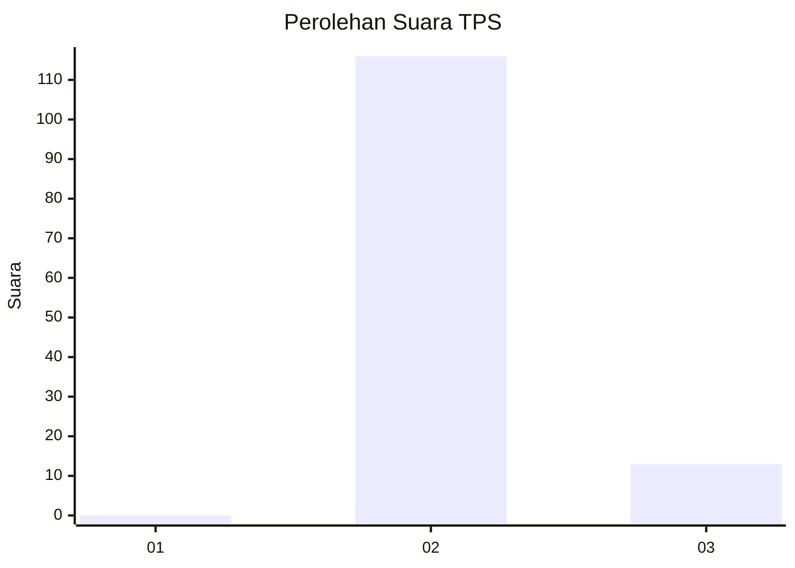
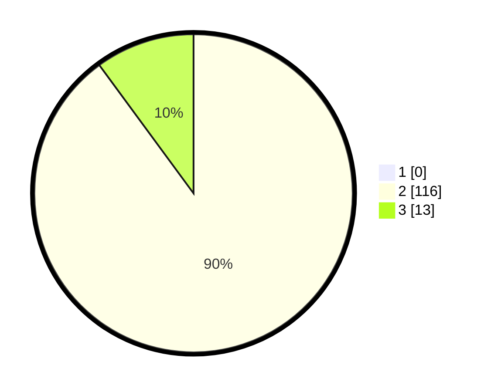

# Hasil

## Grafik

## Tabel

| No. | Nama Paslon    | Suara | Suara (raw) | Persentase |
|:--- |:-------------- | -----:| -----------:| ----------:|
| 1   | ANIES MUHAIMIN | 0     | [0][p-1]    | 0,00       |
| 2   | PRABOWO GIBRAN | 116   | [116][p-2]  | 89,92      |
| 3   | GANJAR MAHFUD  | 13    | [13][p-3]   | 10,08      |

[p-1]: https://github.com/gigit-pemilu/pemilu-2024-12-sumatera-utara/blob/main/pilpres/hitung-suara/sub/12-sumatera-utara/sub/14-nias-selatan/sub/03-lahusa/sub/2001-bawolato/sub/001-tps/sub/paslon-1.txt
[p-2]: https://github.com/gigit-pemilu/pemilu-2024-12-sumatera-utara/blob/main/pilpres/hitung-suara/sub/12-sumatera-utara/sub/14-nias-selatan/sub/03-lahusa/sub/2001-bawolato/sub/001-tps/sub/paslon-2.txt
[p-3]: https://github.com/gigit-pemilu/pemilu-2024-12-sumatera-utara/blob/main/pilpres/hitung-suara/sub/12-sumatera-utara/sub/14-nias-selatan/sub/03-lahusa/sub/2001-bawolato/sub/001-tps/sub/paslon-3.txt

## Foto C Plano

https://sirekap-obj-formc.kpu.go.id/9951/pemilu/ppwp/12/14/03/20/01/1214032001001-20240215-110138--a48b6fde-43b4-45df-aac8-c1996336f6d3.jpg

https://sirekap-obj-formc.kpu.go.id/9951/pemilu/ppwp/12/14/03/20/01/1214032001001-20240214-231503--d3316cca-0078-4adc-91d4-7c06b1d01677.jpg

https://sirekap-obj-formc.kpu.go.id/9951/pemilu/ppwp/12/14/03/20/01/1214032001001-20240214-231631--bb86e9b0-069c-4ec6-8d41-f196c819d43b.jpg

## Metadata

| Key        | Value               |
| ---------- | ------------------- |
| Time Stamp | 2024-02-15 15:00:29 |

