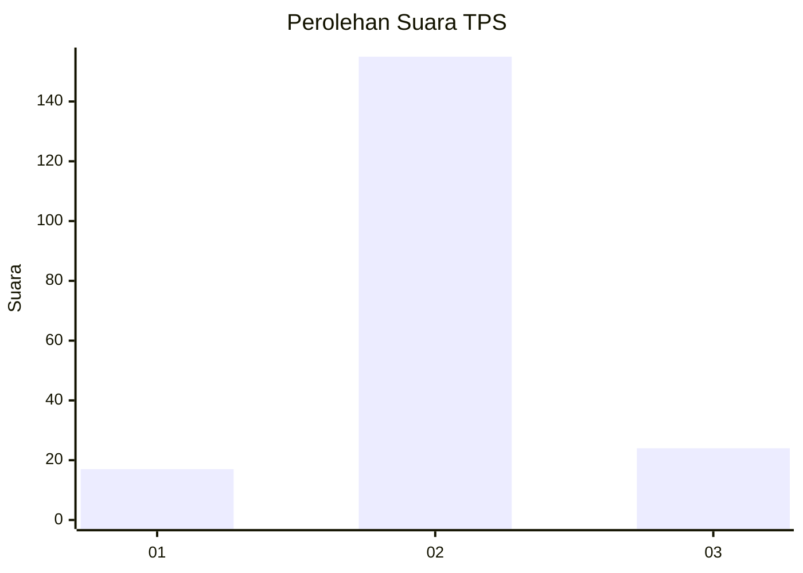
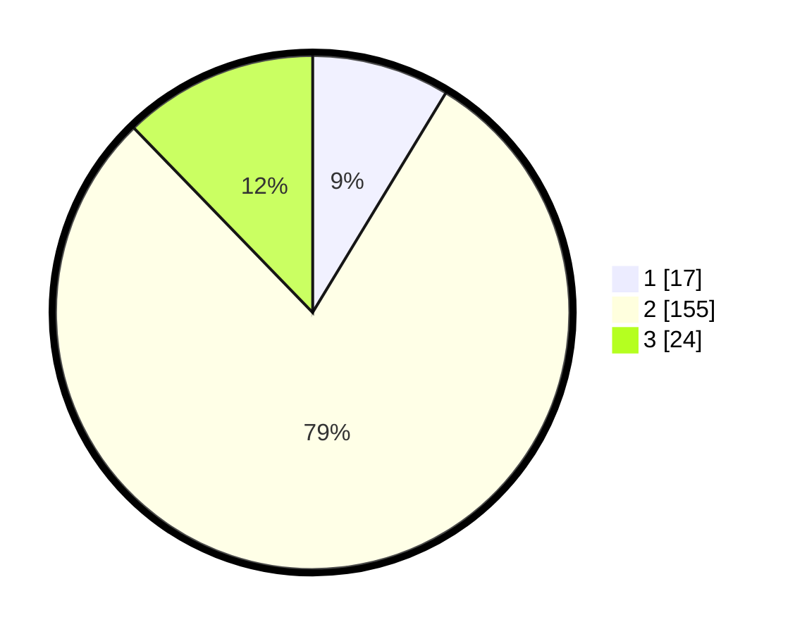

# Hasil

## Grafik

## Tabel

| No. | Nama Paslon    | Suara | Suara (raw) | Persentase |
|:--- |:-------------- | -----:| -----------:| ----------:|
| 1   | ANIES MUHAIMIN | 17    | [17][p-1]   | 8,67       |
| 2   | PRABOWO GIBRAN | 155   | [155][p-2]  | 79,08      |
| 3   | GANJAR MAHFUD  | 24    | [24][p-3]   | 12,24      |

[p-1]: https://github.com/gigit-pemilu/pemilu-2024-12-sumatera-utara/blob/main/pilpres/hitung-suara/sub/12-sumatera-utara/sub/14-nias-selatan/sub/03-lahusa/sub/2003-bawo'otalua/sub/001-tps/sub/paslon-1.txt
[p-2]: https://github.com/gigit-pemilu/pemilu-2024-12-sumatera-utara/blob/main/pilpres/hitung-suara/sub/12-sumatera-utara/sub/14-nias-selatan/sub/03-lahusa/sub/2003-bawo'otalua/sub/001-tps/sub/paslon-2.txt
[p-3]: https://github.com/gigit-pemilu/pemilu-2024-12-sumatera-utara/blob/main/pilpres/hitung-suara/sub/12-sumatera-utara/sub/14-nias-selatan/sub/03-lahusa/sub/2003-bawo'otalua/sub/001-tps/sub/paslon-3.txt

## Foto C Plano

https://sirekap-obj-formc.kpu.go.id/7186/pemilu/ppwp/12/14/03/20/03/1214032003001-20240215-103504--87382f0f-f52b-4b61-a1de-f2151d677bb2.jpg

https://sirekap-obj-formc.kpu.go.id/7186/pemilu/ppwp/12/14/03/20/03/1214032003001-20240215-103646--b14d8eec-af31-4ab5-a730-43d6b396e2cb.jpg

https://sirekap-obj-formc.kpu.go.id/7186/pemilu/ppwp/12/14/03/20/03/1214032003001-20240215-103818--f169b18c-ea82-4b3e-bbc3-e32db2b3291b.jpg

## Metadata

| Key        | Value               |
| ---------- | ------------------- |
| Time Stamp | 2024-02-15 19:00:26 |

