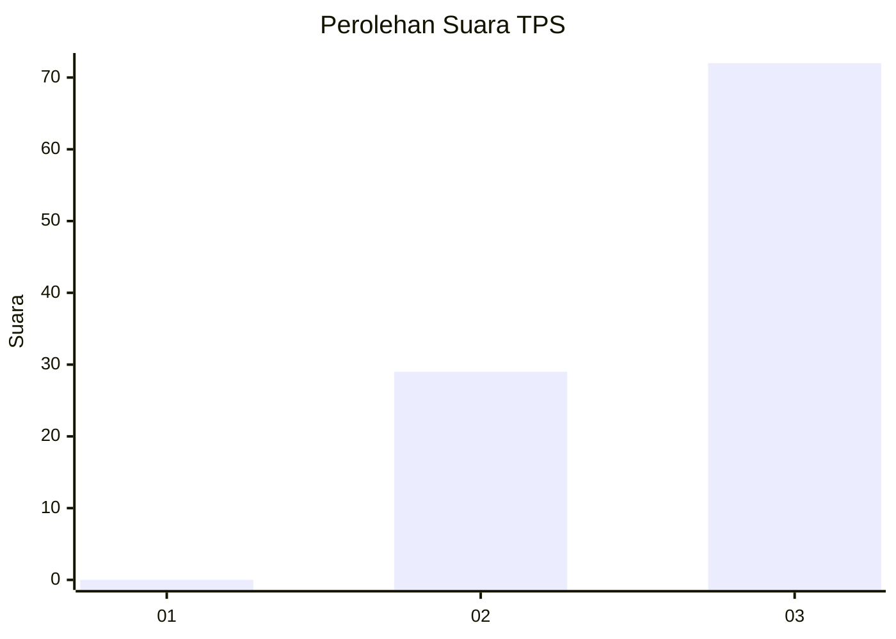
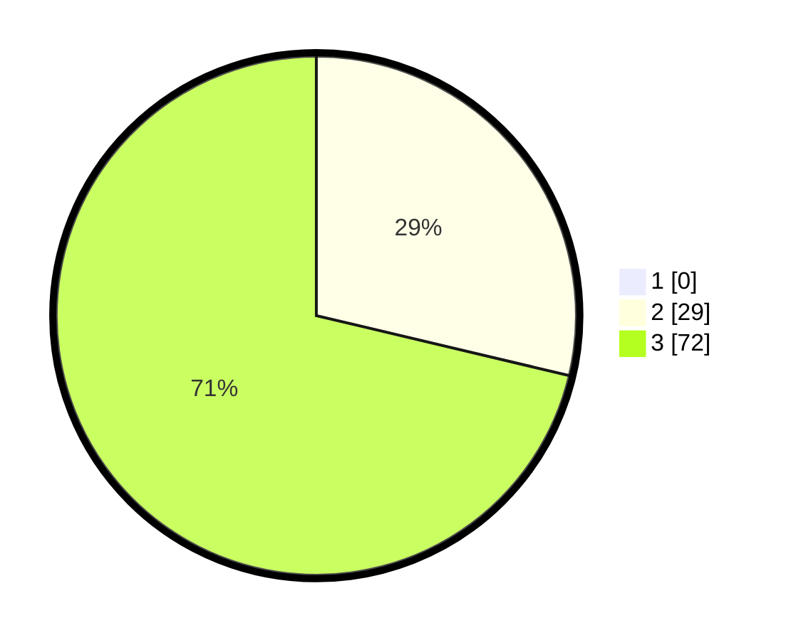

# Hasil

## Grafik

## Tabel

| No. | Nama Paslon    | Suara | Suara (raw) | Persentase |
|:--- |:-------------- | -----:| -----------:| ----------:|
| 1   | ANIES MUHAIMIN | 0     | [0][p-1]    | 0,00       |
| 2   | PRABOWO GIBRAN | 29    | [29][p-2]   | 28,71      |
| 3   | GANJAR MAHFUD  | 72    | [72][p-3]   | 71,29      |

[p-1]: https://github.com/gigit-pemilu/pemilu-2024-12-sumatera-utara/blob/main/pilpres/hitung-suara/sub/12-sumatera-utara/sub/14-nias-selatan/sub/03-lahusa/sub/2004-golambanua-i/sub/001-tps/sub/paslon-1.txt
[p-2]: https://github.com/gigit-pemilu/pemilu-2024-12-sumatera-utara/blob/main/pilpres/hitung-suara/sub/12-sumatera-utara/sub/14-nias-selatan/sub/03-lahusa/sub/2004-golambanua-i/sub/001-tps/sub/paslon-2.txt
[p-3]: https://github.com/gigit-pemilu/pemilu-2024-12-sumatera-utara/blob/main/pilpres/hitung-suara/sub/12-sumatera-utara/sub/14-nias-selatan/sub/03-lahusa/sub/2004-golambanua-i/sub/001-tps/sub/paslon-3.txt

## Foto C Plano

https://sirekap-obj-formc.kpu.go.id/b72f/pemilu/ppwp/12/14/03/20/04/1214032004001-20240215-030214--e0506be8-9b5c-47ce-b7f1-a7cce1ede79c.jpg

https://sirekap-obj-formc.kpu.go.id/b72f/pemilu/ppwp/12/14/03/20/04/1214032004001-20240215-030539--babc3bef-e5c3-4d96-8576-70e230b78ddb.jpg

https://sirekap-obj-formc.kpu.go.id/b72f/pemilu/ppwp/12/14/03/20/04/1214032004001-20240215-030800--d7d4f5a9-b7ca-4869-8cdd-22c6cf071abf.jpg

## Metadata

| Key        | Value               |
| ---------- | ------------------- |
| Time Stamp | 2024-02-15 15:30:25 |

