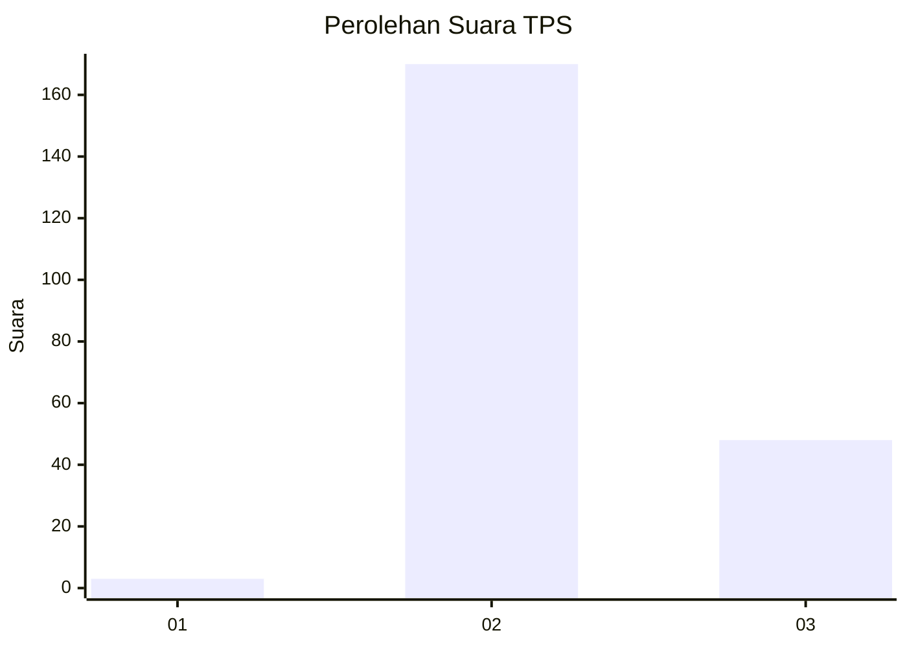

# Hasil

## Grafik

## Tabel

| No. | Nama Paslon    | Suara | Suara (raw) | Persentase |
|:--- |:-------------- | -----:| -----------:| ----------:|
| 1   | ANIES MUHAIMIN | 3     | [3][p-1]    | 1,36       |
| 2   | PRABOWO GIBRAN | 170   | [170][p-2]  | 76,92      |
| 3   | GANJAR MAHFUD  | 48    | [48][p-3]   | 21,72      |

[p-1]: https://github.com/gigit-pemilu/pemilu-2024/blob/main/pilpres/hitung-suara/sub/12-sumatera-utara/sub/14-nias-selatan/sub/03-lahusa/sub/2007-hilisimaetano-balaekha/sub/001-tps/sub/paslon-1.txt
[p-2]: https://github.com/gigit-pemilu/pemilu-2024/blob/main/pilpres/hitung-suara/sub/12-sumatera-utara/sub/14-nias-selatan/sub/03-lahusa/sub/2007-hilisimaetano-balaekha/sub/001-tps/sub/paslon-2.txt
[p-3]: https://github.com/gigit-pemilu/pemilu-2024/blob/main/pilpres/hitung-suara/sub/12-sumatera-utara/sub/14-nias-selatan/sub/03-lahusa/sub/2007-hilisimaetano-balaekha/sub/001-tps/sub/paslon-3.txt

## Foto C Plano

https://sirekap-obj-formc.kpu.go.id/5db9/pemilu/ppwp/12/14/03/20/07/1214032007001-20240214-232842--f1178bdd-ce67-4271-a477-bb348740b0cb.jpg

https://sirekap-obj-formc.kpu.go.id/5db9/pemilu/ppwp/12/14/03/20/07/1214032007001-20240214-231744--6bbe4121-a6ec-4a66-abfc-c64704bffc37.jpg

https://sirekap-obj-formc.kpu.go.id/5db9/pemilu/ppwp/12/14/03/20/07/1214032007001-20240215-002449--bc43903d-73a9-439c-b970-887002bc5b79.jpg

## Metadata

| Key        | Value               |
| ---------- | ------------------- |
| Time Stamp | 2024-02-15 22:30:27 |

