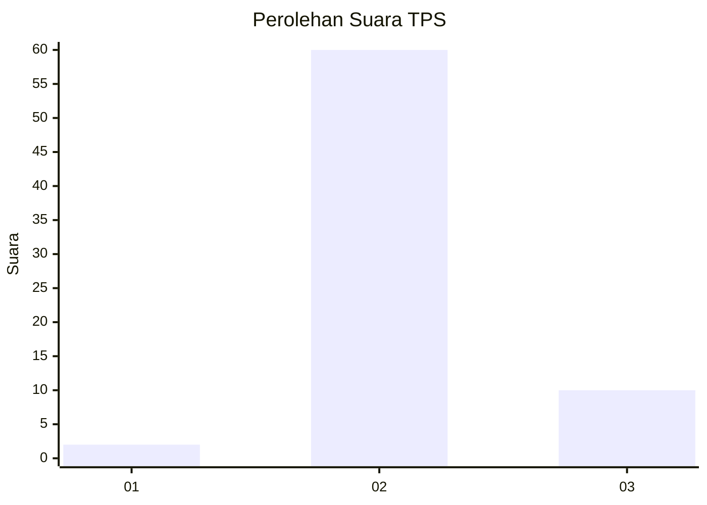
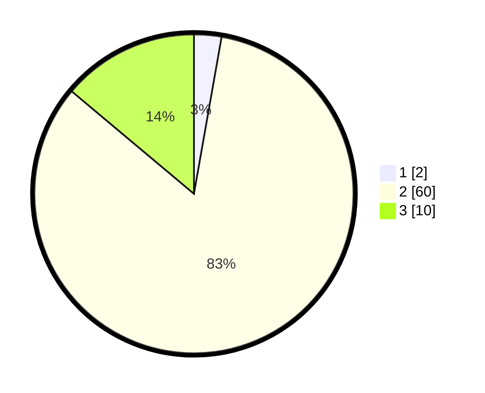

# Hasil

## Grafik

## Tabel

| No. | Nama Paslon    | Suara | Suara (raw) | Persentase |
|:--- |:-------------- | -----:| -----------:| ----------:|
| 1   | ANIES MUHAIMIN | 2     | [2][p-1]    | 2,78       |
| 2   | PRABOWO GIBRAN | 60    | [60][p-2]   | 83,33      |
| 3   | GANJAR MAHFUD  | 10    | [10][p-3]   | 13,89      |

[p-1]: https://github.com/gigit-pemilu/pemilu-2024/blob/main/pilpres/hitung-suara/sub/12-sumatera-utara/sub/14-nias-selatan/sub/03-lahusa/sub/2009-lahusa/sub/003-tps/sub/paslon-1.txt
[p-2]: https://github.com/gigit-pemilu/pemilu-2024/blob/main/pilpres/hitung-suara/sub/12-sumatera-utara/sub/14-nias-selatan/sub/03-lahusa/sub/2009-lahusa/sub/003-tps/sub/paslon-2.txt
[p-3]: https://github.com/gigit-pemilu/pemilu-2024/blob/main/pilpres/hitung-suara/sub/12-sumatera-utara/sub/14-nias-selatan/sub/03-lahusa/sub/2009-lahusa/sub/003-tps/sub/paslon-3.txt

## Foto C Plano

https://sirekap-obj-formc.kpu.go.id/80e9/pemilu/ppwp/12/14/03/20/09/1214032009003-20240215-091220--5a81f1b1-4dc0-463f-85d3-d7af8f4b5d7c.jpg

https://sirekap-obj-formc.kpu.go.id/80e9/pemilu/ppwp/12/14/03/20/09/1214032009003-20240215-091808--aad532f6-d5f0-48d0-b1b1-40613b425677.jpg

https://sirekap-obj-formc.kpu.go.id/80e9/pemilu/ppwp/12/14/03/20/09/1214032009003-20240215-092043--744f5d2e-fd38-40df-8e70-6e23ba0d0a00.jpg

## Metadata

| Key        | Value               |
| ---------- | ------------------- |
| Time Stamp | 2024-02-15 22:30:27 |

