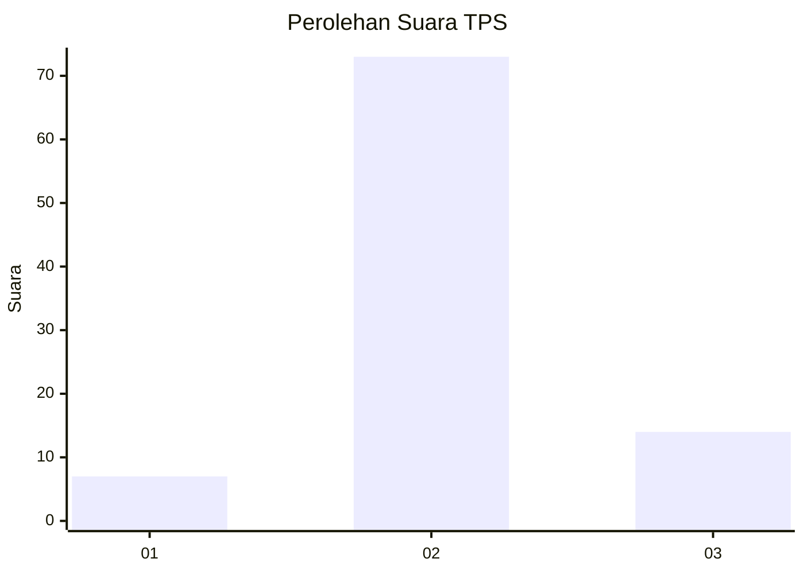

# Hasil

## Grafik

## Tabel

| No. | Nama Paslon    | Suara | Suara (raw) | Persentase |
|:--- |:-------------- | -----:| -----------:| ----------:|
| 1   | ANIES MUHAIMIN | 7     | [7][p-1]    | 7,45       |
| 2   | PRABOWO GIBRAN | 73    | [73][p-2]   | 77,66      |
| 3   | GANJAR MAHFUD  | 14    | [14][p-3]   | 14,89      |

[p-1]: https://github.com/gigit-pemilu/pemilu-2024-12-sumatera-utara/blob/main/pilpres/hitung-suara/sub/12-sumatera-utara/sub/14-nias-selatan/sub/03-lahusa/sub/2017-harenoro/sub/002-tps/sub/paslon-1.txt
[p-2]: https://github.com/gigit-pemilu/pemilu-2024-12-sumatera-utara/blob/main/pilpres/hitung-suara/sub/12-sumatera-utara/sub/14-nias-selatan/sub/03-lahusa/sub/2017-harenoro/sub/002-tps/sub/paslon-2.txt
[p-3]: https://github.com/gigit-pemilu/pemilu-2024-12-sumatera-utara/blob/main/pilpres/hitung-suara/sub/12-sumatera-utara/sub/14-nias-selatan/sub/03-lahusa/sub/2017-harenoro/sub/002-tps/sub/paslon-3.txt

## Foto C Plano

https://sirekap-obj-formc.kpu.go.id/ce5d/pemilu/ppwp/12/14/03/20/17/1214032017002-20240215-143520--274679c8-edf4-457d-a59b-971b984d0449.jpg

https://sirekap-obj-formc.kpu.go.id/ce5d/pemilu/ppwp/12/14/03/20/17/1214032017002-20240215-143616--a85a4e89-b12a-42b4-a71a-803a97cb43e7.jpg

https://sirekap-obj-formc.kpu.go.id/ce5d/pemilu/ppwp/12/14/03/20/17/1214032017002-20240215-143704--12549bb6-71dd-4e16-aa4f-596612699e8e.jpg

## Metadata

| Key        | Value               |
| ---------- | ------------------- |
| Time Stamp | 2024-02-15 15:00:29 |

