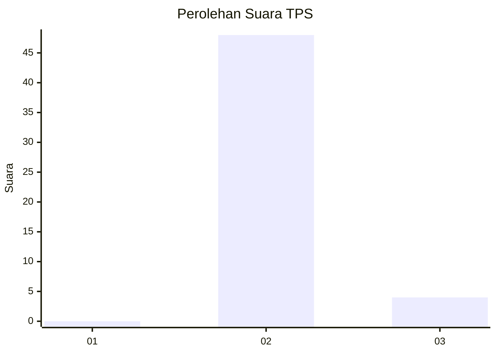
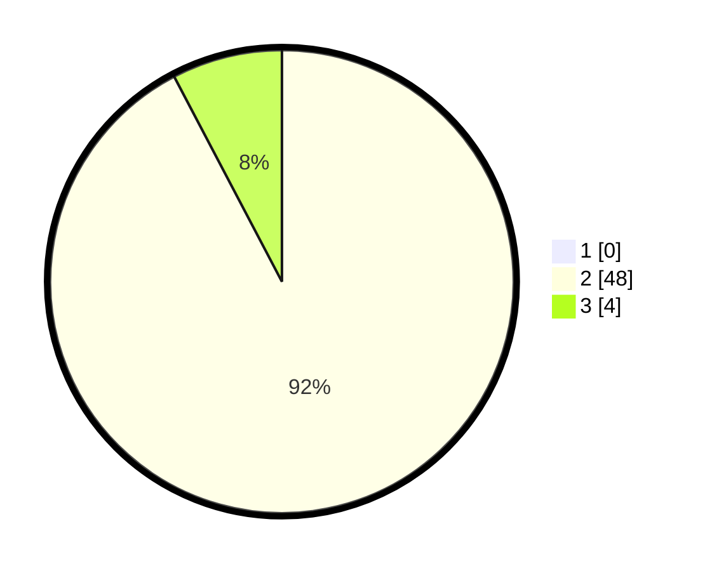

# Hasil

## Grafik

## Tabel

| No. | Nama Paslon    | Suara | Suara (raw) | Persentase |
|:--- |:-------------- | -----:| -----------:| ----------:|
| 1   | ANIES MUHAIMIN | 0     | [0][p-1]    | 0,00       |
| 2   | PRABOWO GIBRAN | 48    | [48][p-2]   | 92,31      |
| 3   | GANJAR MAHFUD  | 4     | [4][p-3]    | 7,69       |

[p-1]: https://github.com/gigit-pemilu/pemilu-2024-12-sumatera-utara/blob/main/pilpres/hitung-suara/sub/12-sumatera-utara/sub/14-nias-selatan/sub/03-lahusa/sub/2017-harenoro/sub/003-tps/sub/paslon-1.txt
[p-2]: https://github.com/gigit-pemilu/pemilu-2024-12-sumatera-utara/blob/main/pilpres/hitung-suara/sub/12-sumatera-utara/sub/14-nias-selatan/sub/03-lahusa/sub/2017-harenoro/sub/003-tps/sub/paslon-2.txt
[p-3]: https://github.com/gigit-pemilu/pemilu-2024-12-sumatera-utara/blob/main/pilpres/hitung-suara/sub/12-sumatera-utara/sub/14-nias-selatan/sub/03-lahusa/sub/2017-harenoro/sub/003-tps/sub/paslon-3.txt

## Foto C Plano

https://sirekap-obj-formc.kpu.go.id/b061/pemilu/ppwp/12/14/03/20/17/1214032017003-20240215-165904--759e5a80-2d0f-4cfc-a610-d1be32ed3bfd.jpg

https://sirekap-obj-formc.kpu.go.id/b061/pemilu/ppwp/12/14/03/20/17/1214032017003-20240215-170104--1a27e0fe-c697-47c3-8c35-8ee3c9c43351.jpg

https://sirekap-obj-formc.kpu.go.id/b061/pemilu/ppwp/12/14/03/20/17/1214032017003-20240215-170329--3d821ed9-c997-40fe-8cca-7b81681b2bfc.jpg

## Metadata

| Key        | Value               |
| ---------- | ------------------- |
| Time Stamp | 2024-02-15 18:30:25 |

