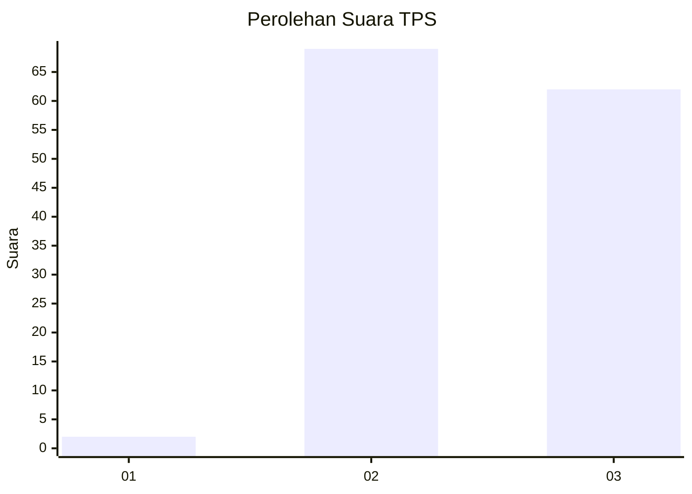
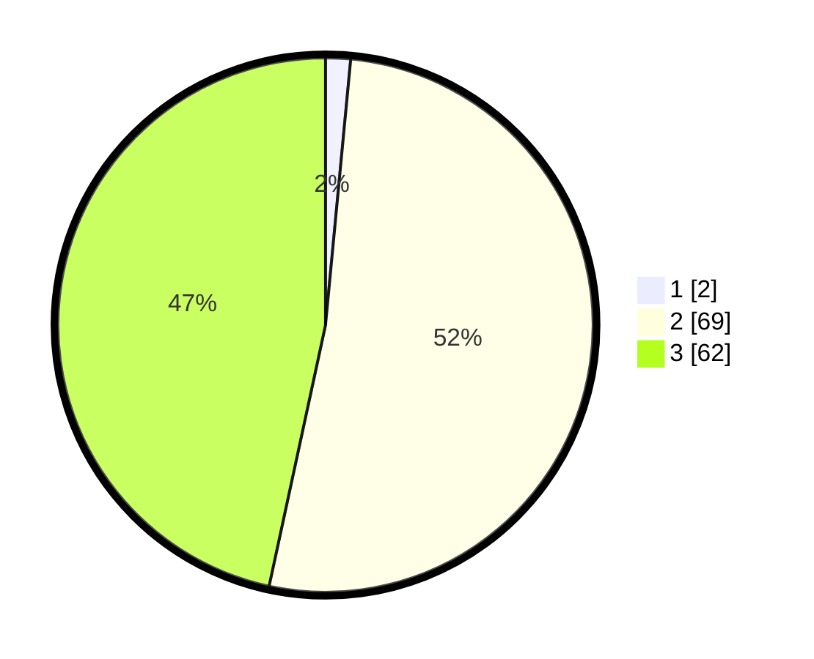

# Hasil

## Grafik

## Tabel

| No. | Nama Paslon    | Suara | Suara (raw) | Persentase |
|:--- |:-------------- | -----:| -----------:| ----------:|
| 1   | ANIES MUHAIMIN | 2     | [2][p-1]    | 1,50       |
| 2   | PRABOWO GIBRAN | 69    | [69][p-2]   | 51,88      |
| 3   | GANJAR MAHFUD  | 62    | [62][p-3]   | 46,62      |

[p-1]: https://github.com/gigit-pemilu/pemilu-2024/blob/main/pilpres/hitung-suara/sub/12-sumatera-utara/sub/14-nias-selatan/sub/03-lahusa/sub/2018-sarahililaza/sub/003-tps/sub/paslon-1.txt
[p-2]: https://github.com/gigit-pemilu/pemilu-2024/blob/main/pilpres/hitung-suara/sub/12-sumatera-utara/sub/14-nias-selatan/sub/03-lahusa/sub/2018-sarahililaza/sub/003-tps/sub/paslon-2.txt
[p-3]: https://github.com/gigit-pemilu/pemilu-2024/blob/main/pilpres/hitung-suara/sub/12-sumatera-utara/sub/14-nias-selatan/sub/03-lahusa/sub/2018-sarahililaza/sub/003-tps/sub/paslon-3.txt

## Foto C Plano

https://sirekap-obj-formc.kpu.go.id/0c8d/pemilu/ppwp/12/14/03/20/18/1214032018003-20240215-165406--d09fb913-efb6-4be6-9ed9-0ec04e5ea1c1.jpg

https://sirekap-obj-formc.kpu.go.id/0c8d/pemilu/ppwp/12/14/03/20/18/1214032018003-20240214-230011--1ad0e840-f8cc-4e5c-8005-19603bf457ad.jpg

https://sirekap-obj-formc.kpu.go.id/0c8d/pemilu/ppwp/12/14/03/20/18/1214032018003-20240215-165833--2d5f693f-736b-4ddf-915b-14d39f2a8915.jpg

## Metadata

| Key        | Value               |
| ---------- | ------------------- |
| Time Stamp | 2024-02-15 23:29:50 |

