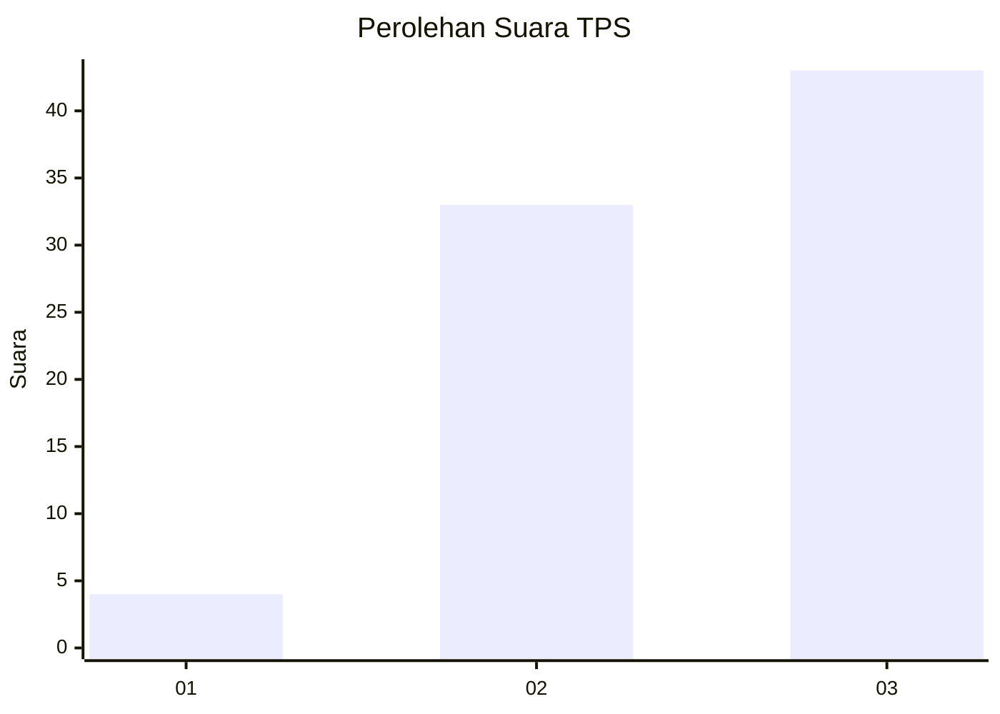
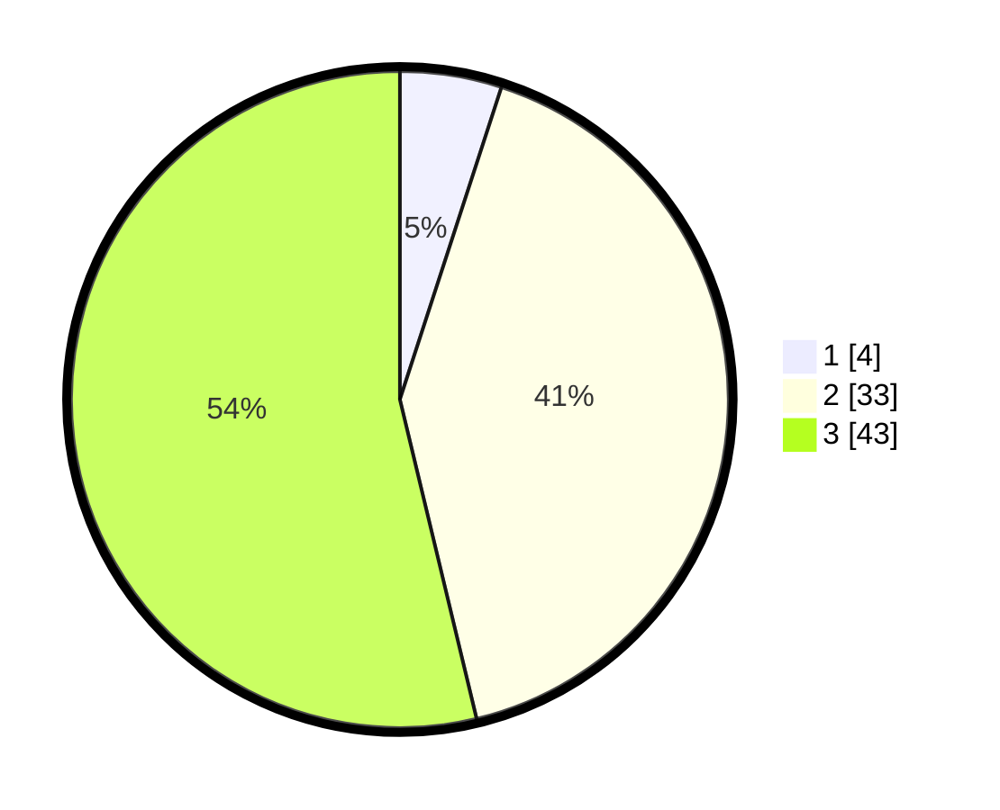

# Hasil

## Grafik

## Tabel

| No. | Nama Paslon    | Suara | Suara (raw) | Persentase |
|:--- |:-------------- | -----:| -----------:| ----------:|
| 1   | ANIES MUHAIMIN | 4     | [4][p-1]    | 5,00       |
| 2   | PRABOWO GIBRAN | 33    | [33][p-2]   | 41,25      |
| 3   | GANJAR MAHFUD  | 43    | [43][p-3]   | 53,75      |

[p-1]: https://github.com/gigit-pemilu/pemilu-2024/blob/main/pilpres/hitung-suara/sub/12-sumatera-utara/sub/14-nias-selatan/sub/03-lahusa/sub/2025-hiligambukha/sub/001-tps/sub/paslon-1.txt
[p-2]: https://github.com/gigit-pemilu/pemilu-2024/blob/main/pilpres/hitung-suara/sub/12-sumatera-utara/sub/14-nias-selatan/sub/03-lahusa/sub/2025-hiligambukha/sub/001-tps/sub/paslon-2.txt
[p-3]: https://github.com/gigit-pemilu/pemilu-2024/blob/main/pilpres/hitung-suara/sub/12-sumatera-utara/sub/14-nias-selatan/sub/03-lahusa/sub/2025-hiligambukha/sub/001-tps/sub/paslon-3.txt

## Foto C Plano

https://sirekap-obj-formc.kpu.go.id/c282/pemilu/ppwp/12/14/03/20/25/1214032025001-20240215-111816--717fc2ae-20f3-42f9-9ac7-1a08fe36b8b3.jpg

https://sirekap-obj-formc.kpu.go.id/c282/pemilu/ppwp/12/14/03/20/25/1214032025001-20240215-111941--fe9b6e74-22cb-47df-9f01-b671cb59d743.jpg

https://sirekap-obj-formc.kpu.go.id/c282/pemilu/ppwp/12/14/03/20/25/1214032025001-20240215-112135--1bded14e-7ea4-400b-ba6f-aa3a1515141b.jpg

## Metadata

| Key        | Value               |
| ---------- | ------------------- |
| Time Stamp | 2024-02-15 23:29:50 |

