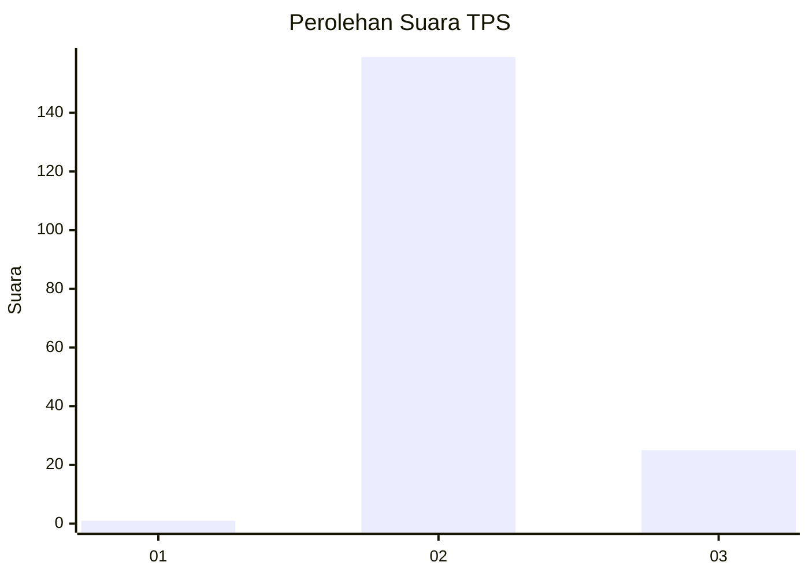
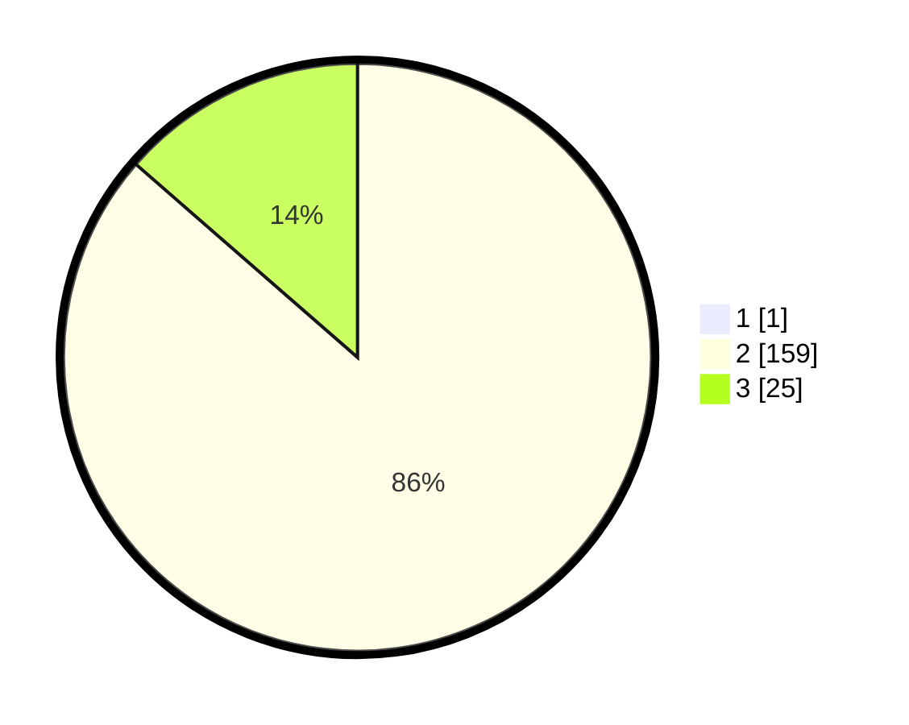

# Hasil

## Grafik

## Tabel

| No. | Nama Paslon    | Suara | Suara (raw) | Persentase |
|:--- |:-------------- | -----:| -----------:| ----------:|
| 1   | ANIES MUHAIMIN | 1     | [1][p-1]    | 0,54       |
| 2   | PRABOWO GIBRAN | 159   | [159][p-2]  | 85,95      |
| 3   | GANJAR MAHFUD  | 25    | [25][p-3]   | 13,51      |

[p-1]: https://github.com/gigit-pemilu/pemilu-2024/blob/main/pilpres/hitung-suara/sub/12-sumatera-utara/sub/14-nias-selatan/sub/03-lahusa/sub/2025-hiligambukha/sub/002-tps/sub/paslon-1.txt
[p-2]: https://github.com/gigit-pemilu/pemilu-2024/blob/main/pilpres/hitung-suara/sub/12-sumatera-utara/sub/14-nias-selatan/sub/03-lahusa/sub/2025-hiligambukha/sub/002-tps/sub/paslon-2.txt
[p-3]: https://github.com/gigit-pemilu/pemilu-2024/blob/main/pilpres/hitung-suara/sub/12-sumatera-utara/sub/14-nias-selatan/sub/03-lahusa/sub/2025-hiligambukha/sub/002-tps/sub/paslon-3.txt

## Foto C Plano

https://sirekap-obj-formc.kpu.go.id/c12a/pemilu/ppwp/12/14/03/20/25/1214032025002-20240215-184831--15b221ab-cd2f-405c-8fc0-6b0ee5456008.jpg

https://sirekap-obj-formc.kpu.go.id/c12a/pemilu/ppwp/12/14/03/20/25/1214032025002-20240215-184944--f2a23c5e-7a4a-4bfb-a733-2ff3b2878e36.jpg

https://sirekap-obj-formc.kpu.go.id/c12a/pemilu/ppwp/12/14/03/20/25/1214032025002-20240215-185107--396abd5e-0efd-4c16-bb8c-7fd5361ae442.jpg

## Metadata

| Key        | Value               |
| ---------- | ------------------- |
| Time Stamp | 2024-02-15 21:30:27 |

