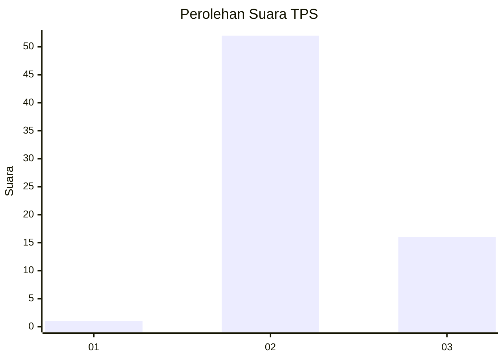
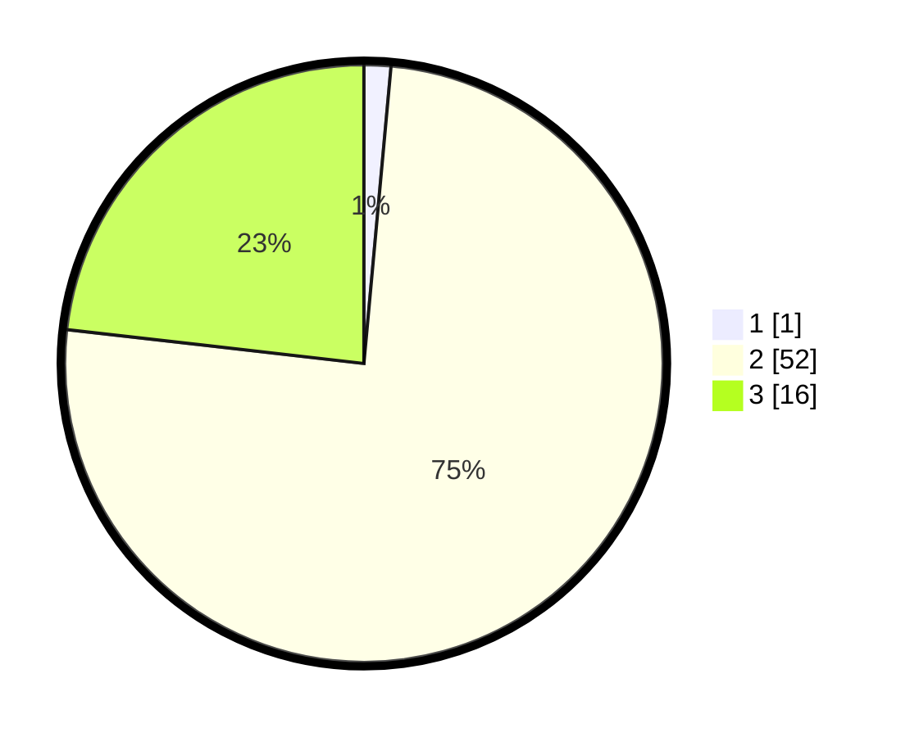

# Hasil

## Grafik

## Tabel

| No. | Nama Paslon    | Suara | Suara (raw) | Persentase |
|:--- |:-------------- | -----:| -----------:| ----------:|
| 1   | ANIES MUHAIMIN | 1     | [1][p-1]    | 1,45       |
| 2   | PRABOWO GIBRAN | 52    | [52][p-2]   | 75,36      |
| 3   | GANJAR MAHFUD  | 16    | [16][p-3]   | 23,19      |

[p-1]: https://github.com/gigit-pemilu/pemilu-2024/blob/main/pilpres/hitung-suara/sub/12-sumatera-utara/sub/14-nias-selatan/sub/03-lahusa/sub/2025-hiligambukha/sub/003-tps/sub/paslon-1.txt
[p-2]: https://github.com/gigit-pemilu/pemilu-2024/blob/main/pilpres/hitung-suara/sub/12-sumatera-utara/sub/14-nias-selatan/sub/03-lahusa/sub/2025-hiligambukha/sub/003-tps/sub/paslon-2.txt
[p-3]: https://github.com/gigit-pemilu/pemilu-2024/blob/main/pilpres/hitung-suara/sub/12-sumatera-utara/sub/14-nias-selatan/sub/03-lahusa/sub/2025-hiligambukha/sub/003-tps/sub/paslon-3.txt

## Foto C Plano

https://sirekap-obj-formc.kpu.go.id/3b74/pemilu/ppwp/12/14/03/20/25/1214032025003-20240215-112436--ec970cf5-78b6-4280-b03e-49a565f121ae.jpg

https://sirekap-obj-formc.kpu.go.id/3b74/pemilu/ppwp/12/14/03/20/25/1214032025003-20240215-133429--38474526-aa5f-431c-97c5-bbc1829403d5.jpg

## Metadata

| Key        | Value               |
| ---------- | ------------------- |
| Time Stamp | 2024-02-15 18:30:25 |

